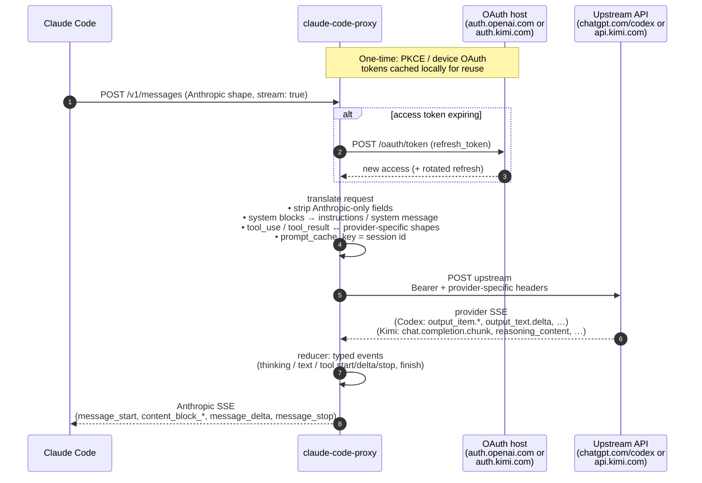

This file is a merged representation of the entire codebase, combined into a single document by Repomix.

<file_summary>
This section contains a summary of this file.

<purpose>
This file contains a packed representation of the entire repository's contents.
It is designed to be easily consumable by AI systems for analysis, code review,
or other automated processes.
</purpose>

<file_format>
The content is organized as follows:
1. This summary section
2. Repository information
3. Directory structure
4. Repository files (if enabled)
5. Multiple file entries, each consisting of:
  - File path as an attribute
  - Full contents of the file
</file_format>

<usage_guidelines>
- This file should be treated as read-only. Any changes should be made to the
  original repository files, not this packed version.
- When processing this file, use the file path to distinguish
  between different files in the repository.
- Be aware that this file may contain sensitive information. Handle it with
  the same level of security as you would the original repository.
</usage_guidelines>

<notes>
- Some files may have been excluded based on .gitignore rules and Repomix's configuration
- Binary files are not included in this packed representation. Please refer to the Repository Structure section for a complete list of file paths, including binary files
- Files matching patterns in .gitignore are excluded
- Files matching default ignore patterns are excluded
- Files are sorted by Git change count (files with more changes are at the bottom)
</notes>

</file_summary>

<directory_structure>
.github/workflows/release.yml
.gitignore
CHANGELOG.md
LICENSE
meta/claude-code-screenshot.webp
package.json
README.md
scripts/install.sh
scripts/publish
src/anthropic/schema.ts
src/cli.ts
src/config.test.ts
src/config.ts
src/keychain.ts
src/log.ts
src/paths.test.ts
src/paths.ts
src/providers/codex/auth/constants.ts
src/providers/codex/auth/device.ts
src/providers/codex/auth/jwt.ts
src/providers/codex/auth/manager.ts
src/providers/codex/auth/pkce.ts
src/providers/codex/auth/token-store.ts
src/providers/codex/client.ts
src/providers/codex/count-tokens.ts
src/providers/codex/index.test.ts
src/providers/codex/index.ts
src/providers/codex/translate/accumulate.ts
src/providers/codex/translate/model-allowlist.test.ts
src/providers/codex/translate/model-allowlist.ts
src/providers/codex/translate/reducer.ts
src/providers/codex/translate/request.test.ts
src/providers/codex/translate/request.ts
src/providers/codex/translate/stream.ts
src/providers/kimi/auth/constants.ts
src/providers/kimi/auth/device-id.ts
src/providers/kimi/auth/headers.ts
src/providers/kimi/auth/jwt.ts
src/providers/kimi/auth/login.ts
src/providers/kimi/auth/manager.ts
src/providers/kimi/auth/token-store.ts
src/providers/kimi/client.ts
src/providers/kimi/count-tokens.ts
src/providers/kimi/index.ts
src/providers/kimi/translate/accumulate.ts
src/providers/kimi/translate/model-allowlist.ts
src/providers/kimi/translate/reducer.ts
src/providers/kimi/translate/request.test.ts
src/providers/kimi/translate/request.ts
src/providers/kimi/translate/signature.ts
src/providers/kimi/translate/stream.ts
src/providers/registry.test.ts
src/providers/registry.ts
src/providers/retry.test.ts
src/providers/retry.ts
src/providers/types.ts
src/server.test.ts
src/server.ts
src/sse.ts
tsconfig.json
</directory_structure>

<files>
This section contains the contents of the repository's files.

<file path=".github/workflows/release.yml">
name: Release

on:
  push:
    tags: ['v*']

permissions:
  contents: write

env:
  BIN_NAME: claude-code-proxy

jobs:
  build:
    runs-on: ubuntu-latest
    strategy:
      fail-fast: false
      matrix:
        include:
          - target: bun-darwin-arm64
            platform: darwin-arm64
            ext: ""
            archive: tar.gz
          - target: bun-darwin-x64
            platform: darwin-amd64
            ext: ""
            archive: tar.gz
          - target: bun-linux-x64
            platform: linux-amd64
            ext: ""
            archive: tar.gz
          - target: bun-linux-arm64
            platform: linux-arm64
            ext: ""
            archive: tar.gz
          - target: bun-windows-x64
            platform: windows-amd64
            ext: .exe
            archive: zip
          - target: bun-windows-arm64
            platform: windows-arm64
            ext: .exe
            archive: zip
    steps:
      - uses: actions/checkout@v5
      - uses: oven-sh/setup-bun@v2
        with:
          bun-version: latest
      - name: Install dependencies
        run: bun install --frozen-lockfile
      - name: Build
        env:
          VERSION: ${{ github.ref_name }}
        run: |
          mkdir -p dist
          bun build ./src/cli.ts \
            --compile \
            --target=${{ matrix.target }} \
            --define BUILD_VERSION="\"${VERSION#v}\"" \
            --outfile dist/${BIN_NAME}${{ matrix.ext }}
      - name: Package
        run: |
          archive="${BIN_NAME}-${{ matrix.platform }}.${{ matrix.archive }}"
          if [[ "${{ matrix.archive }}" == "zip" ]]; then
            (cd dist && zip "../$archive" ${BIN_NAME}${{ matrix.ext }})
          else
            tar -C dist -czf "$archive" ${BIN_NAME}${{ matrix.ext }}
          fi
          shasum -a 256 "$archive" > "${BIN_NAME}-${{ matrix.platform }}.sha256"
      - uses: actions/upload-artifact@v5
        with:
          name: ${{ matrix.platform }}
          path: |
            ${{ env.BIN_NAME }}-${{ matrix.platform }}.${{ matrix.archive }}
            ${{ env.BIN_NAME }}-${{ matrix.platform }}.sha256

  smoke-windows:
    needs: build
    runs-on: windows-latest
    steps:
      - uses: actions/download-artifact@v5
        with:
          name: windows-amd64
      - shell: pwsh
        run: |
          Expand-Archive claude-code-proxy-windows-amd64.zip -DestinationPath .
          .\claude-code-proxy.exe --version

  release:
    needs: [build, smoke-windows]
    runs-on: ubuntu-latest
    permissions:
      contents: write
    steps:
      - uses: actions/download-artifact@v5
        with:
          merge-multiple: true
      - uses: softprops/action-gh-release@v2
        with:
          token: ${{ secrets.RELEASE_TOKEN }}
          generate_release_notes: true
          files: |
            *.tar.gz
            *.zip
            *.sha256

  update-tap:
    needs: release
    runs-on: ubuntu-latest
    steps:
      - uses: actions/download-artifact@v5
        with:
          merge-multiple: true
      - uses: actions/checkout@v5
        with:
          repository: raine/homebrew-claude-code-proxy
          token: ${{ secrets.RELEASE_TOKEN }}
          path: tap
      - name: Generate formula and push to tap
        env:
          VERSION: ${{ github.ref_name }}
        run: |
          VERSION="${VERSION#v}"
          SHA_ARM=$(awk '{print $1}' claude-code-proxy-darwin-arm64.sha256)
          SHA_INTEL=$(awk '{print $1}' claude-code-proxy-darwin-amd64.sha256)
          SHA_LINUX_AMD=$(awk '{print $1}' claude-code-proxy-linux-amd64.sha256)
          SHA_LINUX_ARM=$(awk '{print $1}' claude-code-proxy-linux-arm64.sha256)

          mkdir -p tap/Formula
          cat > tap/Formula/claude-code-proxy.rb << EOF
          class ClaudeCodeProxy < Formula
            desc "Local proxy: Claude Code to ChatGPT subscription via Codex Responses API"
            homepage "https://github.com/raine/claude-code-proxy"
            version "${VERSION}"
            license "MIT"

            on_macos do
              if Hardware::CPU.arm?
                url "https://github.com/raine/claude-code-proxy/releases/download/v${VERSION}/claude-code-proxy-darwin-arm64.tar.gz"
                sha256 "${SHA_ARM}"
              else
                url "https://github.com/raine/claude-code-proxy/releases/download/v${VERSION}/claude-code-proxy-darwin-amd64.tar.gz"
                sha256 "${SHA_INTEL}"
              end
            end

            on_linux do
              if Hardware::CPU.arm?
                url "https://github.com/raine/claude-code-proxy/releases/download/v${VERSION}/claude-code-proxy-linux-arm64.tar.gz"
                sha256 "${SHA_LINUX_ARM}"
              else
                url "https://github.com/raine/claude-code-proxy/releases/download/v${VERSION}/claude-code-proxy-linux-amd64.tar.gz"
                sha256 "${SHA_LINUX_AMD}"
              end
            end

            def install
              bin.install "claude-code-proxy"
            end

            test do
              assert_match version.to_s, shell_output("\#{bin}/claude-code-proxy --version")
            end
          end
          EOF
          sed -i 's/^          //' tap/Formula/claude-code-proxy.rb

          cd tap
          git config user.name "github-actions[bot]"
          git config user.email "github-actions[bot]@users.noreply.github.com"
          git add Formula/claude-code-proxy.rb
          git commit -m "claude-code-proxy ${VERSION}"
          git pull --rebase
          git push
</file>

<file path="CHANGELOG.md">
# Changelog

## v0.0.13 (2026-05-14)

- Windows users can now download prebuilt `windows-amd64` and `windows-arm64` release archives.

## v0.0.12 (2026-05-12)

- Codex requests can now use `gpt-5.3-codex-spark` as a supported model. ([#14](https://github.com/raine/claude-code-proxy/pull/14))

## v0.0.11 (2026-05-12)

- Claude-style aliases such as `haiku`, `sonnet`, and `opus` now default to Codex while still following the provider already active in the current Claude Code session.
- Mixed Codex and Kimi sessions now keep background alias and token-count requests on the right provider instead of unexpectedly switching providers.
- Tool results with images, errors, or unsupported blocks are handled more safely, reducing malformed upstream requests.

## v0.0.10 (2026-05-06)

- Codex requests can now use `codex.serviceTier` or `CCP_CODEX_SERVICE_TIER` to request a service tier; `fast` is sent upstream as `priority`.
- Codex model names can now include `-fast`, such as `gpt-5.4-fast[1m]`, to request fast mode per request without restarting the proxy.
- Codex's upstream endpoint can now be overridden with `codex.baseUrl` or `CCP_CODEX_BASE_URL`.

## v0.0.9 (2026-05-03)

- Kimi debugging overrides now use `CCP_KIMI_OAUTH_HOST` and `CCP_KIMI_BASE_URL`, matching the proxy's `CCP_` environment variable naming.

## v0.0.8 (2026-04-30)

- Added exponential backoff retry on upstream 429 errors, respecting
  `Retry-After` headers when present
- Added `config.json` as an alternative to environment variables (read from
  `~/.config/claude-code-proxy/config.json` on macOS, XDG-compliant on Linux)
- Made the `originator` and `User-Agent` headers configurable via new env vars
  (`CCP_CODEX_ORIGINATOR`, `CCP_CODEX_USER_AGENT`, `CCP_KIMI_USER_AGENT`,
  `CCP_ORIGINATOR`, `CCP_USER_AGENT`) and the config file
- Codex now sends a default `User-Agent: claude-code-proxy/<version>` header

## v0.0.7 (2026-04-25)

- Some security hardening inspired by [#5](https://github.com/raine/claude-code-proxy/pull/5)

## v0.0.6 (2026-04-25)

- Added support for `gpt-5.5`, and `opus`/`claude-opus-4-7` aliases now map to
  `gpt-5.5` instead of `gpt-5.4`
- Model names with a `[1m]` context suffix (e.g. `gpt-5.4[1m]`) are now
  accepted and stripped before routing, so Claude Code's larger-context model
  variants work without errors
- Documented how to switch between the proxy and direct Anthropic in the README

## v0.0.5 (2026-04-22)

- Added `CCP_CODEX_MODEL` and `CCP_CODEX_EFFORT` environment variables to
  override the model and reasoning effort for Codex requests
  ([#2](https://github.com/raine/claude-code-proxy/pull/2))
- Added `claude-sonnet-4-6` and additional model aliases so more Claude-style
  model names resolve correctly
- Improved request logging with usage summaries, time-to-first-byte metrics, and
  stream completion details for easier debugging
- Client disconnections during streaming are now handled gracefully

## v0.0.4 (2026-04-20)

- Kimi: reasoning content is now preserved across turns as Anthropic thinking
  blocks, so Claude Code sees the model's thinking and multi-turn reasoning
  stays coherent
- Kimi: thinking is always enabled

## v0.0.3 (2026-04-20)

- Renamed to `claude-code-proxy` to reflect multi-provider support
- Added Kimi (kimi.com) as a provider, with device-code login via the install
  script and support for Kimi's chat models
- Requests are now routed to providers based on the requested model, so a single
  proxy can serve both Codex and Kimi models simultaneously
- Improved token counting accuracy and fixed cached token usage reporting
- Added MIT license

## v0.0.2 (2026-04-19)

- Accept Claude-style model aliases (`haiku`, `sonnet`, `opus`, and `claude-*`
  names), resolving them to the appropriate upstream model so portable configs
  and subagents work without edits
- Fix malformed streamed Read tool arguments that Claude Code would reject when
  upstream emitted an empty `pages` field

## v0.0.1 (2026-04-19)

Initial release.
</file>

<file path="LICENSE">
MIT License

Copyright (c) 2026 Raine Virta

Permission is hereby granted, free of charge, to any person obtaining a copy
of this software and associated documentation files (the "Software"), to deal
in the Software without restriction, including without limitation the rights
to use, copy, modify, merge, publish, distribute, sublicense, and/or sell
copies of the Software, and to permit persons to whom the Software is
furnished to do so, subject to the following conditions:

The above copyright notice and this permission notice shall be included in all
copies or substantial portions of the Software.

THE SOFTWARE IS PROVIDED "AS IS", WITHOUT WARRANTY OF ANY KIND, EXPRESS OR
IMPLIED, INCLUDING BUT NOT LIMITED TO THE WARRANTIES OF MERCHANTABILITY,
FITNESS FOR A PARTICULAR PURPOSE AND NONINFRINGEMENT. IN NO EVENT SHALL THE
AUTHORS OR COPYRIGHT HOLDERS BE LIABLE FOR ANY CLAIM, DAMAGES OR OTHER
LIABILITY, WHETHER IN AN ACTION OF CONTRACT, TORT OR OTHERWISE, ARISING FROM,
OUT OF OR IN CONNECTION WITH THE SOFTWARE OR THE USE OR OTHER DEALINGS IN THE
SOFTWARE.
</file>

<file path="package.json">
{
  "name": "claude-code-proxy",
  "version": "0.0.13",
  "license": "MIT",
  "type": "module",
  "bin": {
    "claude-code-proxy": "./src/cli.ts"
  },
  "scripts": {
    "start": "bun run src/cli.ts serve",
    "auth": "bun run src/cli.ts auth login",
    "typecheck": "tsc --noEmit"
  },
  "dependencies": {
    "gpt-tokenizer": "^2.9.0"
  },
  "devDependencies": {
    "@types/bun": "latest",
    "typescript": "^5.6.0"
  }
}
</file>

<file path="scripts/install.sh">
#!/usr/bin/env bash
#
# claude-code-proxy installation script
# Usage: curl -fsSL https://raw.githubusercontent.com/raine/claude-code-proxy/main/scripts/install.sh | bash
#
# Environment variables:
#   CLAUDE_CODE_PROXY_VERSION      - Pin a specific version (e.g., v0.1.0)
#   CLAUDE_CODE_PROXY_INSTALL_DIR  - Override install directory (default: /usr/local/bin or ~/.local/bin)
#
# Examples:
#   CLAUDE_CODE_PROXY_VERSION=v0.1.0 bash install.sh
#   CLAUDE_CODE_PROXY_INSTALL_DIR=/opt/bin bash install.sh
#

set -e

BIN_NAME="claude-code-proxy"
REPO="raine/claude-code-proxy"

RED='\033[0;31m'
GREEN='\033[0;32m'
YELLOW='\033[1;33m'
BLUE='\033[0;34m'
NC='\033[0m'

log_info()    { echo -e "${BLUE}==>${NC} $1"; }
log_success() { echo -e "${GREEN}==>${NC} $1"; }
log_warning() { echo -e "${YELLOW}==>${NC} $1"; }
log_error()   { echo -e "${RED}Error:${NC} $1" >&2; }

detect_platform() {
	local os arch

	case "$(uname -s)" in
	Darwin) os="darwin" ;;
	Linux)  os="linux" ;;
	*)
		log_error "Unsupported operating system: $(uname -s)"
		echo ""
		echo "${BIN_NAME} supports macOS and Linux."
		echo "For other platforms, build from source with Bun:"
		echo "  git clone https://github.com/${REPO}"
		echo ""
		exit 1
		;;
	esac

	case "$(uname -m)" in
	x86_64 | amd64)   arch="amd64" ;;
	aarch64 | arm64)  arch="arm64" ;;
	*)
		log_error "Unsupported architecture: $(uname -m)"
		echo ""
		echo "${BIN_NAME} prebuilt binaries are available for amd64 and arm64."
		echo "For other architectures, build from source with Bun:"
		echo "  git clone https://github.com/${REPO}"
		echo ""
		exit 1
		;;
	esac

	echo "${os}-${arch}"
}

install_from_release() {
	log_info "Installing ${BIN_NAME} from GitHub releases..."

	local platform=$1
	local tmp_dir
	tmp_dir=$(mktemp -d)
	trap 'rm -rf "$tmp_dir"' EXIT

	local version="${CLAUDE_CODE_PROXY_VERSION:-}"

	if [ -z "$version" ]; then
		log_info "Fetching latest release..."
		local latest_url="https://api.github.com/repos/${REPO}/releases/latest"
		local release_json

		if command -v curl &>/dev/null; then
			release_json=$(curl -fsSL --retry 3 --retry-connrefused --connect-timeout 10 --max-time 30 "$latest_url")
		elif command -v wget &>/dev/null; then
			release_json=$(wget --tries=3 --timeout=30 -qO- "$latest_url")
		else
			log_error "Neither curl nor wget found. Please install one of them."
			exit 1
		fi

		version=$(echo "$release_json" | grep '"tag_name"' | sed -E 's/.*"tag_name": "([^"]+)".*/\1/')

		if [ -z "$version" ]; then
			log_error "Failed to fetch latest version"
			echo ""
			echo "This might be due to network issues or GitHub API rate limits."
			echo "You can specify a version manually:"
			echo "  CLAUDE_CODE_PROXY_VERSION=v0.1.0 bash install.sh"
			echo ""
			exit 1
		fi
	fi

	log_info "Installing version: $version"

	local archive_name="${BIN_NAME}-${platform}.tar.gz"
	local download_url="https://github.com/${REPO}/releases/download/${version}/${archive_name}"

	log_info "Downloading $archive_name..."

	cd "$tmp_dir"
	if command -v curl &>/dev/null; then
		if ! curl -fsSL --retry 3 --retry-connrefused --connect-timeout 10 --max-time 120 -o "$archive_name" "$download_url"; then
			log_error "Download failed"
			echo ""
			echo "The release may not have a prebuilt binary for your platform."
			echo ""
			cd - >/dev/null || cd "$HOME"
			exit 1
		fi
	elif command -v wget &>/dev/null; then
		if ! wget --tries=3 --timeout=120 -q -O "$archive_name" "$download_url"; then
			log_error "Download failed"
			cd - >/dev/null || cd "$HOME"
			exit 1
		fi
	fi

	log_info "Verifying checksum..."
	local checksum_file="${BIN_NAME}-${platform}.sha256"
	local checksum_url="https://github.com/${REPO}/releases/download/${version}/${checksum_file}"

	if command -v curl &>/dev/null; then
		if ! curl -fsSL --retry 3 --retry-connrefused --connect-timeout 10 --max-time 30 -o "$checksum_file" "$checksum_url"; then
			log_error "Failed to download checksum file"
			cd - >/dev/null || cd "$HOME"
			exit 1
		fi
	elif command -v wget &>/dev/null; then
		if ! wget --tries=3 --timeout=30 -q -O "$checksum_file" "$checksum_url"; then
			log_error "Failed to download checksum file"
			cd - >/dev/null || cd "$HOME"
			exit 1
		fi
	fi

	if command -v sha256sum &>/dev/null; then
		if ! sha256sum -c "$checksum_file" &>/dev/null; then
			log_error "Checksum verification failed"
			cd - >/dev/null || cd "$HOME"
			exit 1
		fi
	elif command -v shasum &>/dev/null; then
		if ! shasum -a 256 -c "$checksum_file" &>/dev/null; then
			log_error "Checksum verification failed"
			cd - >/dev/null || cd "$HOME"
			exit 1
		fi
	else
		log_warning "Neither sha256sum nor shasum found, skipping checksum verification"
	fi

	log_success "Checksum verified"

	log_info "Extracting archive..."
	if ! tar -xzf "$archive_name"; then
		log_error "Failed to extract archive"
		exit 1
	fi

	local install_dir="${CLAUDE_CODE_PROXY_INSTALL_DIR:-}"
	if [ -z "$install_dir" ]; then
		if [[ -w /usr/local/bin ]]; then
			install_dir="/usr/local/bin"
		else
			install_dir="$HOME/.local/bin"
			mkdir -p "$install_dir"
		fi
	fi

	if [ -f "$install_dir/${BIN_NAME}" ]; then
		local existing_version
		existing_version=$("$install_dir/${BIN_NAME}" --version 2>/dev/null | grep -oE 'v[0-9]+\.[0-9]+\.[0-9]+' || echo "unknown")
		log_info "Existing installation found: $existing_version"
		log_info "Upgrading to: $version"
	fi

	log_info "Installing to $install_dir..."
	local tmp_binary="$install_dir/${BIN_NAME}.tmp.$$"

	if [[ -w "$install_dir" ]]; then
		cp "${BIN_NAME}" "$tmp_binary"
		chmod +x "$tmp_binary"
		mv -f "$tmp_binary" "$install_dir/${BIN_NAME}"
	else
		if ! sudo cp "${BIN_NAME}" "$tmp_binary"; then
			log_error "Failed to install to $install_dir (sudo required)"
			exit 1
		fi
		sudo chmod +x "$tmp_binary"
		sudo mv -f "$tmp_binary" "$install_dir/${BIN_NAME}"
	fi

	if [[ "$(uname -s)" == "Darwin" ]]; then
		if command -v xattr &>/dev/null; then
			xattr -d com.apple.quarantine "$install_dir/${BIN_NAME}" 2>/dev/null || true
		fi
		if command -v codesign &>/dev/null; then
			codesign --remove-signature "$install_dir/${BIN_NAME}" 2>/dev/null || true
			codesign --sign - --force "$install_dir/${BIN_NAME}" 2>/dev/null || true
		fi
	fi

	log_success "${BIN_NAME} installed to $install_dir/${BIN_NAME}"

	if [[ ":$PATH:" != *":$install_dir:"* ]]; then
		log_warning "$install_dir is not in your PATH"
		echo ""
		echo "Add this to your shell profile (~/.bashrc, ~/.zshrc, etc.):"
		echo "  export PATH=\"\$PATH:$install_dir\""
		echo ""
	fi

	cd - >/dev/null || cd "$HOME"

	INSTALL_DIR="$install_dir"
}

verify_installation() {
	local install_dir="$1"

	if [ ! -x "$install_dir/${BIN_NAME}" ]; then
		log_error "${BIN_NAME} binary not found or not executable at $install_dir/${BIN_NAME}"
		exit 1
	fi

	if ! "$install_dir/${BIN_NAME}" --version &>/dev/null; then
		log_error "${BIN_NAME} binary exists but failed to run"
		exit 1
	fi

	log_success "${BIN_NAME} is installed and ready!"
	echo ""
	"$install_dir/${BIN_NAME}" --version
	echo ""

	echo "Get started:"
	echo "  ${BIN_NAME} codex auth login    # authenticate with your ChatGPT account, or"
	echo "  ${BIN_NAME} kimi auth login     # authenticate with your kimi.com account"
	echo "  ${BIN_NAME} serve               # start the proxy"
	echo ""
	echo "Documentation: https://github.com/${REPO}"
	echo ""
}

main() {
	echo ""
	echo "${BIN_NAME} installer"
	echo ""

	log_info "Detecting platform..."
	local platform
	platform=$(detect_platform)
	log_info "Platform: $platform"

	install_from_release "$platform"

	verify_installation "$INSTALL_DIR"
}

main "$@"
</file>

<file path="scripts/publish">
#!/usr/bin/env bash
set -euo pipefail

SKIP_CHANGELOG=false
bump=""

for arg in "$@"; do
	case "$arg" in
		--skip-changelog) SKIP_CHANGELOG=true ;;
		patch|minor|major|beta) bump="$arg" ;;
		*)
			echo "error: unknown argument: $arg" >&2
			echo "usage: scripts/publish <patch|minor|major|beta> [--skip-changelog]" >&2
			exit 1
			;;
	esac
done

if [[ -z "$bump" ]]; then
	echo "usage: scripts/publish <patch|minor|major|beta> [--skip-changelog]" >&2
	exit 1
fi

BETA=false
if [[ "$bump" == "beta" ]]; then
	BETA=true
fi

if ! git diff --quiet || ! git diff --cached --quiet; then
	echo "error: working tree has uncommitted changes" >&2
	exit 1
fi

if [[ "$BETA" == false ]]; then
	echo "Running checks..."
	bun run typecheck
fi

cleanup() {
	rc=$?
	if [ $rc -ne 0 ]; then
		echo "Failure detected, rolling back version changes..." >&2
		git restore package.json CHANGELOG.md 2>/dev/null || true
	fi
	exit $rc
}
trap cleanup EXIT

if [[ "$BETA" == true ]]; then
	npm version prepatch --preid=beta --no-git-tag-version
else
	npm version "$bump" --no-git-tag-version
fi
VERSION=$(node -p "require('./package.json').version")

if [[ "$SKIP_CHANGELOG" == false ]]; then
	echo "Generating changelog entry for v${VERSION}..."

	# shellcheck disable=SC2016
	CHANGELOG_PROMPT=$(sed "s/__VERSION__/$VERSION/g" <<'PROMPT_EOF'
# Changelog Updater (Pending Release)

## Task

Generate a user-focused changelog entry for the upcoming release `v__VERSION__` and insert it into CHANGELOG.md.

## Steps

1. **Find the previous tag**

   ```bash
   git describe --tags --abbrev=0
   ```

   If this fails (no previous tag exists), this is the first release—compare against the initial commit instead.

2. **Get the commits since the last tag**

   ```bash
   git log --oneline PREVIOUS_TAG..HEAD
   ```

3. **Review the actual changes** to understand context

   ```bash
   git diff PREVIOUS_TAG..HEAD --stat
   ```

   Read relevant changed files as needed to understand what the changes do.

4. **Update CHANGELOG.md**

   - Insert the new entry at the top (after the `# Changelog` header), as the newest release
   - Use heading level `##` for version entries
   - Use today's date in YYYY-MM-DD format
   - Create CHANGELOG.md if it does not exist, with `# Changelog` as the first line

## Writing Guidelines

- Write from the user's perspective: what can they now do, what's fixed, what's improved?
- Use plain language, avoid implementation details like function names, file paths, or internal refactors
- Focus on behavior changes, new capabilities, and bug fixes users would notice
- Skip purely internal changes (refactoring, test improvements, CI changes) unless they affect users
- Keep entries concise—one line per change is usually enough
- If there are no user-facing changes, still create a minimal entry noting the release

## Linking Issues and Pull Requests

- Determine the GitHub repository URL from the git remote (e.g., `git remote get-url origin`)
- When commits reference GitHub issues or pull requests (e.g., `#70`, `fixes #70`, `closes #65`), link them at the end of the relevant changelog entry
- Even when commits don't explicitly reference issues or PRs, check recent closed issues and merged pull requests (`gh issue list --state closed --limit 20`, `gh pr list --state merged --limit 20`) to find ones related to the changes, and link them
- Format: `([#70](https://github.com/OWNER/REPO/issues/70))` for issues, `([#68](https://github.com/OWNER/REPO/pull/68))` for pull requests
- If multiple entries relate to the same issue/PR, link it on each relevant entry

## Entry Format

```markdown
## v__VERSION__ (YYYY-MM-DD)

- Change description ([#70](https://github.com/OWNER/REPO/issues/70))
- Another change description
```
PROMPT_EOF
)

	claude --dangerously-skip-permissions --no-session-persistence -p "$CHANGELOG_PROMPT"
	prettier --write CHANGELOG.md 2>/dev/null || true

	${EDITOR:-vim} CHANGELOG.md
fi

read -rp "Proceed with release v${VERSION}? [y/n] " response
if [[ "$response" != "y" && "$response" != "yes" ]]; then
	echo "Aborting release."
	exit 1
fi

trap - EXIT

CHANGELOG_FILE=""
if [[ -f CHANGELOG.md ]]; then
	CHANGELOG_FILE="CHANGELOG.md"
fi

git add package.json $CHANGELOG_FILE
git commit -m "$VERSION"
git tag "v$VERSION"
git push
git push --tags

echo ""
echo "Pushed v${VERSION} — CI will build and publish."
</file>

<file path="src/anthropic/schema.ts">
export interface AnthropicTextBlock {
  type: "text"
  text: string
  cache_control?: { type: "ephemeral" }
}

export interface AnthropicImageBlock {
  type: "image"
  source:
    | { type: "base64"; media_type: string; data: string }
    | { type: "url"; url: string }
}

export interface AnthropicToolUseBlock {
  type: "tool_use"
  id: string
  name: string
  input: unknown
}

export interface AnthropicToolResultBlock {
  type: "tool_result"
  tool_use_id: string
  content: string | AnthropicToolResultContentBlock[]
  is_error?: boolean
}

export interface AnthropicThinkingBlock {
  type: "thinking"
  thinking: string
  signature?: string
}

export type AnthropicToolResultContentBlock =
  | AnthropicTextBlock
  | AnthropicImageBlock
  | AnthropicToolUseBlock
  | AnthropicToolResultBlock
  | AnthropicThinkingBlock
  | (Record<string, unknown> & { type?: unknown })

export type AnthropicContentBlock =
  | AnthropicTextBlock
  | AnthropicImageBlock
  | AnthropicToolUseBlock
  | AnthropicToolResultBlock
  | AnthropicThinkingBlock

export interface AnthropicMessage {
  role: "user" | "assistant"
  content: string | AnthropicContentBlock[]
}

export interface AnthropicTool {
  name: string
  description?: string
  input_schema: unknown
}

export interface AnthropicRequest {
  model: string
  messages: AnthropicMessage[]
  system?: string | AnthropicTextBlock[]
  tools?: AnthropicTool[]
  tool_choice?: { type: "auto" | "any" | "tool" | "none"; name?: string }
  max_tokens?: number
  temperature?: number
  top_p?: number
  stream?: boolean
  thinking?: { type: string; [k: string]: unknown }
  output_config?: {
    effort?: "low" | "medium" | "high" | "max"
    format?: { type: "json_schema"; schema: unknown; name?: string; strict?: boolean }
  }
  context_management?: unknown
  metadata?: unknown
}
</file>

<file path="src/cli.ts">
#!/usr/bin/env bun
import { startServer } from "./server.ts"
import { createLogger, logFile } from "./log.ts"
import { port as configPort, getConfig, aliasProvider as configAliasProvider } from "./config.ts"
import { configDir } from "./paths.ts"
import { existsSync } from "node:fs"
import { join } from "node:path"
import {
  allProviders,
  allSupportedModels,
  getProvider,
  listProviders,
} from "./providers/registry.ts"
import type { CliHandlers } from "./providers/types.ts"

declare const BUILD_VERSION: string | undefined
const VERSION = typeof BUILD_VERSION === "string" ? BUILD_VERSION : "dev"

const log = createLogger("cli")

async function main() {
  const args = process.argv.slice(2)
  const [first, ...rest] = args

  if (first === "--version" || first === "-v" || first === "version") {
    console.log(`claude-code-proxy ${VERSION}`)
    return
  }

  if (!first || first === "serve") {
    const port = configPort()
    startServer({ port })
    console.log(`Proxy listening on http://localhost:${port}`)
    console.log(`Logs: ${logFile()}`)
    printConfigSummary()
    console.log()
    console.log("Providers are selected per-request by ANTHROPIC_MODEL:")
    printSupportedModels()
    console.log()
    console.log("Configure Claude Code (pick a model from above):")
    console.log(`  export ANTHROPIC_BASE_URL="http://localhost:${port}"`)
    console.log(`  export ANTHROPIC_AUTH_TOKEN="anything"`)
    console.log(`  export ANTHROPIC_MODEL="kimi-for-coding[1m]"              # or gpt-5.4[1m], etc.`)
    console.log(`  export ANTHROPIC_SMALL_FAST_MODEL="kimi-for-coding[1m]"   # background / title-gen`)
    console.log(`  export CLAUDE_CODE_DISABLE_NONESSENTIAL_TRAFFIC="1"`)
    return
  }

  if (listProviders().includes(first)) {
    const provider = getProvider(first)
    await runProviderCommand(provider.name, provider.cli, rest)
    return
  }

  usageAndExit()
}

async function runProviderCommand(name: string, cli: CliHandlers, args: string[]): Promise<void> {
  const [group, sub] = args
  if (group !== "auth") usageAndExit()

  switch (sub) {
    case "login":
      if (!cli.login) {
        console.error(`${name}: browser login not supported`)
        process.exit(2)
      }
      await cli.login()
      process.exit(0)
    case "device":
      if (!cli.device) {
        console.error(`${name}: device login not supported`)
        process.exit(2)
      }
      await cli.device()
      process.exit(0)
    case "status":
      await cli.status()
      return
    case "logout":
      await cli.logout()
      return
    default:
      usageAndExit()
  }
}

function usageAndExit(): never {
  const providers = listProviders().join("|")
  const models = allSupportedModels()
    .map((m) => `${m.model} (${m.provider})`)
    .join(", ")
  console.log(`Usage:
  claude-code-proxy serve                      Run proxy (PORT env or config.json port, default 18765)
                                               Upstream is chosen per-request from ANTHROPIC_MODEL.
  claude-code-proxy <provider> auth login      Browser OAuth
  claude-code-proxy <provider> auth device     Device-code OAuth
  claude-code-proxy <provider> auth status     Show current auth
  claude-code-proxy <provider> auth logout     Clear stored auth
  claude-code-proxy --version                  Show version

Providers: ${providers}
Models:    ${models}
`)
  process.exit(2)
}

function printSupportedModels(): void {
  const groups = new Map<string, string[]>()
  for (const { model, provider } of allSupportedModels()) {
    const models = groups.get(provider) ?? []
    models.push(model)
    groups.set(provider, models)
  }
  for (const provider of listProviders()) {
    const models = groups.get(provider) ?? []
    console.log(`  ${provider}: ${models.join(", ")}`)
  }
}

function printConfigSummary(): void {
  const cfg = getConfig()
  const fromFile = cfg.file
  const overrides: string[] = []

  const configPath = join(configDir(), "config.json")
  if (existsSync(configPath)) {
    console.log(`Config: ${configPath}`)
  }

  if (cfg.env.CCP_CODEX_ORIGINATOR) overrides.push("CCP_CODEX_ORIGINATOR (env)")
  else if (fromFile.codex?.originator) overrides.push("codex.originator (config)")

  if (cfg.env.CCP_CODEX_USER_AGENT) overrides.push("CCP_CODEX_USER_AGENT (env)")
  else if (cfg.env.CCP_USER_AGENT) overrides.push("CCP_USER_AGENT (env)")
  else if (fromFile.codex?.userAgent) overrides.push("codex.userAgent (config)")

  if (cfg.env.CCP_KIMI_USER_AGENT) overrides.push("CCP_KIMI_USER_AGENT (env)")
  else if (fromFile.kimi?.userAgent) overrides.push("kimi.userAgent (config)")

  if (cfg.env.CCP_CODEX_MODEL) overrides.push("CCP_CODEX_MODEL (env)")
  else if (fromFile.codex?.model) overrides.push("codex.model (config)")

  if (cfg.env.CCP_CODEX_EFFORT) overrides.push("CCP_CODEX_EFFORT (env)")
  else if (fromFile.codex?.effort) overrides.push("codex.effort (config)")

  if (cfg.env.CCP_CODEX_SERVICE_TIER) overrides.push("CCP_CODEX_SERVICE_TIER (env)")
  else if (fromFile.codex?.serviceTier) overrides.push("codex.serviceTier (config)")

  if (cfg.env.CCP_CODEX_BASE_URL) overrides.push("CCP_CODEX_BASE_URL (env)")
  else if (fromFile.codex?.baseUrl) overrides.push("codex.baseUrl (config)")

  if (cfg.env.CCP_ALIAS_PROVIDER) overrides.push(`CCP_ALIAS_PROVIDER=${configAliasProvider()} (env)`)
  else if (fromFile.aliasProvider) overrides.push(`aliasProvider=${fromFile.aliasProvider} (config)`)

  if (cfg.env.CCP_LOG_VERBOSE !== undefined) overrides.push("CCP_LOG_VERBOSE (env)")
  else if (fromFile.log?.verbose) overrides.push("log.verbose (config)")

  if (cfg.env.CCP_LOG_STDERR !== undefined) overrides.push("CCP_LOG_STDERR (env)")
  else if (fromFile.log?.stderr) overrides.push("log.stderr (config)")

  if (cfg.env.CCP_KIMI_OAUTH_HOST) overrides.push("CCP_KIMI_OAUTH_HOST (env)")
  else if (fromFile.kimi?.oauthHost) overrides.push("kimi.oauthHost (config)")

  if (cfg.env.CCP_KIMI_BASE_URL) overrides.push("CCP_KIMI_BASE_URL (env)")
  else if (fromFile.kimi?.baseUrl) overrides.push("kimi.baseUrl (config)")

  if (overrides.length > 0) {
    console.log("Overrides:")
    for (const o of overrides) {
      console.log(`  ${o}`)
    }
  }
}

main().catch((err) => {
  log.error("cli fatal", { err: String(err), stack: (err as Error)?.stack })
  console.error(err)
  process.exit(1)
})
</file>

<file path="src/config.test.ts">
import { describe, expect, it, beforeEach, afterEach } from "bun:test"
import { mkdtempSync, writeFileSync, rmSync } from "node:fs"
import { tmpdir } from "node:os"
import { join } from "node:path"
import {
  loadConfig,
  port,
  codexOriginator,
  codexUserAgent,
  codexModel,
  codexEffort,
  codexServiceTier,
  codexBaseUrl,
  aliasProvider,
  kimiUserAgent,
  kimiOauthHost,
  kimiBaseUrl,
  logVerbose,
  logStderr,
} from "./config.ts"

let dir: string
let configPath: string

function setEnv(env: NodeJS.ProcessEnv) {
  loadConfig({ configPath, env, forceReload: true })
}

beforeEach(() => {
  dir = mkdtempSync(join(tmpdir(), "ccp-config-"))
  configPath = join(dir, "config.json")
})

afterEach(() => {
  rmSync(dir, { recursive: true, force: true })
  // Reset module-level cache to a clean process-env baseline so unrelated
  // tests that import config getters do not see leftover overrides.
  loadConfig({ forceReload: true })
})

describe("config defaults", () => {
  it("returns built-in defaults when no env and no file", () => {
    setEnv({})
    expect(port()).toBe(18765)
    expect(codexOriginator("default-orig")).toBe("default-orig")
    expect(codexUserAgent("default-ua")).toBe("default-ua")
    expect(codexModel()).toBeUndefined()
    expect(codexEffort()).toBeUndefined()
    expect(codexServiceTier()).toBeUndefined()
    expect(codexBaseUrl("default-codex-url")).toBe("default-codex-url")
    expect(aliasProvider()).toBe("codex")
    expect(kimiUserAgent("default-kimi-ua")).toBe("default-kimi-ua")
    expect(kimiOauthHost()).toBe("https://auth.kimi.com")
    expect(kimiBaseUrl()).toBe("https://api.kimi.com/coding/v1")
    expect(logVerbose()).toBe(false)
    expect(logStderr()).toBe(false)
  })
})

describe("file overrides default", () => {
  it("port from config.json", () => {
    writeFileSync(configPath, JSON.stringify({ port: 11111 }))
    setEnv({})
    expect(port()).toBe(11111)
  })

  it("codex.userAgent from config.json", () => {
    writeFileSync(
      configPath,
      JSON.stringify({ codex: { userAgent: "ccp/file" } }),
    )
    setEnv({})
    expect(codexUserAgent("default")).toBe("ccp/file")
  })

  it("codex.serviceTier from config.json", () => {
    writeFileSync(configPath, JSON.stringify({ codex: { serviceTier: "fast" } }))
    setEnv({})
    expect(codexServiceTier()).toBe("fast")
  })

  it("codex.baseUrl from config.json", () => {
    writeFileSync(
      configPath,
      JSON.stringify({
        codex: { baseUrl: "http://127.0.0.1:2455/backend-api/codex/responses" },
      }),
    )
    setEnv({})
    expect(codexBaseUrl("default")).toBe(
      "http://127.0.0.1:2455/backend-api/codex/responses",
    )
  })

  it("aliasProvider from config.json", () => {
    writeFileSync(configPath, JSON.stringify({ aliasProvider: "codex" }))
    setEnv({})
    expect(aliasProvider()).toBe("codex")
  })

  it("kimi.oauthHost from config.json", () => {
    writeFileSync(
      configPath,
      JSON.stringify({ kimi: { oauthHost: "https://auth.example.com" } }),
    )
    setEnv({})
    expect(kimiOauthHost()).toBe("https://auth.example.com")
  })

  it("log.verbose from config.json", () => {
    writeFileSync(configPath, JSON.stringify({ log: { verbose: true } }))
    setEnv({})
    expect(logVerbose()).toBe(true)
  })
})

describe("env overrides file", () => {
  it("PORT env wins over config port", () => {
    writeFileSync(configPath, JSON.stringify({ port: 11111 }))
    setEnv({ PORT: "22222" })
    expect(port()).toBe(22222)
  })

  it("CCP_CODEX_USER_AGENT env wins over config", () => {
    writeFileSync(
      configPath,
      JSON.stringify({ codex: { userAgent: "from-file" } }),
    )
    setEnv({ CCP_CODEX_USER_AGENT: "from-env" })
    expect(codexUserAgent("default")).toBe("from-env")
  })

  it("CCP_CODEX_SERVICE_TIER env wins over config", () => {
    writeFileSync(configPath, JSON.stringify({ codex: { serviceTier: "flex" } }))
    setEnv({ CCP_CODEX_SERVICE_TIER: "fast" })
    expect(codexServiceTier()).toBe("fast")
  })

  it("CCP_CODEX_BASE_URL env wins over config", () => {
    writeFileSync(
      configPath,
      JSON.stringify({ codex: { baseUrl: "http://127.0.0.1:2455/file" } }),
    )
    setEnv({ CCP_CODEX_BASE_URL: "http://127.0.0.1:2455/env" })
    expect(codexBaseUrl("default")).toBe("http://127.0.0.1:2455/env")
  })

  it("CCP_ALIAS_PROVIDER env wins over config", () => {
    writeFileSync(configPath, JSON.stringify({ aliasProvider: "kimi" }))
    setEnv({ CCP_ALIAS_PROVIDER: "codex" })
    expect(aliasProvider()).toBe("codex")
  })

  it("CCP_USER_AGENT env (generic fallback) is preferred over file", () => {
    writeFileSync(
      configPath,
      JSON.stringify({ codex: { userAgent: "from-file" } }),
    )
    setEnv({ CCP_USER_AGENT: "generic-env" })
    expect(codexUserAgent("default")).toBe("generic-env")
    expect(kimiUserAgent("default")).toBe("generic-env")
  })

  it("logStderr env-set forces true even when config sets false", () => {
    writeFileSync(configPath, JSON.stringify({ log: { stderr: false } }))
    setEnv({ CCP_LOG_STDERR: "1" })
    expect(logStderr()).toBe(true)
  })
})

describe("empty-string semantics", () => {
  it("empty CCP_CODEX_MODEL env falls through to file value", () => {
    writeFileSync(configPath, JSON.stringify({ codex: { model: "gpt-5.2" } }))
    setEnv({ CCP_CODEX_MODEL: "" })
    expect(codexModel()).toBe("gpt-5.2")
  })

  it("empty CCP_CODEX_MODEL env with no file value returns undefined", () => {
    setEnv({ CCP_CODEX_MODEL: "" })
    expect(codexModel()).toBeUndefined()
  })

  it("empty CCP_CODEX_SERVICE_TIER env falls through to file value", () => {
    writeFileSync(configPath, JSON.stringify({ codex: { serviceTier: "flex" } }))
    setEnv({ CCP_CODEX_SERVICE_TIER: "" })
    expect(codexServiceTier()).toBe("flex")
  })

  it("empty CCP_ALIAS_PROVIDER env falls through to file value", () => {
    writeFileSync(configPath, JSON.stringify({ aliasProvider: "codex" }))
    setEnv({ CCP_ALIAS_PROVIDER: "" })
    expect(aliasProvider()).toBe("codex")
  })

  it("invalid CCP_ALIAS_PROVIDER env falls through to file value", () => {
    writeFileSync(configPath, JSON.stringify({ aliasProvider: "codex" }))
    setEnv({ CCP_ALIAS_PROVIDER: "openai" })
    expect(aliasProvider()).toBe("codex")
  })

  it("empty PORT env falls through to file value", () => {
    writeFileSync(configPath, JSON.stringify({ port: 33333 }))
    setEnv({ PORT: "" })
    expect(port()).toBe(33333)
  })
})

describe("empty env-string compatibility", () => {
  it("empty CCP_CODEX_USER_AGENT env is a valid value (legacy ?? semantics)", () => {
    setEnv({ CCP_CODEX_USER_AGENT: "" })
    expect(codexUserAgent("default-ua")).toBe("")
  })

  it("empty CCP_KIMI_OAUTH_HOST env is a valid value (legacy ?? semantics)", () => {
    setEnv({ CCP_KIMI_OAUTH_HOST: "" })
    expect(kimiOauthHost()).toBe("")
  })

  it("CCP_LOG_STDERR set to empty string still enables stderr (legacy !! semantics)", () => {
    setEnv({ CCP_LOG_STDERR: "" })
    expect(logStderr()).toBe(true)
  })
})

describe("malformed config", () => {
  it("returns defaults when JSON is invalid", () => {
    writeFileSync(configPath, "{not valid json")
    setEnv({})
    expect(port()).toBe(18765)
  })

  it("ignores wrong-typed values with a warning, keeps other valid ones", () => {
    writeFileSync(
      configPath,
      JSON.stringify({ port: "not-a-number", codex: { userAgent: "good" } }),
    )
    setEnv({})
    expect(port()).toBe(18765)
    expect(codexUserAgent("default")).toBe("good")
  })

  it("ignores invalid aliasProvider values", () => {
    writeFileSync(configPath, JSON.stringify({ aliasProvider: "openai" }))
    setEnv({})
    expect(aliasProvider()).toBe("codex")
  })

  it("returns defaults when file is missing entirely", () => {
    setEnv({})
    expect(port()).toBe(18765)
  })
})
</file>

<file path="src/config.ts">
import { readFileSync } from "node:fs"
import { join } from "node:path"
import { configDir } from "./paths.ts"

// Config precedence per setting:
//   provider-specific env > generic-fallback env (where one exists) > config.json > default
//
// The config file is parsed once on first access and cached. Empty strings
// from either env or the file are treated as "unset" so they fall through
// to the next layer (matches existing CCP_CODEX_MODEL behavior).

export type AliasProvider = "codex" | "kimi"

export interface FileConfig {
  port?: number
  aliasProvider?: AliasProvider
  codex?: {
    originator?: string
    userAgent?: string
    model?: string
    effort?: string
    serviceTier?: string
    baseUrl?: string
  }
  kimi?: {
    userAgent?: string
    oauthHost?: string
    baseUrl?: string
  }
  log?: {
    stderr?: boolean
    verbose?: boolean
  }
}

interface LoadedConfig {
  file: FileConfig
  env: NodeJS.ProcessEnv
}

interface LoadOptions {
  configPath?: string
  env?: NodeJS.ProcessEnv
  forceReload?: boolean
}

let cached: LoadedConfig | undefined

// Most env-var consumers historically used `??` semantics — empty string is
// a real value that wins. Only CCP_CODEX_MODEL and CCP_CODEX_EFFORT had
// explicit empty-string-as-unset handling in the legacy code, so only those
// getters use emptyOrUnset.
function emptyOrUnset(v: string | undefined): string | undefined {
  return v === undefined || v === "" ? undefined : v
}

function warnInvalid(key: string, expected: string, got: unknown): void {
  process.stderr.write(
    `claude-code-proxy: ignoring config.json key "${key}": expected ${expected}, got ${typeof got}\n`,
  )
}

function parseAliasProvider(key: string, value: unknown): AliasProvider | undefined {
  if (value === undefined) return undefined
  if (value === "codex" || value === "kimi") return value
  warnInvalid(key, '"codex" or "kimi"', value)
  return undefined
}

function validate(raw: unknown): FileConfig {
  if (!raw || typeof raw !== "object" || Array.isArray(raw)) return {}
  const r = raw as Record<string, unknown>
  const out: FileConfig = {}

  if (r.port !== undefined) {
    if (typeof r.port === "number" && Number.isFinite(r.port)) out.port = r.port
    else warnInvalid("port", "number", r.port)
  }

  out.aliasProvider = parseAliasProvider("aliasProvider", r.aliasProvider)

  const validateStringSection = <K extends "codex" | "kimi" | "log">(
    key: K,
    keys: ReadonlyArray<keyof NonNullable<FileConfig[K]>>,
    types: Record<string, "string" | "boolean">,
  ): NonNullable<FileConfig[K]> | undefined => {
    if (r[key] === undefined) return undefined
    const sec = r[key]
    if (!sec || typeof sec !== "object" || Array.isArray(sec)) {
      warnInvalid(key, "object", sec)
      return undefined
    }
    const acc: Record<string, unknown> = {}
    for (const k of keys) {
      const v = (sec as Record<string, unknown>)[k as string]
      if (v === undefined) continue
      const expected = types[k as string]
      if (expected && typeof v === expected) acc[k as string] = v
      else warnInvalid(`${key}.${String(k)}`, expected ?? "unknown", v)
    }
    return acc as NonNullable<FileConfig[K]>
  }

  const codex = validateStringSection(
    "codex",
    ["originator", "userAgent", "model", "effort", "serviceTier", "baseUrl"],
    {
      originator: "string",
      userAgent: "string",
      model: "string",
      effort: "string",
      serviceTier: "string",
      baseUrl: "string",
    },
  )
  if (codex) out.codex = codex

  const kimi = validateStringSection("kimi", ["userAgent", "oauthHost", "baseUrl"], {
    userAgent: "string",
    oauthHost: "string",
    baseUrl: "string",
  })
  if (kimi) out.kimi = kimi

  const log = validateStringSection("log", ["stderr", "verbose"], {
    stderr: "boolean",
    verbose: "boolean",
  })
  if (log) out.log = log

  return out
}

export function loadConfig(opts: LoadOptions = {}): LoadedConfig {
  if (cached && !opts.forceReload && !opts.configPath && !opts.env) {
    return cached
  }
  const env = opts.env ?? process.env
  const path = opts.configPath ?? join(configDir(), "config.json")
  let file: FileConfig = {}
  try {
    const raw = readFileSync(path, "utf8")
    try {
      file = validate(JSON.parse(raw))
    } catch (err) {
      process.stderr.write(
        `claude-code-proxy: failed to parse ${path} (${(err as Error).message}); using defaults\n`,
      )
    }
  } catch (err: unknown) {
    if ((err as NodeJS.ErrnoException).code !== "ENOENT") {
      process.stderr.write(
        `claude-code-proxy: failed to read ${path} (${(err as Error).message}); using defaults\n`,
      )
    }
  }
  const result: LoadedConfig = { file, env }
  // Always update the cache when forceReload is requested (lets tests
  // install a custom env+path under the same singleton other modules read).
  if (opts.forceReload || (!opts.configPath && !opts.env)) cached = result
  return result
}

export function getConfig(): LoadedConfig {
  return cached ?? loadConfig()
}

// Per-setting getters. Each encodes its precedence chain explicitly.

// Preserves legacy `Number(process.env.PORT ?? 18765)` semantics: an env-set
// PORT of empty string parsed to NaN under the old code (effectively broken),
// so we treat it as unset rather than returning NaN.
export function port(): number {
  const c = getConfig()
  const envPort = c.env.PORT
  if (envPort !== undefined && envPort !== "") {
    const n = Number(envPort)
    if (Number.isFinite(n)) return n
  }
  return c.file.port ?? 18765
}

export function codexOriginator(defaultValue: string): string {
  const c = getConfig()
  return (
    c.env.CCP_CODEX_ORIGINATOR ??
    c.env.CCP_ORIGINATOR ??
    c.file.codex?.originator ??
    defaultValue
  )
}

export function codexUserAgent(defaultValue: string): string {
  const c = getConfig()
  return (
    c.env.CCP_CODEX_USER_AGENT ??
    c.env.CCP_USER_AGENT ??
    c.file.codex?.userAgent ??
    defaultValue
  )
}

// Returns undefined when neither env nor file specifies a value. Empty
// string in env is intentionally treated as "unset" (preserves the
// long-standing CCP_CODEX_MODEL escape hatch).
export function codexModel(): string | undefined {
  const c = getConfig()
  return emptyOrUnset(c.env.CCP_CODEX_MODEL) ?? emptyOrUnset(c.file.codex?.model)
}

export function codexEffort(): string | undefined {
  const c = getConfig()
  return emptyOrUnset(c.env.CCP_CODEX_EFFORT) ?? emptyOrUnset(c.file.codex?.effort)
}

export function codexServiceTier(): string | undefined {
  const c = getConfig()
  return emptyOrUnset(c.env.CCP_CODEX_SERVICE_TIER) ?? emptyOrUnset(c.file.codex?.serviceTier)
}

export function codexBaseUrl(defaultValue: string): string {
  const c = getConfig()
  return c.env.CCP_CODEX_BASE_URL ?? c.file.codex?.baseUrl ?? defaultValue
}

export function aliasProvider(): AliasProvider {
  const c = getConfig()
  return parseAliasProvider("CCP_ALIAS_PROVIDER", emptyOrUnset(c.env.CCP_ALIAS_PROVIDER)) ?? c.file.aliasProvider ?? "codex"
}

export function kimiUserAgent(defaultValue: string): string {
  const c = getConfig()
  return (
    c.env.CCP_KIMI_USER_AGENT ??
    c.env.CCP_USER_AGENT ??
    c.file.kimi?.userAgent ??
    defaultValue
  )
}

export function kimiOauthHost(): string {
  const c = getConfig()
  return c.env.CCP_KIMI_OAUTH_HOST ?? c.file.kimi?.oauthHost ?? "https://auth.kimi.com"
}

export function kimiBaseUrl(): string {
  const c = getConfig()
  return c.env.CCP_KIMI_BASE_URL ?? c.file.kimi?.baseUrl ?? "https://api.kimi.com/coding/v1"
}

// Additive: error/warn always go to stderr in log.ts; this getter only
// controls whether *all* levels are also mirrored to stderr. Matches the
// pre-existing `!!process.env.CCP_LOG_STDERR` semantics where any value
// (including the empty string) enables it.
export function logStderr(): boolean {
  const c = getConfig()
  if (c.env.CCP_LOG_STDERR !== undefined) return true
  return c.file.log?.stderr ?? false
}

export function logVerbose(): boolean {
  const c = getConfig()
  if (c.env.CCP_LOG_VERBOSE !== undefined) return true
  return c.file.log?.verbose ?? false
}
</file>

<file path="src/keychain.ts">
import { dlopen, FFIType, ptr, toArrayBuffer, type Pointer } from "bun:ffi"

const errSecSuccess = 0
const errSecItemNotFound = -25300
const errSecDuplicateItem = -25299

function readPtr(buf: Uint8Array): Pointer {
  return Number(new DataView(buf.buffer, buf.byteOffset).getBigUint64(0, true)) as unknown as Pointer
}

let _sym: ReturnType<typeof loadLib>["symbols"] | undefined

function sym() {
  if (!_sym) _sym = loadLib().symbols
  return _sym
}

function loadLib() {
  return dlopen("/System/Library/Frameworks/Security.framework/Security", {
    SecKeychainAddGenericPassword: {
      args: [FFIType.ptr, FFIType.u32, FFIType.ptr, FFIType.u32, FFIType.ptr, FFIType.u32, FFIType.ptr, FFIType.ptr],
      returns: FFIType.i32,
    },
    SecKeychainFindGenericPassword: {
      args: [FFIType.ptr, FFIType.u32, FFIType.ptr, FFIType.u32, FFIType.ptr, FFIType.ptr, FFIType.ptr, FFIType.ptr],
      returns: FFIType.i32,
    },
    SecKeychainItemModifyAttributesAndData: {
      args: [FFIType.ptr, FFIType.ptr, FFIType.u32, FFIType.ptr],
      returns: FFIType.i32,
    },
    SecKeychainItemFreeContent: {
      args: [FFIType.ptr, FFIType.ptr],
      returns: FFIType.i32,
    },
    SecKeychainItemDelete: {
      args: [FFIType.ptr],
      returns: FFIType.i32,
    },
    CFRelease: {
      args: [FFIType.ptr],
      returns: FFIType.void,
    },
  } as const)
}

export function keychainGet(service: string, account: string): string | undefined {
  const svc = Buffer.from(service)
  const acc = Buffer.from(account)
  const lenBuf = new Uint8Array(4)
  const dataBuf = new Uint8Array(8)

  const s = sym().SecKeychainFindGenericPassword(
    null,
    svc.byteLength, ptr(svc),
    acc.byteLength, ptr(acc),
    ptr(lenBuf), ptr(dataBuf),
    null,
  ) as number

  if (s === errSecItemNotFound) return undefined
  if (s !== errSecSuccess) throw keychainError("read", s)

  const dataPtr = readPtr(dataBuf)
  const dataLen = new DataView(lenBuf.buffer).getUint32(0, true)
  const result = Buffer.from(toArrayBuffer(dataPtr, 0, dataLen)).toString("utf8")
  sym().SecKeychainItemFreeContent(null, dataPtr)
  return result
}

export function keychainSet(service: string, account: string, password: string): void {
  const svc = Buffer.from(service)
  const acc = Buffer.from(account)
  const pwd = Buffer.from(password)
  const itemBuf = new Uint8Array(8)

  let s = sym().SecKeychainAddGenericPassword(
    null,
    svc.byteLength, ptr(svc),
    acc.byteLength, ptr(acc),
    pwd.byteLength, ptr(pwd),
    ptr(itemBuf),
  ) as number

  if (s === errSecSuccess) {
    const ref = readPtr(itemBuf)
    if (ref) sym().CFRelease(ref)
    return
  }

  if (s !== errSecDuplicateItem) throw keychainError("add", s)

  // Item exists — find it and update in place
  const itemBuf2 = new Uint8Array(8)
  s = sym().SecKeychainFindGenericPassword(
    null,
    svc.byteLength, ptr(svc),
    acc.byteLength, ptr(acc),
    null, null,
    ptr(itemBuf2),
  ) as number
  if (s !== errSecSuccess) throw keychainError("find for update", s)

  const itemRef = readPtr(itemBuf2)
  s = sym().SecKeychainItemModifyAttributesAndData(itemRef, null, pwd.byteLength, ptr(pwd)) as number
  sym().CFRelease(itemRef)
  if (s !== errSecSuccess) throw keychainError("update", s)
}

export function keychainDelete(service: string, account: string): void {
  const svc = Buffer.from(service)
  const acc = Buffer.from(account)
  const itemBuf = new Uint8Array(8)

  const s = sym().SecKeychainFindGenericPassword(
    null,
    svc.byteLength, ptr(svc),
    acc.byteLength, ptr(acc),
    null, null,
    ptr(itemBuf),
  ) as number

  if (s === errSecItemNotFound) return
  if (s !== errSecSuccess) throw keychainError("find for delete", s)

  const itemRef = readPtr(itemBuf)
  const delStatus = sym().SecKeychainItemDelete(itemRef) as number
  sym().CFRelease(itemRef)
  if (delStatus !== errSecSuccess) throw keychainError("delete", delStatus)
}

function keychainError(op: string, code: number): Error {
  const err = new Error(`Keychain ${op} failed: ${code}`) as Error & { code: number }
  err.code = code
  return err
}
</file>

<file path="src/log.ts">
import { mkdir, stat, rename } from "node:fs/promises"
import { createWriteStream, type WriteStream } from "node:fs"
import { dirname } from "node:path"
import { logFile } from "./paths.ts"
import { logStderr, logVerbose } from "./config.ts"

const MAX_LOG_BYTES = 20 * 1024 * 1024 // 20 MiB
export const REDACT_KEYS = new Set([
  "authorization",
  "access",
  "access_token",
  "refresh",
  "refresh_token",
  "id_token",
  "code",
  "code_verifier",
  "chatgpt-account-id",
  "x-api-key",
])

export { logFile }

export function logDir(): string {
  return dirname(logFile())
}

let stream: WriteStream | undefined
let rotating: Promise<void> | undefined

async function ensureStream(): Promise<WriteStream> {
  if (stream) return stream
  const file = logFile()
  await mkdir(dirname(file), { recursive: true })
  stream = createWriteStream(file, { flags: "a", mode: 0o600 })
  return stream
}

async function maybeRotate(): Promise<void> {
  if (rotating) return rotating
  rotating = (async () => {
    try {
      const file = logFile()
      const s = await stat(file).catch(() => undefined)
      if (!s || s.size < MAX_LOG_BYTES) return
      const rotated = `${file}.${Date.now()}`
      await rename(file, rotated)
      if (stream) {
        stream.end()
        stream = undefined
      }
    } catch {
      // Never propagate rotation errors — logging must never crash the proxy.
    } finally {
      rotating = undefined
    }
  })()
  return rotating
}

function redact(value: unknown, depth = 0): unknown {
  if (depth > 6) return "[depth-limit]"
  if (value == null) return value
  if (typeof value === "string") {
    if (!logVerbose() && value.length > 4000) return value.slice(0, 4000) + `…[${value.length - 4000} more]`
    return value
  }
  if (typeof value !== "object") return value
  if (Array.isArray(value)) return value.map((v) => redact(v, depth + 1))
  const out: Record<string, unknown> = {}
  for (const [k, v] of Object.entries(value as Record<string, unknown>)) {
    if (REDACT_KEYS.has(k.toLowerCase())) {
      out[k] = typeof v === "string" ? `[redacted len=${v.length}]` : "[redacted]"
    } else {
      out[k] = redact(v, depth + 1)
    }
  }
  return out
}

type Level = "debug" | "info" | "warn" | "error"

async function write(level: Level, service: string, msg: string, fields?: Record<string, unknown>): Promise<void> {
  const line = JSON.stringify({
    t: new Date().toISOString(),
    level,
    service,
    msg,
    ...(fields ? { fields: redact(fields) as Record<string, unknown> } : {}),
  })
  try {
    const s = await ensureStream()
    s.write(line + "\n")
    maybeRotate().catch(() => {})
  } catch {
    // swallow; also print to stderr for visibility
  }
  if (level === "error" || level === "warn" || logStderr()) {
    process.stderr.write(line + "\n")
  }
}

export interface Logger {
  debug(msg: string, fields?: Record<string, unknown>): void
  info(msg: string, fields?: Record<string, unknown>): void
  warn(msg: string, fields?: Record<string, unknown>): void
  error(msg: string, fields?: Record<string, unknown>): void
  child(bindings: Record<string, unknown>): Logger
}

export function createLogger(
  service: string,
  baseFields: Record<string, unknown> = {},
): Logger {
  const merge = (f?: Record<string, unknown>) =>
    f ? { ...baseFields, ...f } : baseFields
  return {
    debug: (msg, fields) => void write("debug", service, msg, merge(fields)),
    info: (msg, fields) => void write("info", service, msg, merge(fields)),
    warn: (msg, fields) => void write("warn", service, msg, merge(fields)),
    error: (msg, fields) => void write("error", service, msg, merge(fields)),
    child: (bindings) => createLogger(service, { ...baseFields, ...bindings }),
  }
}
</file>

<file path="src/paths.test.ts">
import { describe, expect, it } from "bun:test"
import {
  codexAuthFile,
  kimiAuthFile,
  kimiDeviceIdFile,
  legacyConfigDir,
  resolveConfigDir,
  resolveStateDir,
} from "./paths.ts"

describe("resolveConfigDir", () => {
  it("uses ~/.config on darwin even when XDG_CONFIG_HOME is set", () => {
    expect(
      resolveConfigDir({ platform: "darwin", env: { XDG_CONFIG_HOME: "/x" }, home: "/home/u" }),
    ).toBe("/home/u/.config/claude-code-proxy")
  })

  it("honors XDG_CONFIG_HOME on linux", () => {
    expect(
      resolveConfigDir({ platform: "linux", env: { XDG_CONFIG_HOME: "/x" }, home: "/home/u" }),
    ).toBe("/x/claude-code-proxy")
  })

  it("falls back to $HOME/.config on linux without XDG_CONFIG_HOME", () => {
    expect(resolveConfigDir({ platform: "linux", env: {}, home: "/home/u" })).toBe(
      "/home/u/.config/claude-code-proxy",
    )
  })

  it("uses APPDATA on windows", () => {
    expect(
      resolveConfigDir({
        platform: "win32",
        env: { APPDATA: "C:\\Users\\u\\AppData\\Roaming" },
        home: "C:\\Users\\u",
      }),
    ).toBe("C:\\Users\\u\\AppData\\Roaming\\claude-code-proxy")
  })

  it("falls back to $HOME/AppData/Roaming on windows without APPDATA", () => {
    expect(resolveConfigDir({ platform: "win32", env: {}, home: "C:\\Users\\u" })).toBe(
      "C:\\Users\\u\\AppData\\Roaming\\claude-code-proxy",
    )
  })
})

describe("resolveStateDir", () => {
  it("honors XDG_STATE_HOME on darwin (preserves pre-existing log.ts behavior)", () => {
    expect(
      resolveStateDir({ platform: "darwin", env: { XDG_STATE_HOME: "/x" }, home: "/home/u" }),
    ).toBe("/x/claude-code-proxy")
  })

  it("falls back to $HOME/.local/state on darwin without XDG_STATE_HOME", () => {
    expect(resolveStateDir({ platform: "darwin", env: {}, home: "/home/u" })).toBe(
      "/home/u/.local/state/claude-code-proxy",
    )
  })

  it("honors XDG_STATE_HOME on linux", () => {
    expect(
      resolveStateDir({ platform: "linux", env: { XDG_STATE_HOME: "/x" }, home: "/home/u" }),
    ).toBe("/x/claude-code-proxy")
  })

  it("uses LOCALAPPDATA on windows", () => {
    expect(
      resolveStateDir({
        platform: "win32",
        env: { LOCALAPPDATA: "C:\\Users\\u\\AppData\\Local" },
        home: "C:\\Users\\u",
      }),
    ).toBe("C:\\Users\\u\\AppData\\Local\\claude-code-proxy")
  })

  it("falls back to $HOME/AppData/Local on windows without LOCALAPPDATA", () => {
    expect(
      resolveStateDir({
        platform: "win32",
        env: { APPDATA: "C:\\Users\\u\\AppData\\Roaming" },
        home: "C:\\Users\\u",
      }),
    ).toBe("C:\\Users\\u\\AppData\\Local\\claude-code-proxy")
  })
})

describe("provider paths", () => {
  it("resolves provider files under the windows config directory", () => {
    const deps = {
      platform: "win32" as const,
      env: { APPDATA: "C:\\Users\\u\\AppData\\Roaming" },
      home: "C:\\Users\\u",
    }
    expect(codexAuthFile(deps)).toBe(
      "C:\\Users\\u\\AppData\\Roaming\\claude-code-proxy\\codex\\auth.json",
    )
    expect(kimiAuthFile(deps)).toBe(
      "C:\\Users\\u\\AppData\\Roaming\\claude-code-proxy\\kimi\\auth.json",
    )
    expect(kimiDeviceIdFile(deps)).toBe(
      "C:\\Users\\u\\AppData\\Roaming\\claude-code-proxy\\kimi\\device_id",
    )
  })

  it("keeps the legacy config directory independent of platform", () => {
    expect(legacyConfigDir({ platform: "win32", env: {}, home: "C:\\Users\\u" })).toBe(
      "C:\\Users\\u\\.config\\claude-code-proxy",
    )
  })
})
</file>

<file path="src/paths.ts">
import { homedir } from "node:os"
import { posix, win32 } from "node:path"

export interface DirResolverEnv {
  platform: NodeJS.Platform
  env: NodeJS.ProcessEnv
  home: string
}

function defaults(): DirResolverEnv {
  return { platform: process.platform, env: process.env, home: homedir() }
}

function pathFor(platform: NodeJS.Platform) {
  return platform === "win32" ? win32 : posix
}

function windowsRoamingAppData(deps: DirResolverEnv): string {
  return deps.env.APPDATA || win32.join(deps.home, "AppData", "Roaming")
}

function windowsLocalAppData(deps: DirResolverEnv): string {
  return deps.env.LOCALAPPDATA || win32.join(deps.home, "AppData", "Local")
}

// macOS deliberately uses ~/.config/<app> rather than honoring XDG_CONFIG_HOME
// (which would redirect to ~/Library/Application Support). This matches where
// auth tokens have always been stored on macOS.
export function resolveConfigDir(deps: DirResolverEnv): string {
  const path = pathFor(deps.platform)
  if (deps.platform === "win32") {
    return path.join(windowsRoamingAppData(deps), "claude-code-proxy")
  }
  if (deps.platform === "darwin") {
    return path.join(deps.home, ".config", "claude-code-proxy")
  }
  const base = deps.env.XDG_CONFIG_HOME || path.join(deps.home, ".config")
  return path.join(base, "claude-code-proxy")
}

// XDG_STATE_HOME is honored on macOS and Unix platforms — that's the
// pre-config.json behavior of log.ts and is documented in the README.
export function resolveStateDir(deps: DirResolverEnv): string {
  const path = pathFor(deps.platform)
  if (deps.platform === "win32") {
    return path.join(windowsLocalAppData(deps), "claude-code-proxy")
  }
  const base = deps.env.XDG_STATE_HOME || path.join(deps.home, ".local", "state")
  return path.join(base, "claude-code-proxy")
}

// Legacy (pre-config.json) auth/device-id path. Always ~/.config regardless
// of XDG_CONFIG_HOME — this is the directory token stores hardcoded before
// configDir() existed. Used as a read-only fallback so existing logins keep
// working after upgrade.
export function legacyConfigDir(deps: DirResolverEnv = defaults()): string {
  return pathFor(deps.platform).join(deps.home, ".config", "claude-code-proxy")
}

export function codexAuthFile(deps: DirResolverEnv = defaults()): string {
  return pathFor(deps.platform).join(resolveConfigDir(deps), "codex", "auth.json")
}

export function kimiAuthFile(deps: DirResolverEnv = defaults()): string {
  return pathFor(deps.platform).join(resolveConfigDir(deps), "kimi", "auth.json")
}

export function kimiDeviceIdFile(deps: DirResolverEnv = defaults()): string {
  return pathFor(deps.platform).join(resolveConfigDir(deps), "kimi", "device_id")
}

export function logFile(deps: DirResolverEnv = defaults()): string {
  return pathFor(deps.platform).join(resolveStateDir(deps), "proxy.log")
}

export function configDir(): string {
  return resolveConfigDir(defaults())
}

export function stateDir(): string {
  return resolveStateDir(defaults())
}
</file>

<file path="src/providers/codex/auth/constants.ts">
export const CLIENT_ID = "app_EMoamEEZ73f0CkXaXp7hrann"
export const ISSUER = "https://auth.openai.com"
export const CODEX_API_ENDPOINT = "https://chatgpt.com/backend-api/codex/responses"
export const OAUTH_PORT = 1455
export const OAUTH_REDIRECT_URI = `http://localhost:${OAUTH_PORT}/auth/callback`
export const ORIGINATOR = "claude-code-proxy"
export const REFRESH_MARGIN_MS = 5 * 60 * 1000
</file>

<file path="src/providers/codex/auth/device.ts">
import { CLIENT_ID, ISSUER } from "./constants.ts"
import type { TokenResponse } from "./jwt.ts"

const POLL_SAFETY_MARGIN_MS = 3000

export async function runDeviceLogin(): Promise<TokenResponse> {
  const init = await fetch(`${ISSUER}/api/accounts/deviceauth/usercode`, {
    method: "POST",
    headers: { "Content-Type": "application/json" },
    body: JSON.stringify({ client_id: CLIENT_ID }),
  })
  if (!init.ok) throw new Error(`Device init failed: ${init.status}`)
  const data = (await init.json()) as {
    device_auth_id: string
    user_code: string
    interval: string
  }
  const intervalMs = Math.max(parseInt(data.interval) || 5, 1) * 1000

  console.log(`\nVisit: ${ISSUER}/codex/device\nEnter code: ${data.user_code}\n`)

  while (true) {
    const resp = await fetch(`${ISSUER}/api/accounts/deviceauth/token`, {
      method: "POST",
      headers: { "Content-Type": "application/json" },
      body: JSON.stringify({
        device_auth_id: data.device_auth_id,
        user_code: data.user_code,
      }),
    })
    if (resp.ok) {
      const body = (await resp.json()) as { authorization_code: string; code_verifier: string }
      const tokenResp = await fetch(`${ISSUER}/oauth/token`, {
        method: "POST",
        headers: { "Content-Type": "application/x-www-form-urlencoded" },
        body: new URLSearchParams({
          grant_type: "authorization_code",
          code: body.authorization_code,
          redirect_uri: `${ISSUER}/deviceauth/callback`,
          client_id: CLIENT_ID,
          code_verifier: body.code_verifier,
        }).toString(),
      })
      if (!tokenResp.ok) throw new Error(`Token exchange failed: ${tokenResp.status}`)
      return (await tokenResp.json()) as TokenResponse
    }
    if (resp.status !== 403 && resp.status !== 404) {
      throw new Error(`Device poll failed: ${resp.status}`)
    }
    await new Promise((r) => setTimeout(r, intervalMs + POLL_SAFETY_MARGIN_MS))
  }
}
</file>

<file path="src/providers/codex/auth/jwt.ts">
export interface IdTokenClaims {
  chatgpt_account_id?: string
  organizations?: Array<{ id: string }>
  email?: string
  "https://api.openai.com/auth"?: {
    chatgpt_account_id?: string
  }
  "https://api.openai.com/auth.chatgpt_account_id"?: string
}

export function parseJwtClaims(token: string): IdTokenClaims | undefined {
  const parts = token.split(".")
  if (parts.length !== 3) return undefined
  try {
    return JSON.parse(Buffer.from(parts[1]!, "base64url").toString())
  } catch {
    return undefined
  }
}

export function extractAccountIdFromClaims(claims: IdTokenClaims): string | undefined {
  return (
    claims.chatgpt_account_id ||
    claims["https://api.openai.com/auth"]?.chatgpt_account_id ||
    claims["https://api.openai.com/auth.chatgpt_account_id"] ||
    claims.organizations?.[0]?.id
  )
}

export interface TokenResponse {
  id_token?: string
  access_token: string
  refresh_token: string
  expires_in?: number
}

export function extractAccountId(tokens: TokenResponse): string | undefined {
  if (tokens.id_token) {
    const claims = parseJwtClaims(tokens.id_token)
    const accountId = claims && extractAccountIdFromClaims(claims)
    if (accountId) return accountId
  }
  if (tokens.access_token) {
    const claims = parseJwtClaims(tokens.access_token)
    return claims ? extractAccountIdFromClaims(claims) : undefined
  }
  return undefined
}
</file>

<file path="src/providers/codex/auth/manager.ts">
import { CLIENT_ID, ISSUER, REFRESH_MARGIN_MS } from "./constants.ts"
import { extractAccountId, type TokenResponse } from "./jwt.ts"
import { loadAuth, saveAuth, type StoredAuth } from "./token-store.ts"

function validateTokenResponse(t: unknown): asserts t is TokenResponse {
  if (!t || typeof t !== "object") throw new Error("Invalid token response: not an object")
  const o = t as Record<string, unknown>
  if (typeof o.access_token !== "string" || !o.access_token)
    throw new Error("Invalid token response: missing access_token")
  if (typeof o.refresh_token !== "string" || !o.refresh_token)
    throw new Error("Invalid token response: missing refresh_token")
  if (o.expires_in !== undefined && (typeof o.expires_in !== "number" || !Number.isFinite(o.expires_in) || o.expires_in <= 0))
    throw new Error("Invalid token response: bad expires_in")
}

let cached: StoredAuth | undefined
let inflight: Promise<StoredAuth> | undefined

export async function getAuth(): Promise<StoredAuth> {
  if (!cached) {
    const stored = await loadAuth()
    if (!stored) throw new Error("Not authenticated. Run: claude-code-proxy codex auth login")
    cached = stored
  }
  if (cached.expires - REFRESH_MARGIN_MS > Date.now()) {
    return cached
  }
  if (inflight) return inflight
  inflight = refreshNow(cached).finally(() => {
    inflight = undefined
  })
  return inflight
}

export async function forceRefresh(): Promise<StoredAuth> {
  if (!cached) {
    const stored = await loadAuth()
    if (!stored) throw new Error("Not authenticated")
    cached = stored
  }
  if (inflight) return inflight
  inflight = refreshNow(cached).finally(() => {
    inflight = undefined
  })
  return inflight
}

async function refreshNow(current: StoredAuth): Promise<StoredAuth> {
  const resp = await fetch(`${ISSUER}/oauth/token`, {
    method: "POST",
    headers: { "Content-Type": "application/x-www-form-urlencoded" },
    body: new URLSearchParams({
      grant_type: "refresh_token",
      refresh_token: current.refresh,
      client_id: CLIENT_ID,
    }).toString(),
  })
  if (!resp.ok) throw new Error(`Token refresh failed: ${resp.status}`)
  const tokens = await resp.json()
  validateTokenResponse(tokens)
  const accountId = extractAccountId(tokens) || current.accountId
  const next: StoredAuth = {
    access: tokens.access_token,
    refresh: tokens.refresh_token || current.refresh,
    expires: Date.now() + (tokens.expires_in ?? 3600) * 1000,
    accountId,
  }
  await saveAuth(next)
  cached = next
  return next
}

export async function persistInitialTokens(tokens: TokenResponse): Promise<StoredAuth> {
  validateTokenResponse(tokens)
  const auth: StoredAuth = {
    access: tokens.access_token,
    refresh: tokens.refresh_token,
    expires: Date.now() + (tokens.expires_in ?? 3600) * 1000,
    accountId: extractAccountId(tokens),
  }
  await saveAuth(auth)
  cached = auth
  return auth
}

export function resetCache(): void {
  cached = undefined
}
</file>

<file path="src/providers/codex/auth/pkce.ts">
import { createServer } from "node:http"
import { CLIENT_ID, ISSUER, OAUTH_PORT, OAUTH_REDIRECT_URI, ORIGINATOR } from "./constants.ts"
import type { TokenResponse } from "./jwt.ts"

export interface PkceCodes {
  verifier: string
  challenge: string
}

export async function generatePKCE(): Promise<PkceCodes> {
  const verifier = base64UrlEncode(crypto.getRandomValues(new Uint8Array(32)).buffer)
  const hash = await crypto.subtle.digest("SHA-256", new TextEncoder().encode(verifier))
  return { verifier, challenge: base64UrlEncode(hash) }
}

function base64UrlEncode(buffer: ArrayBuffer): string {
  const bytes = new Uint8Array(buffer)
  let binary = ""
  for (const b of bytes) binary += String.fromCharCode(b)
  return btoa(binary).replace(/\+/g, "-").replace(/\//g, "_").replace(/=+$/, "")
}

export function generateState(): string {
  return base64UrlEncode(crypto.getRandomValues(new Uint8Array(32)).buffer)
}

export function buildAuthorizeUrl(pkce: PkceCodes, state: string): string {
  const params = new URLSearchParams({
    response_type: "code",
    client_id: CLIENT_ID,
    redirect_uri: OAUTH_REDIRECT_URI,
    scope: "openid profile email offline_access",
    code_challenge: pkce.challenge,
    code_challenge_method: "S256",
    id_token_add_organizations: "true",
    codex_cli_simplified_flow: "true",
    state,
    originator: ORIGINATOR,
  })
  return `${ISSUER}/oauth/authorize?${params.toString()}`
}

export async function exchangeCodeForTokens(code: string, pkce: PkceCodes): Promise<TokenResponse> {
  const response = await fetch(`${ISSUER}/oauth/token`, {
    method: "POST",
    headers: { "Content-Type": "application/x-www-form-urlencoded" },
    body: new URLSearchParams({
      grant_type: "authorization_code",
      code,
      redirect_uri: OAUTH_REDIRECT_URI,
      client_id: CLIENT_ID,
      code_verifier: pkce.verifier,
    }).toString(),
  })
  if (!response.ok) throw new Error(`Token exchange failed: ${response.status} ${await response.text()}`)
  return (await response.json()) as TokenResponse
}

export async function runBrowserLogin(): Promise<TokenResponse> {
  const pkce = await generatePKCE()
  const state = generateState()
  const authUrl = buildAuthorizeUrl(pkce, state)

  return new Promise<TokenResponse>((resolve, reject) => {
    const cleanup = () => {
      clearTimeout(timeout)
      server.close()
      server.closeAllConnections?.()
    }
    const server = createServer((req, res) => {
      const url = new URL(req.url || "/", `http://localhost:${OAUTH_PORT}`)
      if (url.pathname !== "/auth/callback") {
        res.writeHead(404)
        res.end("Not found")
        return
      }
      const code = url.searchParams.get("code")
      const receivedState = url.searchParams.get("state")
      const error = url.searchParams.get("error")
      if (error || !code || receivedState !== state) {
        const msg = error || "Invalid callback"
        res.writeHead(400, { "Content-Type": "text/plain" })
        res.end(`Auth failed: ${msg}`)
        cleanup()
        reject(new Error(msg))
        return
      }
      exchangeCodeForTokens(code, pkce)
        .then((tokens) => {
          res.writeHead(200, { "Content-Type": "text/html" })
          res.end(
            "<html><body><h1>Authorization Successful</h1><p>You can close this window.</p></body></html>",
          )
          cleanup()
          resolve(tokens)
        })
        .catch((err) => {
          res.writeHead(500, { "Content-Type": "text/plain" })
          res.end(String(err))
          cleanup()
          reject(err)
        })
    })
    server.listen(OAUTH_PORT, "127.0.0.1", () => {
      console.log(`Open this URL in your browser to authorize:\n\n  ${authUrl}\n`)
    })
    server.on("error", reject)
    const timeout = setTimeout(
      () => {
        cleanup()
        reject(new Error("OAuth timeout"))
      },
      5 * 60 * 1000,
    )
  })
}
</file>

<file path="src/providers/codex/auth/token-store.ts">
import { mkdir, readFile, writeFile, unlink, rename } from "node:fs/promises"
import { dirname, join } from "node:path"
import { keychainGet, keychainSet, keychainDelete } from "../../../keychain.ts"
import { codexAuthFile, legacyConfigDir } from "../../../paths.ts"

export interface StoredAuth {
  access: string
  refresh: string
  expires: number
  accountId?: string
}

function file(): string {
  return codexAuthFile()
}
function legacyFile(): string {
  return join(legacyConfigDir(), "codex", "auth.json")
}
const KEYCHAIN_SERVICE = "claude-code-proxy.codex"
const KEYCHAIN_ACCOUNT = "auth"

export async function loadAuth(): Promise<StoredAuth | undefined> {
  if (process.platform === "darwin") {
    const raw = keychainGet(KEYCHAIN_SERVICE, KEYCHAIN_ACCOUNT)
    if (!raw) return undefined
    return JSON.parse(raw) as StoredAuth
  }

  const primary = file()
  try {
    const raw = await readFile(primary, "utf8")
    return JSON.parse(raw) as StoredAuth
  } catch (err: any) {
    if (err?.code !== "ENOENT") throw err
  }
  const legacy = legacyFile()
  if (legacy === primary) return undefined
  try {
    const raw = await readFile(legacy, "utf8")
    return JSON.parse(raw) as StoredAuth
  } catch (err: any) {
    if (err?.code === "ENOENT") return undefined
    throw err
  }
}

export async function saveAuth(auth: StoredAuth): Promise<void> {
  if (process.platform === "darwin") {
    keychainSet(KEYCHAIN_SERVICE, KEYCHAIN_ACCOUNT, JSON.stringify(auth))
    return
  }

  const path = file()
  await mkdir(dirname(path), { recursive: true, mode: 0o700 })
  const tmp = `${path}.${process.pid}.${Date.now()}.tmp`
  await writeFile(tmp, JSON.stringify(auth, null, 2), { encoding: "utf8", mode: 0o600 })
  await rename(tmp, path)
}

export async function clearAuth(): Promise<void> {
  if (process.platform === "darwin") {
    keychainDelete(KEYCHAIN_SERVICE, KEYCHAIN_ACCOUNT)
    return
  }

  for (const path of [file(), legacyFile()]) {
    try {
      await unlink(path)
    } catch (err: any) {
      if (err?.code !== "ENOENT") throw err
    }
  }
}

export function authPath(): string {
  return process.platform === "darwin" ? "macOS Keychain" : file()
}
</file>

<file path="src/providers/codex/client.ts">
import { CODEX_API_ENDPOINT, ORIGINATOR as ORIGINATOR_DEFAULT } from "./auth/constants.ts"
import { codexBaseUrl, codexOriginator, codexUserAgent } from "../../config.ts"
declare const BUILD_VERSION: string | undefined
const PROXY_VERSION = typeof BUILD_VERSION === "string" ? BUILD_VERSION : "dev"
import { forceRefresh, getAuth } from "./auth/manager.ts"
import type { Logger } from "../../log.ts"
import type { RequestContext } from "../types.ts"
import type { ResponsesRequest } from "./translate/request.ts"
import { retryOn429 } from "../retry.ts"

export interface CodexResponse {
  body: ReadableStream<Uint8Array>
  status: number
  headers: Headers
}

export async function postCodex(
  body: ResponsesRequest,
  ctx: RequestContext,
): Promise<CodexResponse> {
  const log = ctx.childLogger("codex.client")
  return retryOn429(() => attemptPostCodex(body, ctx, log), {
    log,
    signal: ctx.signal,
    classify: (err) =>
      err instanceof CodexError && err.status === 429
        ? { retryAfter: err.meta?.retryAfter }
        : undefined,
  })
}

async function attemptPostCodex(
  body: ResponsesRequest,
  ctx: RequestContext,
  log: Logger,
): Promise<CodexResponse> {
  let auth = await getAuth()
  let resp = await doFetch(auth.access, auth.accountId, body, log, ctx.signal, ctx.sessionId)

  if (resp.status === 401) {
    log.warn("got 401, refreshing token", {})
    try {
      auth = await forceRefresh()
      resp = await doFetch(auth.access, auth.accountId, body, log, ctx.signal, ctx.sessionId)
    } catch (err) {
      log.error("refresh after 401 failed", { err: String(err) })
    }
  }

  if (resp.status === 403) {
    const text = await safeText(resp)
    log.error("403 from upstream (non-refreshable)", { body: text })
    throw new CodexError(403, "Forbidden", text)
  }

  if (resp.status === 429) {
    const retryAfter = resp.headers.get("retry-after") || undefined
    const text = await safeText(resp)
    throw new CodexError(429, "Rate limited", text, { retryAfter })
  }

  if (!resp.ok) {
    const text = await safeText(resp)
    throw new CodexError(resp.status, "Upstream error", text)
  }

  if (!resp.body) throw new CodexError(500, "Upstream returned no body")

  return { body: resp.body, status: resp.status, headers: resp.headers }
}

async function doFetch(
  accessToken: string,
  accountId: string | undefined,
  body: ResponsesRequest,
  log: Logger,
  signal?: AbortSignal,
  sessionId?: string,
): Promise<Response> {
  const headers = new Headers({
    "Content-Type": "application/json",
    accept: "text/event-stream",
    authorization: `Bearer ${accessToken}`,
    originator: codexOriginator(ORIGINATOR_DEFAULT),
    "openai-beta": "responses=experimental",
  })
  const userAgent = codexUserAgent(`claude-code-proxy/${PROXY_VERSION}`)
  if (userAgent) headers.set("User-Agent", userAgent)
  if (accountId) headers.set("ChatGPT-Account-Id", accountId)
  if (sessionId) {
    headers.set("session_id", sessionId)
    headers.set("x-client-request-id", sessionId)
    headers.set("x-codex-window-id", `${sessionId}:0`)
  }

  const codexUrl = codexBaseUrl(CODEX_API_ENDPOINT)

  log.debug("posting to codex", {
    url: codexUrl,
    model: body.model,
    inputCount: body.input.length,
    toolCount: body.tools?.length ?? 0,
  })

  return fetch(codexUrl, {
    method: "POST",
    headers,
    body: JSON.stringify(body),
    signal,
  })
}

async function safeText(resp: Response): Promise<string> {
  try {
    return await resp.text()
  } catch {
    return ""
  }
}

export class CodexError extends Error {
  constructor(
    public status: number,
    message: string,
    public detail?: string,
    public meta?: { retryAfter?: string },
  ) {
    super(message)
    this.name = "CodexError"
  }
}
</file>

<file path="src/providers/codex/count-tokens.ts">
import { encode } from "gpt-tokenizer/model/gpt-4o"
import type { AnthropicRequest } from "../../anthropic/schema.ts"
import type { ResponsesRequest } from "./translate/request.ts"
import { buildInstructions, normalizeContent, toolResultToString } from "./translate/request.ts"

const IMAGE_TOKEN_ESTIMATE = 2000

export function countTokens(req: AnthropicRequest): number {
  let total = 0
  const instructions = buildInstructions(req.system)
  if (instructions) total += encode(instructions).length

  for (const msg of req.messages) {
    const blocks = normalizeContent(msg.content)
    for (const block of blocks) {
      if (block.type === "text") {
        total += encode(block.text).length
      } else if (block.type === "image") {
        total += IMAGE_TOKEN_ESTIMATE
      } else if (block.type === "tool_use") {
        total += encode(block.name).length
        total += encode(JSON.stringify(block.input ?? {})).length
      } else if (block.type === "tool_result") {
        total += encode(toolResultToString(block.content)).length
      }
    }
  }

  for (const tool of req.tools ?? []) {
    total += encode(tool.name).length
    if (tool.description) total += encode(tool.description).length
    total += encode(JSON.stringify(tool.input_schema ?? {})).length
  }

  total += req.messages.length * 4
  return total
}

export function countTranslatedTokens(
  req: Pick<ResponsesRequest, "instructions" | "input" | "tools" | "text" | "tool_choice">,
): number {
  let total = 0
  if (req.instructions) total += encode(req.instructions).length

  for (const item of req.input) {
    if (item.type === "message") {
      for (const part of item.content) {
        if (part.type === "input_text" || part.type === "output_text") {
          total += encode(part.text).length
        } else if (part.type === "input_image") {
          total += IMAGE_TOKEN_ESTIMATE
        }
      }
    } else if (item.type === "function_call") {
      total += encode(item.call_id).length
      total += encode(item.name).length
      total += encode(item.arguments).length
    } else if (item.type === "function_call_output") {
      total += encode(item.call_id).length
      total += encode(item.output).length
    }
  }

  for (const tool of req.tools ?? []) {
    total += encode(tool.name).length
    if (tool.description) total += encode(tool.description).length
    total += encode(JSON.stringify(tool.parameters ?? {})).length
  }

  if (req.text?.format?.type === "json_schema") {
    total += encode(req.text.format.name).length
    total += encode(JSON.stringify(req.text.format.schema)).length
  }

  if (typeof req.tool_choice === "string") {
    total += encode(req.tool_choice).length
  } else if (req.tool_choice?.type === "function") {
    total += encode(req.tool_choice.type).length
    total += encode(req.tool_choice.name).length
  }

  total += req.input.length * 4
  return total
}
</file>

<file path="src/providers/codex/index.test.ts">
import { afterEach, describe, expect, it } from "bun:test"
import type { RequestContext } from "../types.ts"
import { loadConfig } from "../../config.ts"
import { codexProvider } from "./index.ts"

const ctx: RequestContext = {
  reqId: "test-req",
  signal: new AbortController().signal,
  childLogger: () => ({
    debug() {},
    info() {},
    warn() {},
    error() {},
    child() {
      return this
    },
  }),
}

afterEach(() => {
  loadConfig({ forceReload: true })
})

describe("codexProvider", () => {
  it("returns 400 for invalid service tier config during token counting", async () => {
    loadConfig({ env: { CCP_CODEX_SERVICE_TIER: "standard" }, forceReload: true })

    const resp = await codexProvider.handleCountTokens(
      { model: "gpt-5.4", messages: [{ role: "user", content: "hello" }] },
      ctx,
    )

    expect(resp.status).toBe(400)
    expect(await resp.json()).toEqual({
      type: "error",
      error: {
        type: "invalid_request_error",
        message: 'Invalid service tier override: "standard". Must be one of: fast, priority, flex',
      },
    })
  })

  it("returns 400 for invalid forced model during token counting", async () => {
    loadConfig({ env: { CCP_CODEX_MODEL: "gpt-4.1" }, forceReload: true })

    const resp = await codexProvider.handleCountTokens(
      { model: "gpt-5.4", messages: [{ role: "user", content: "hello" }] },
      ctx,
    )

    expect(resp.status).toBe(400)
    expect(await resp.json()).toEqual({
      type: "error",
      error: {
        type: "invalid_request_error",
        message: 'Model "gpt-5.4" resolves to unsupported model "gpt-4.1"',
      },
    })
  })
})
</file>

<file path="src/providers/codex/index.ts">
import type { AnthropicRequest } from "../../anthropic/schema.ts"
import type { Provider, RequestContext, CliHandlers } from "../types.ts"
import {
  ALLOWED_MODELS,
  assertAllowedModel,
  FAST_MODEL_ALIASES,
  ModelNotAllowedError,
  resolveModelRequest,
} from "./translate/model-allowlist.ts"
import { InvalidServiceTierError, translateRequest } from "./translate/request.ts"
import { translateStream } from "./translate/stream.ts"
import { accumulateResponse, UpstreamStreamError } from "./translate/accumulate.ts"
import { mapUsageToAnthropic } from "./translate/reducer.ts"
import { CodexError, postCodex } from "./client.ts"
import { countTokens, countTranslatedTokens } from "./count-tokens.ts"
import { runBrowserLogin } from "./auth/pkce.ts"
import { runDeviceLogin } from "./auth/device.ts"
import { persistInitialTokens } from "./auth/manager.ts"
import { loadAuth, authPath, clearAuth } from "./auth/token-store.ts"
import { logVerbose } from "../../config.ts"

interface SessionCountSnapshot {
  reqId: string
  model: string
  messageCount: number
  toolCount: number
  tokens: number
}

interface SessionMessageSnapshot {
  reqId: string
  model: string
  messageCount: number
  toolCount: number
  localInputTokens?: number
  translatedInputTokens?: number
}

interface SessionTimelineState {
  lastCount?: SessionCountSnapshot
  lastMessage?: SessionMessageSnapshot
}

const sessionTimeline = new Map<string, SessionTimelineState>()

function sessionState(sessionId?: string): SessionTimelineState | undefined {
  if (!sessionId) return undefined
  let state = sessionTimeline.get(sessionId)
  if (!state) {
    state = {}
    sessionTimeline.set(sessionId, state)
  }
  return state
}

function usageWindowTokens(usage: {
  input_tokens: number
  output_tokens: number
  cache_creation_input_tokens: number
  cache_read_input_tokens: number
}): number {
  return (
    usage.input_tokens +
    usage.output_tokens +
    usage.cache_creation_input_tokens +
    usage.cache_read_input_tokens
  )
}

function upstreamHeaderSnapshot(headers: Headers): {
  serverModel?: string
  serverReasoningIncluded: boolean
} {
  return {
    serverModel: headers.get("OpenAI-Model") || undefined,
    serverReasoningIncluded: headers.has("X-Reasoning-Included"),
  }
}

function jsonError(status: number, type: string, message: string): Response {
  return new Response(JSON.stringify({ type: "error", error: { type, message } }), {
    status,
    headers: { "content-type": "application/json" },
  })
}

function invalidServiceTierResponse(err: InvalidServiceTierError): Response {
  return jsonError(400, "invalid_request_error", err.message)
}

async function handleCountTokens(body: AnthropicRequest, ctx: RequestContext): Promise<Response> {
  const log = ctx.childLogger("provider.codex")
  const resolved = resolveModelRequest(body.model)
  const resolvedModel = resolved.model
  let translated
  try {
    assertAllowedModel(resolvedModel)
    translated = translateRequest({ ...body, model: resolvedModel }, { serviceTier: resolved.serviceTier })
  } catch (err) {
    if (err instanceof ModelNotAllowedError) {
      return jsonError(
        400,
        "invalid_request_error",
        `Model "${body.model}" resolves to unsupported model "${err.model}"`,
      )
    }
    if (err instanceof InvalidServiceTierError) return invalidServiceTierResponse(err)
    throw err
  }
  const tokens = countTranslatedTokens(translated)
  const messageCount = body.messages?.length ?? 0
  const toolCount = body.tools?.length ?? 0
  const state = sessionState(ctx.sessionId)
  log.debug("count_tokens", { tokens })
  if (state) {
    state.lastCount = {
      reqId: ctx.reqId,
      model: body.model,
      messageCount,
      toolCount,
      tokens,
    }
  }
  if (logVerbose()) {
    log.info("compaction telemetry", {
      phase: "count_tokens",
      model: body.model,
      resolvedModel,
      tokens,
      messageCount,
      toolCount,
      previousMessageReqId: state?.lastMessage?.reqId,
      previousMessageModel: state?.lastMessage?.model,
      previousMessageCount: state?.lastMessage?.messageCount,
      previousMessageToolCount: state?.lastMessage?.toolCount,
      previousMessageLocalInputTokens: state?.lastMessage?.localInputTokens,
      previousMessageTranslatedInputTokens: state?.lastMessage?.translatedInputTokens,
    })
  }
  return new Response(JSON.stringify({ input_tokens: tokens }), {
    headers: { "content-type": "application/json" },
  })
}

async function handleMessages(body: AnthropicRequest, ctx: RequestContext): Promise<Response> {
  const log = ctx.childLogger("provider.codex")
  const messageId = `msg_${crypto.randomUUID().replace(/-/g, "")}`
  const wantStream = body.stream !== false
  const messageCount = body.messages?.length ?? 0
  const toolCount = body.tools?.length ?? 0
  const contextManagement = body.context_management
  const state = sessionState(ctx.sessionId)

  log.debug("anthropic request", {
    model: body.model,
    messageCount,
    toolCount,
    stream: wantStream,
    requestedMaxTokens: body.max_tokens,
    hasContextManagement: contextManagement !== undefined,
    hasJsonSchemaFormat: body.output_config?.format?.type === "json_schema",
  })
  if (logVerbose()) log.debug("anthropic request body", { body })

  const resolved = resolveModelRequest(body.model)
  const resolvedModel = resolved.model

  let translated
  try {
    assertAllowedModel(resolvedModel)
    translated = translateRequest(
      { ...body, model: resolvedModel },
      { sessionId: ctx.sessionId, serviceTier: resolved.serviceTier },
    )
  } catch (err) {
    if (err instanceof ModelNotAllowedError) {
      return jsonError(
        400,
        "invalid_request_error",
        `Model "${body.model}" resolves to unsupported model "${err.model}"`,
      )
    }
    if (err instanceof InvalidServiceTierError) return invalidServiceTierResponse(err)
    throw err
  }
  const localInputTokens = logVerbose() ? countTokens(body) : undefined
  const translatedInputTokens = logVerbose() ? countTranslatedTokens(translated) : undefined
  if (state) {
    state.lastMessage = {
      reqId: ctx.reqId,
      model: body.model,
      messageCount,
      toolCount,
      localInputTokens,
      translatedInputTokens,
    }
  }
  log.debug("translated request", {
    requestedModel: body.model,
    resolvedModel,
    inputItems: translated.input.length,
    tools: translated.tools?.length ?? 0,
    hasInstructions: !!translated.instructions,
    requestedMaxTokens: body.max_tokens,
    hasContextManagement: contextManagement !== undefined,
    promptCacheKey: translated.prompt_cache_key,
  })
  if (logVerbose()) log.debug("translated request body", { body: translated })
  if (logVerbose()) {
    log.info("compaction telemetry", {
      phase: "translated_request",
      requestedModel: body.model,
      resolvedModel,
      messageCount,
      toolCount,
      localInputTokens,
      translatedInputTokens,
      inputItems: translated.input.length,
      translatedToolCount: translated.tools?.length ?? 0,
      hasInstructions: !!translated.instructions,
      requestedMaxTokens: body.max_tokens,
      hasContextManagement: contextManagement !== undefined,
      contextManagement,
      previousCountReqId: state?.lastCount?.reqId,
      previousCountModel: state?.lastCount?.model,
      previousCountTokens: state?.lastCount?.tokens,
      previousCountMessageCount: state?.lastCount?.messageCount,
      previousCountToolCount: state?.lastCount?.toolCount,
    })
  }

  let upstream
  try {
    upstream = await postCodex(translated, ctx)
  } catch (err) {
    if (err instanceof CodexError) {
      log.warn("codex error", { status: err.status, detail: err.detail })
      if (err.status === 429) {
        const headers: Record<string, string> = { "content-type": "application/json" }
        if (err.meta?.retryAfter) headers["retry-after"] = err.meta.retryAfter
        return new Response(
          JSON.stringify({
            type: "error",
            error: { type: "rate_limit_error", message: err.detail || err.message },
          }),
          { status: 429, headers },
        )
      }
      const type =
        err.status === 401 || err.status === 403 ? "authentication_error" : "api_error"
      return jsonError(err.status, type, err.detail || err.message)
    }
    throw err
  }

  if (wantStream) {
    const { serverModel, serverReasoningIncluded } = upstreamHeaderSnapshot(upstream.headers)
    const stream = translateStream(upstream.body, {
      messageId,
      model: body.model,
      log: ctx.childLogger("codex.stream"),
      onFinish: logVerbose()
        ? (finish) => {
            const mappedUsage = finish.usage ? mapUsageToAnthropic(finish.usage) : undefined
            log.info("compaction telemetry", {
              phase: "upstream_finish",
              mode: "stream",
              requestedModel: body.model,
              resolvedModel,
              serverModel,
              serverReasoningIncluded,
              messageCount,
              toolCount,
              localInputTokens,
              translatedInputTokens,
              requestedMaxTokens: body.max_tokens,
              hasContextManagement: contextManagement !== undefined,
              contextManagement,
              upstreamInputTokens: finish.usage?.input_tokens ?? 0,
              upstreamOutputTokens: finish.usage?.output_tokens ?? 0,
              upstreamCachedInputTokens: finish.usage?.input_tokens_details?.cached_tokens ?? 0,
              upstreamReasoningTokens:
                finish.usage?.output_tokens_details?.reasoning_tokens ?? 0,
              mappedInputTokens: mappedUsage?.input_tokens ?? 0,
              mappedOutputTokens: mappedUsage?.output_tokens ?? 0,
              mappedCachedInputTokens: mappedUsage?.cache_read_input_tokens ?? 0,
              mappedContextWindowTokens: mappedUsage ? usageWindowTokens(mappedUsage) : 0,
              stopReason: finish.stopReason,
            })
          }
        : undefined,
    })
    return new Response(stream, {
      status: 200,
      headers: {
        "content-type": "text/event-stream",
        "cache-control": "no-cache",
        connection: "keep-alive",
      },
    })
  }

  try {
    const result = await accumulateResponse(upstream.body, { messageId, model: body.model, log: ctx.childLogger("codex.accumulate") })
    if (logVerbose()) {
      const { serverModel, serverReasoningIncluded } = upstreamHeaderSnapshot(upstream.headers)
      log.info("compaction telemetry", {
        phase: "upstream_finish",
        mode: "non_stream",
        requestedModel: body.model,
        resolvedModel,
        serverModel,
        serverReasoningIncluded,
        messageCount,
        toolCount,
        localInputTokens,
        translatedInputTokens,
        requestedMaxTokens: body.max_tokens,
        hasContextManagement: contextManagement !== undefined,
        contextManagement,
        upstreamInputTokens: result.rawUsage?.input_tokens ?? 0,
        upstreamOutputTokens: result.rawUsage?.output_tokens ?? 0,
        upstreamCachedInputTokens: result.rawUsage?.input_tokens_details?.cached_tokens ?? 0,
        upstreamReasoningTokens: result.rawUsage?.output_tokens_details?.reasoning_tokens ?? 0,
        mappedInputTokens: result.response.usage.input_tokens,
        mappedOutputTokens: result.response.usage.output_tokens,
        mappedCachedInputTokens: result.response.usage.cache_read_input_tokens,
        mappedContextWindowTokens: usageWindowTokens(result.response.usage),
        stopReason: result.response.stop_reason,
      })
    }
    return new Response(JSON.stringify(result.response), {
      headers: { "content-type": "application/json" },
    })
  } catch (err) {
    if (err instanceof UpstreamStreamError) {
      log.warn("upstream stream error (non-streaming)", {
        kind: err.kind,
        message: err.message,
      })
      if (err.kind === "rate_limit") {
        const headers: Record<string, string> = { "content-type": "application/json" }
        if (err.retryAfterSeconds) headers["retry-after"] = String(err.retryAfterSeconds)
        return new Response(
          JSON.stringify({
            type: "error",
            error: { type: "rate_limit_error", message: err.message },
          }),
          { status: 429, headers },
        )
      }
      return jsonError(502, "api_error", err.message)
    }
    throw err
  }
}

const cli: CliHandlers = {
  async login() {
    const tokens = await runBrowserLogin()
    const saved = await persistInitialTokens(tokens)
    console.log(`Auth saved in ${authPath()}`)
    if (saved.accountId) console.log(`Account: ${saved.accountId}`)
  },
  async device() {
    const tokens = await runDeviceLogin()
    const saved = await persistInitialTokens(tokens)
    console.log(`Auth saved in ${authPath()}`)
    if (saved.accountId) console.log(`Account: ${saved.accountId}`)
  },
  async status() {
    const auth = await loadAuth()
    if (!auth) {
      console.log("Not authenticated")
      process.exit(1)
    }
    const ms = auth.expires - Date.now()
    console.log(`Account: ${auth.accountId ?? "(none)"}`)
    console.log(`Expires: ${new Date(auth.expires).toISOString()} (in ${Math.floor(ms / 1000)}s)`)
    console.log(`Storage: ${authPath()}`)
  },
  async logout() {
    await clearAuth()
    console.log("Logged out")
  },
}

export const codexProvider: Provider = {
  name: "codex",
  supportedModels: new Set([...ALLOWED_MODELS, ...FAST_MODEL_ALIASES]),
  handleMessages,
  handleCountTokens,
  cli,
}
</file>

<file path="src/providers/codex/translate/accumulate.ts">
import { mapUsageToAnthropic, reduceUpstream } from "./reducer.ts"
import type { CodexUsage } from "./reducer.ts"
import type { Logger } from "../../../log.ts"

export { UpstreamStreamError } from "./reducer.ts"

export interface AnthropicNonStreamResponse {
  id: string
  type: "message"
  role: "assistant"
  model: string
  content: Array<
    | { type: "text"; text: string }
    | { type: "tool_use"; id: string; name: string; input: unknown }
  >
  stop_reason: "end_turn" | "tool_use" | "max_tokens" | null
  stop_sequence: null
  usage: {
    input_tokens: number
    output_tokens: number
    cache_creation_input_tokens: number
    cache_read_input_tokens: number
  }
}

export interface AccumulatedResponse {
  response: AnthropicNonStreamResponse
  rawUsage?: CodexUsage
}

/**
 * Drive the Codex SSE stream to completion through the shared reducer
 * and fold the ReducerEvents into a single Anthropic non-streaming
 * response object. Throws UpstreamStreamError on rate_limit or failed
 * upstream; server translates to a proper HTTP status.
 */
export async function accumulateResponse(
  upstream: ReadableStream<Uint8Array>,
  opts: { messageId: string; model: string; log: Logger },
): Promise<AccumulatedResponse> {
  type Block =
    | { kind: "text"; text: string }
    | { kind: "tool"; id: string; name: string; args: string }

  const ordered: number[] = []
  const blocks = new Map<number, Block>()
  let stopReason: AnthropicNonStreamResponse["stop_reason"] = null
  let usage: ReturnType<typeof mapUsageToAnthropic> | undefined
  let rawUsage: CodexUsage | undefined

  for await (const e of reduceUpstream(upstream, opts.log)) {
    switch (e.kind) {
      case "text-start":
        blocks.set(e.index, { kind: "text", text: "" })
        ordered.push(e.index)
        break
      case "text-delta": {
        const b = blocks.get(e.index)
        if (b?.kind === "text") b.text += e.text
        break
      }
      case "tool-start":
        blocks.set(e.index, { kind: "tool", id: e.id, name: e.name, args: "" })
        ordered.push(e.index)
        break
      case "tool-delta": {
        const b = blocks.get(e.index)
        if (b?.kind === "tool") b.args += e.partialJson
        break
      }
      case "text-stop":
      case "tool-stop":
        break
      case "finish":
        stopReason = e.stopReason
        rawUsage = e.usage
        usage = mapUsageToAnthropic(e.usage)
        break
    }
  }

  const content: AnthropicNonStreamResponse["content"] = []
  for (const i of ordered) {
    const b = blocks.get(i)
    if (!b) continue
    if (b.kind === "text") {
      if (b.text) content.push({ type: "text", text: b.text })
    } else {
      let input: unknown = {}
      try {
        input = b.args ? JSON.parse(b.args) : {}
      } catch {
        input = { _raw: b.args }
      }
      content.push({ type: "tool_use", id: b.id, name: b.name, input })
    }
  }

  return {
    rawUsage,
    response: {
      id: opts.messageId,
      type: "message",
      role: "assistant",
      model: opts.model,
      content,
      stop_reason: stopReason,
      stop_sequence: null,
      usage: usage ?? {
        input_tokens: 0,
        output_tokens: 0,
        cache_creation_input_tokens: 0,
        cache_read_input_tokens: 0,
      },
    },
  }
}
</file>

<file path="src/providers/codex/translate/model-allowlist.test.ts">
import { describe, expect, it, afterEach } from "bun:test"
import { mkdtempSync, writeFileSync, rmSync } from "node:fs"
import { tmpdir } from "node:os"
import { join } from "node:path"
import {
  ALLOWED_MODELS,
  MODEL_ALIASES,
  resolveModel,
  resolveModelRequest,
} from "./model-allowlist.ts"
import { loadConfig } from "../../../config.ts"
import { ANTHROPIC_STYLE_ALIASES } from "../../registry.ts"

afterEach(() => {
  loadConfig({ forceReload: true })
})

describe("resolveModel", () => {
  it("returns alias when no override is set", () => {
    loadConfig({ env: {}, forceReload: true })
    expect(resolveModel("sonnet")).toBe("gpt-5.4")
  })

  it("env CCP_CODEX_MODEL takes precedence", () => {
    loadConfig({ env: { CCP_CODEX_MODEL: "gpt-5.2" }, forceReload: true })
    expect(resolveModel("sonnet")).toBe("gpt-5.2")
  })

  it("config.json codex.model overrides aliases", () => {
    const dir = mkdtempSync(join(tmpdir(), "ccp-model-"))
    const path = join(dir, "config.json")
    writeFileSync(path, JSON.stringify({ codex: { model: "gpt-5.5" } }))
    try {
      loadConfig({ configPath: path, env: {}, forceReload: true })
      expect(resolveModel("sonnet")).toBe("gpt-5.5")
    } finally {
      rmSync(dir, { recursive: true, force: true })
    }
  })

  it("empty CCP_CODEX_MODEL env is treated as unset (no regression)", () => {
    const dir = mkdtempSync(join(tmpdir(), "ccp-model-"))
    const path = join(dir, "config.json")
    writeFileSync(path, JSON.stringify({ codex: { model: "gpt-5.5" } }))
    try {
      loadConfig({
        configPath: path,
        env: { CCP_CODEX_MODEL: "" },
        forceReload: true,
      })
      // Empty env should fall through to file value
      expect(resolveModel("sonnet")).toBe("gpt-5.5")
    } finally {
      rmSync(dir, { recursive: true, force: true })
    }
  })

  it("empty env and no file value falls through to alias", () => {
    loadConfig({ env: { CCP_CODEX_MODEL: "" }, forceReload: true })
    expect(resolveModel("sonnet")).toBe("gpt-5.4")
  })

  it("detects fast model aliases", () => {
    loadConfig({ env: {}, forceReload: true })
    expect(resolveModelRequest("gpt-5.4-fast")).toEqual({
      model: "gpt-5.4",
      serviceTier: "priority",
    })
  })

  it("model override preserves fast model alias service tier", () => {
    loadConfig({ env: { CCP_CODEX_MODEL: "gpt-5.5" }, forceReload: true })
    expect(resolveModelRequest("gpt-5.4-fast")).toEqual({
      model: "gpt-5.5",
      serviceTier: "priority",
    })
  })

  it("does not strip unsupported fast-looking model names", () => {
    loadConfig({ env: {}, forceReload: true })
    expect(resolveModelRequest("gpt-4.1-fast")).toEqual({ model: "gpt-4.1-fast" })
  })

  it("resolves every shared Anthropic-style alias to an allowed model", () => {
    loadConfig({ env: {}, forceReload: true })

    for (const alias of ANTHROPIC_STYLE_ALIASES) {
      expect(ALLOWED_MODELS.has(resolveModel(alias))).toBe(true)
    }
  })

  it("keeps the shared alias routing set aligned with Codex model aliases", () => {
    expect([...ANTHROPIC_STYLE_ALIASES].sort()).toEqual([...MODEL_ALIASES.keys()].sort())
  })
})
</file>

<file path="src/providers/codex/translate/model-allowlist.ts">
import { codexModel } from "../../../config.ts"
import type { ServiceTier } from "./request.ts"

export const ALLOWED_MODELS = new Set([
  "gpt-5.2",
  "gpt-5.3-codex",
  "gpt-5.3-codex-spark",
  "gpt-5.4",
  "gpt-5.4-mini",
  "gpt-5.5",
])

export const FAST_MODEL_ALIASES = new Set(
  Array.from(ALLOWED_MODELS, (model) => `${model}-fast`),
)

export const MODEL_ALIASES = new Map<string, string>([
  ["haiku", "gpt-5.4-mini"],
  ["claude-haiku-4-5", "gpt-5.4-mini"],
  ["claude-haiku-4-5-20251001", "gpt-5.4-mini"],
  ["sonnet", "gpt-5.4"],
  ["claude-sonnet-4-6", "gpt-5.4"],
  ["opus", "gpt-5.5"],
  ["claude-opus-4-7", "gpt-5.5"],
])

export interface ResolvedModel {
  model: string
  serviceTier?: ServiceTier
}

export function resolveModel(model: string): string {
  return resolveModelRequest(model).model
}

export function resolveModelRequest(model: string): ResolvedModel {
  // CCP_CODEX_MODEL (env) or codex.model (config.json) overrides the model
  // so that regardless of whatever model is requested by the harness, the
  // provided model is always used. Empty values fall through to alias
  // resolution.
  const alias = MODEL_ALIASES.get(model) ?? model
  const isFastAlias = FAST_MODEL_ALIASES.has(alias)
  const modelWithoutTier = isFastAlias ? alias.slice(0, -"-fast".length) : alias
  const override = codexModel()

  return {
    model: override ?? modelWithoutTier,
    ...(isFastAlias ? { serviceTier: "priority" } : {}),
  }
}

export function assertAllowedModel(model: string): void {
  if (!ALLOWED_MODELS.has(model)) {
    throw new ModelNotAllowedError(model)
  }
}

export class ModelNotAllowedError extends Error {
  constructor(public model: string) {
    super(`Model not allowed: ${model}`)
    this.name = "ModelNotAllowedError"
  }
}
</file>

<file path="src/providers/codex/translate/reducer.ts">
import { parseSseStream } from "../../../sse.ts"
import type { Logger } from "../../../log.ts"
import { logVerbose } from "../../../config.ts"

export class UpstreamStreamError extends Error {
  constructor(
    public kind: "rate_limit" | "failed",
    message: string,
    public retryAfterSeconds?: number,
  ) {
    super(message)
    this.name = "UpstreamStreamError"
  }
}

export interface CodexUsage {
  input_tokens?: number
  output_tokens?: number
  input_tokens_details?: { cached_tokens?: number }
  output_tokens_details?: { reasoning_tokens?: number }
}

export type StopReason = "end_turn" | "tool_use" | "max_tokens"

export type ReducerEvent =
  | { kind: "text-start"; index: number }
  | { kind: "text-delta"; index: number; text: string }
  | { kind: "text-stop"; index: number }
  | { kind: "tool-start"; index: number; id: string; name: string }
  | { kind: "tool-delta"; index: number; partialJson: string }
  | { kind: "tool-stop"; index: number }
  | { kind: "finish"; stopReason: StopReason; usage: CodexUsage | undefined }

interface TextState {
  kind: "text"
  index: number
  textAccum: string
}
interface ToolState {
  kind: "tool"
  index: number
  callId: string
  name: string
  argsAccum: string
  hadDelta: boolean
  bufferUntilDone: boolean
  emittedArgs: boolean
}
type BlockState = TextState | ToolState

function shouldBufferToolArgs(name: string): boolean {
  return name === "Read"
}

function sanitizeToolArgs(name: string, args: string): string {
  if (name !== "Read" || !args) return args
  try {
    const parsed = JSON.parse(args)
    if (!parsed || typeof parsed !== "object" || Array.isArray(parsed)) return args
    if (!("pages" in parsed) || parsed.pages !== "") return args
    const sanitized = { ...parsed }
    delete sanitized.pages
    return JSON.stringify(sanitized)
  } catch {
    return args
  }
}

/**
 * Single source of truth for translating Codex Responses SSE into a
 * stream of typed, downstream-agnostic ReducerEvents. Both the streaming
 * and non-streaming frontends consume this generator.
 *
 * Throws UpstreamStreamError on codex.rate_limits.limit_reached or
 * response.failed/response.error. Any usage that arrived before the
 * failure is discarded.
 */
export async function* reduceUpstream(
  upstream: ReadableStream<Uint8Array>,
  log: Logger,
): AsyncGenerator<ReducerEvent> {
  const blocksByOutputIndex = new Map<number, BlockState>()
  const itemIdToOutputIndex = new Map<string, number>()
  let anthropicIndex = 0
  let sawToolUse = false
  let finalUsage: CodexUsage | undefined
  let incomplete = false

  for await (const evt of parseSseStream(upstream)) {
    if (!evt.data) continue
    let p: any
    try {
      p = JSON.parse(evt.data)
    } catch (err) {
      log.warn("upstream sse: invalid json", { err: String(err), preview: evt.data.slice(0, 200) })
      continue
    }
    const t: string = p.type || evt.event || ""

    if (logVerbose()) log.debug("upstream event", { type: t, output_index: p.output_index, item_id: p.item_id })

    if (t === "codex.rate_limits") {
      if (p.rate_limits?.limit_reached) {
        throw new UpstreamStreamError(
          "rate_limit",
          "rate limit reached",
          p.rate_limits?.primary?.reset_after_seconds,
        )
      }
      continue
    }
    if (t === "response.failed" || t === "response.error" || t === "error") {
      const message = p?.response?.error?.message || p?.error?.message || "Upstream error"
      throw new UpstreamStreamError("failed", message)
    }

    if (t === "response.output_item.added") {
      const item = p.item
      const outputIndex: number = p.output_index
      if (!item) continue
      if (item.type === "reasoning") continue
      if (item.type === "message") {
        const idx = anthropicIndex++
        blocksByOutputIndex.set(outputIndex, { kind: "text", index: idx, textAccum: "" })
        if (item.id) itemIdToOutputIndex.set(item.id, outputIndex)
        yield { kind: "text-start", index: idx }
        continue
      }
      if (item.type === "function_call") {
        sawToolUse = true
        const idx = anthropicIndex++
        blocksByOutputIndex.set(outputIndex, {
          kind: "tool",
          index: idx,
          callId: item.call_id,
          name: item.name,
          argsAccum: "",
          hadDelta: false,
          bufferUntilDone: shouldBufferToolArgs(item.name),
          emittedArgs: false,
        })
        yield { kind: "tool-start", index: idx, id: item.call_id, name: item.name }
        continue
      }

      continue
    }

    if (t === "response.output_text.delta") {
      const outputIndex: number | undefined = p.output_index
      const itemId: string | undefined = p.item_id
      let state: BlockState | undefined
      if (typeof outputIndex === "number") state = blocksByOutputIndex.get(outputIndex)
      if (!state && itemId) {
        const mapped = itemIdToOutputIndex.get(itemId)
        if (mapped !== undefined) state = blocksByOutputIndex.get(mapped)
      }
      if (!state || state.kind !== "text") continue
      const delta: string = p.delta ?? ""
      if (!delta) continue
      state.textAccum += delta
      yield { kind: "text-delta", index: state.index, text: delta }
      continue
    }

    if (t === "response.function_call_arguments.delta") {
      const state = blocksByOutputIndex.get(p.output_index)
      if (!state || state.kind !== "tool") continue
      const delta: string = p.delta ?? ""
      if (!delta) continue
      state.argsAccum += delta
      state.hadDelta = true
      if (!state.bufferUntilDone) {
        state.emittedArgs = true
        yield { kind: "tool-delta", index: state.index, partialJson: delta }
      }
      continue
    }

    if (t === "response.function_call_arguments.done") {
      const state = blocksByOutputIndex.get(p.output_index)
      if (!state || state.kind !== "tool") continue
      if (typeof p.arguments === "string" && !state.argsAccum) {
        state.argsAccum = p.arguments
      }
      continue
    }

    if (t === "response.output_item.done") {
      const item = p.item
      const state = blocksByOutputIndex.get(p.output_index)
      if (!state) continue
      if (!item) {
        // defensive
        if (state.kind === "text") yield { kind: "text-stop", index: state.index }
        else yield { kind: "tool-stop", index: state.index }
        blocksByOutputIndex.delete(p.output_index)
        continue
      }
      if (item.type === "reasoning") continue
      if (state.kind === "tool") {
        const finalArgs =
          (typeof item.arguments === "string" && item.arguments.length
            ? item.arguments
            : state.argsAccum) || ""
        if (finalArgs.length) {
          state.argsAccum = sanitizeToolArgs(state.name, finalArgs)
          if (state.bufferUntilDone || !state.emittedArgs) {
            state.emittedArgs = true
            yield { kind: "tool-delta", index: state.index, partialJson: state.argsAccum }
          }
        }
      }
      if (state.kind === "text") {
        log.debug("text block complete", { index: state.index, text: state.textAccum })
        yield { kind: "text-stop", index: state.index }
      } else {
        log.debug("tool block complete", {
          index: state.index,
          callId: state.callId,
          name: state.name,
          args: state.argsAccum,
        })
        yield { kind: "tool-stop", index: state.index }
      }
      blocksByOutputIndex.delete(p.output_index)
      continue
    }

    if (t === "response.completed" || t === "response.incomplete") {
      finalUsage = p.response?.usage
      const reason = p.response?.incomplete_details?.reason
      if (
        t === "response.incomplete" ||
        reason === "max_output_tokens" ||
        p.response?.status === "incomplete"
      ) {
        incomplete = true
      }
      continue
    }
  }

  const stopReason: StopReason = incomplete ? "max_tokens" : sawToolUse ? "tool_use" : "end_turn"
  yield { kind: "finish", stopReason, usage: finalUsage }
}

export function mapUsageToAnthropic(u: CodexUsage | undefined): {
  input_tokens: number
  output_tokens: number
  cache_creation_input_tokens: number
  cache_read_input_tokens: number
} {
  const cachedTokens = u?.input_tokens_details?.cached_tokens ?? 0
  const totalInputTokens = u?.input_tokens ?? 0
  return {
    // OpenAI-style usage reports cached prompt tokens inside input_tokens.
    // Anthropic-style usage reports cache reads separately, and Claude Code
    // sums input_tokens + cache_read_input_tokens when deciding context size.
    // Subtract cached reads here so the downstream total matches the real
    // prompt window instead of double-counting cached context.
    input_tokens: Math.max(0, totalInputTokens - cachedTokens),
    output_tokens: u?.output_tokens ?? 0,
    cache_creation_input_tokens: 0,
    cache_read_input_tokens: cachedTokens,
  }
}
</file>

<file path="src/providers/codex/translate/request.test.ts">
import { afterEach, describe, expect, it } from "bun:test"
import { loadConfig } from "../../../config.ts"
import type { AnthropicRequest } from "../../../anthropic/schema.ts"
import { countTokens } from "../count-tokens.ts"
import { InvalidServiceTierError, toolResultToString, translateRequest } from "./request.ts"
const baseRequest: AnthropicRequest = {
  model: "claude-sonnet-4-6",
  messages: [{ role: "user", content: "hello" }],
}

afterEach(() => {
  loadConfig({ forceReload: true })
})

describe("translateRequest", () => {
  it("omits reasoning include when reasoning is not enabled", () => {
    const translated = translateRequest(baseRequest)

    expect(translated.reasoning).toBeUndefined()
    expect(translated.include).toBeUndefined()
  })

  it("includes encrypted reasoning content when reasoning is enabled", () => {
    const translated = translateRequest({
      ...baseRequest,
      output_config: { effort: "medium" },
    })

    expect(translated.reasoning).toEqual({ effort: "medium" })
    expect(translated.include).toEqual(["reasoning.encrypted_content"])
  })

  it("normalizes fast service tier to upstream priority", () => {
    loadConfig({ env: { CCP_CODEX_SERVICE_TIER: "fast" }, forceReload: true })

    const translated = translateRequest(baseRequest)

    expect(translated.service_tier).toBe("priority")
  })

  it("passes flex service tier through", () => {
    loadConfig({ env: { CCP_CODEX_SERVICE_TIER: "flex" }, forceReload: true })

    const translated = translateRequest(baseRequest)

    expect(translated.service_tier).toBe("flex")
  })

  it("uses model service tier when no override is set", () => {
    loadConfig({ env: {}, forceReload: true })

    const translated = translateRequest(baseRequest, { serviceTier: "priority" })

    expect(translated.service_tier).toBe("priority")
  })

  it("service tier override takes precedence over model service tier", () => {
    loadConfig({ env: { CCP_CODEX_SERVICE_TIER: "flex" }, forceReload: true })

    const translated = translateRequest(baseRequest, { serviceTier: "priority" })

    expect(translated.service_tier).toBe("flex")
  })

  it("rejects invalid service tier overrides", () => {
    loadConfig({ env: { CCP_CODEX_SERVICE_TIER: "standard" }, forceReload: true })

    expect(() => translateRequest(baseRequest)).toThrow(InvalidServiceTierError)
    expect(() => translateRequest(baseRequest)).toThrow('Invalid service tier override: "standard"')
  })

  it("translates unsupported tool result content blocks without throwing", () => {
    const translated = translateRequest({
      ...baseRequest,
      messages: [
        {
          role: "user",
          content: [
            {
              type: "tool_result",
              tool_use_id: "toolu_1",
              content: [
                { type: "text", text: "visible output" },
                { type: "thinking", thinking: "hidden thought" },
              ],
            },
          ],
        },
      ],
    })

    expect(translated.input).toEqual([
      {
        type: "function_call_output",
        call_id: "toolu_1",
        output: "visible output\n[unsupported content block omitted: thinking]",
      },
    ])
  })

  it("preserves text and image tool result stringification", () => {
    expect(
      toolResultToString([
        { type: "text", text: "caption" },
        {
          type: "image",
          source: { type: "base64", media_type: "image/png", data: "abc" },
        },
        { type: "image", source: { type: "url", url: "https://example.invalid/a.png" } },
      ]),
    ).toBe("caption\n[image omitted: image/png]\n[image omitted: url]")
  })

  it("counts unsupported tool result content blocks without throwing", () => {
    expect(
      countTokens({
        ...baseRequest,
        messages: [
          {
            role: "user",
            content: [
              {
                type: "tool_result",
                tool_use_id: "toolu_1",
                content: [{ type: "thinking", thinking: "hidden thought" }],
              },
            ],
          },
        ],
      }),
    ).toBeGreaterThan(0)
  })

  it("treats malformed tool result content blocks as unsupported", () => {
    expect(
      toolResultToString([
        { type: "text" },
        { type: "image" },
      ]),
    ).toBe(
      "[unsupported content block omitted: text]\n[unsupported content block omitted: image]",
    )
  })

  it("returns only the expected top-level upstream request fields", () => {
    const translated = translateRequest({
      ...baseRequest,
      system: "follow instructions",
      tools: [
        {
          name: "lookup_weather",
          description: "Look up the weather",
          input_schema: {
            type: "object",
            properties: { city: { type: "string" } },
            required: ["city"],
          },
        },
      ],
      tool_choice: { type: "tool", name: "lookup_weather" },
      output_config: {
        effort: "high",
        format: {
          type: "json_schema",
          name: "weather_response",
          schema: {
            type: "object",
            properties: { forecast: { type: "string" } },
            required: ["forecast"],
          },
        },
      },
    })

    expect(Object.keys(translated).sort()).toEqual([
      "include",
      "input",
      "instructions",
      "model",
      "parallel_tool_calls",
      "reasoning",
      "store",
      "stream",
      "text",
      "tool_choice",
      "tools",
    ])
  })
})
</file>

<file path="src/providers/codex/translate/request.ts">
import type {
  AnthropicContentBlock,
  AnthropicImageBlock,
  AnthropicMessage,
  AnthropicRequest,
  AnthropicTextBlock,
  AnthropicTool,
  AnthropicToolResultContentBlock,
} from "../../../anthropic/schema.ts"
import { codexEffort, codexServiceTier } from "../../../config.ts"

export type Effort = "none" | "low" | "medium" | "high" | "xhigh"
export type ServiceTier = "priority" | "flex"

export class InvalidServiceTierError extends Error {
  constructor(public serviceTier: string) {
    super(
      `Invalid service tier override: "${serviceTier}". Must be one of: ${Array.from(VALID_SERVICE_TIERS).join(", ")}`,
    )
    this.name = "InvalidServiceTierError"
  }
}

// Keep this aligned to the upstream Codex ResponsesApiRequest field set.
// Do not add plausible-looking top-level fields without source support or a confirmed live test.
export interface ResponsesRequest {
  model: string
  instructions?: string
  input: ResponsesInputItem[]
  tools?: ResponsesTool[]
  tool_choice?:
    | "auto"
    | "none"
    | "required"
    | { type: "function"; name: string }
  parallel_tool_calls?: boolean
  reasoning?: { effort?: Effort; summary?: unknown }
  store: false
  stream: true
  include?: string[]
  service_tier?: ServiceTier
  prompt_cache_key?: string
  text?: {
    verbosity?: "low" | "medium" | "high"
    format?:
      | { type: "text" }
      | { type: "json_object" }
      | { type: "json_schema"; name: string; schema: unknown; strict?: boolean }
  }
  client_metadata?: Record<string, string>
}

export type ResponsesInputItem =
  | {
      type: "message"
      role: "user" | "assistant" | "developer" | "system"
      content: ResponsesContentPart[]
    }
  | {
      type: "function_call"
      call_id: string
      name: string
      arguments: string
    }
  | {
      type: "function_call_output"
      call_id: string
      output: string
    }

export type ResponsesContentPart =
  | { type: "input_text"; text: string }
  | { type: "output_text"; text: string }
  | { type: "input_image"; image_url: string }

export interface ResponsesTool {
  type: "function"
  name: string
  description?: string
  parameters: unknown
  strict?: boolean
}

export interface TranslateOptions {
  sessionId?: string
  serviceTier?: ServiceTier
}

const VALID_EFFORTS = new Set<Effort>(["none", "low", "medium", "high", "xhigh"])

const ANTHROPIC_EFFORTS = new Set(["low", "medium", "high", "max"])

const VALID_SERVICE_TIERS = new Set(["fast", "priority", "flex"])

function assertValidEffort(effort: unknown): void {
  if (effort !== undefined && !ANTHROPIC_EFFORTS.has(effort as string)) {
    throw new Error(
      `Invalid output_config.effort: "${effort}". Must be one of: ${Array.from(ANTHROPIC_EFFORTS).join(", ")}`,
    )
  }
}

function toCodexEffort(
  effort: NonNullable<AnthropicRequest["output_config"]>["effort"],
): Effort | undefined {
  if (effort === "max") return "xhigh"
  return effort
}

function resolveEffort(effort?: Effort): Effort | undefined {
  const override = codexEffort()
  if (override === undefined) {
    return effort
  }
  if (!VALID_EFFORTS.has(override as Effort)) {
    throw new Error(
      `Invalid effort override: "${override}". Must be one of: ${Array.from(VALID_EFFORTS).join(", ")}`,
    )
  }
  return override as Effort
}

function normalizeServiceTier(tier: string): ServiceTier {
  if (!VALID_SERVICE_TIERS.has(tier)) {
    throw new InvalidServiceTierError(tier)
  }
  return tier === "flex" ? "flex" : "priority"
}

function resolveServiceTier(modelServiceTier?: ServiceTier): ServiceTier | undefined {
  const tier = codexServiceTier()
  if (tier === undefined) return modelServiceTier
  return normalizeServiceTier(tier)
}

export function translateRequest(req: AnthropicRequest, opts: TranslateOptions = {}): ResponsesRequest {
  const instructions = buildInstructions(req.system)
  const input = buildInput(req.messages)
  const tools = req.tools?.map(toResponsesTool)

  const text: ResponsesRequest["text"] = { verbosity: "low" }
  const fmt = req.output_config?.format
  if (fmt?.type === "json_schema") {
    text.format = {
      type: "json_schema",
      name: fmt.name ?? "response",
      schema: fmt.schema,
      strict: true,
    }
  }

  const out: ResponsesRequest = {
    model: req.model,
    input,
    store: false,
    stream: true,
    parallel_tool_calls: true,
    tool_choice: mapToolChoice(req.tool_choice),
    text,
  }
  if (instructions) out.instructions = instructions
  if (tools && tools.length) out.tools = tools
  if (opts.sessionId) out.prompt_cache_key = opts.sessionId
  const serviceTier = resolveServiceTier(opts.serviceTier)
  if (serviceTier) out.service_tier = serviceTier
  assertValidEffort(req.output_config?.effort)
  const effort = resolveEffort(toCodexEffort(req.output_config?.effort))
  if (effort) {
    out.reasoning = { effort }
    out.include = ["reasoning.encrypted_content"]
  }
  return out
}

function mapToolChoice(
  choice: AnthropicRequest["tool_choice"],
): ResponsesRequest["tool_choice"] {
  if (!choice) return "auto"
  switch (choice.type) {
    case "auto":
      return "auto"
    case "none":
      return "none"
    case "any":
      return "required"
    case "tool":
      return choice.name ? { type: "function", name: choice.name } : "required"
  }
}

export function buildInstructions(system: AnthropicRequest["system"]): string | undefined {
  if (!system) return undefined
  const blocks: AnthropicTextBlock[] =
    typeof system === "string" ? [{ type: "text", text: system }] : system
  const texts = blocks
    .filter((b) => b && b.type === "text" && typeof b.text === "string")
    .map((b) => b.text)
    .filter((t) => !t.startsWith("x-anthropic-billing-header:"))
  if (!texts.length) return undefined
  return texts.join("\n\n")
}

function buildInput(messages: AnthropicMessage[]): ResponsesInputItem[] {
  const out: ResponsesInputItem[] = []
  for (const msg of messages) {
    const blocks = normalizeContent(msg.content)
    if (msg.role === "user") {
      // Split into message parts vs function_call_output items
      const parts: ResponsesContentPart[] = []
      for (const block of blocks) {
        if (block.type === "text") {
          parts.push({ type: "input_text", text: block.text })
        } else if (block.type === "image") {
          parts.push({ type: "input_image", image_url: imageToUrl(block) })
        } else if (block.type === "tool_result") {
          if (parts.length) {
            out.push({ type: "message", role: "user", content: parts.splice(0) })
          }
          const body = toolResultToString(block.content)
          out.push({
            type: "function_call_output",
            call_id: block.tool_use_id,
            output: block.is_error ? `[tool execution error]\n${body}` : body,
          })
        }
      }
      if (parts.length) out.push({ type: "message", role: "user", content: parts })
    } else {
      // assistant: preserve interleaved order of text vs tool_use
      const textParts: ResponsesContentPart[] = []
      const flushText = () => {
        if (textParts.length) {
          out.push({ type: "message", role: "assistant", content: textParts.splice(0) })
        }
      }
      for (const block of blocks) {
        if (block.type === "text") {
          textParts.push({ type: "output_text", text: block.text })
        } else if (block.type === "tool_use") {
          flushText()
          out.push({
            type: "function_call",
            call_id: block.id,
            name: block.name,
            arguments: JSON.stringify(block.input ?? {}),
          })
        }
      }
      flushText()
    }
  }
  return out
}

export function normalizeContent(content: AnthropicMessage["content"]): AnthropicContentBlock[] {
  if (typeof content === "string") return [{ type: "text", text: content }]
  return content
}

function imageToUrl(block: Extract<AnthropicContentBlock, { type: "image" }>): string {
  if (block.source.type === "url") return block.source.url
  return `data:${block.source.media_type};base64,${block.source.data}`
}

function unsupportedToolResultBlockToString(block: AnthropicToolResultContentBlock): string {
  const type = typeof block.type === "string" ? block.type : "unknown"
  return `[unsupported content block omitted: ${type}]`
}

function isToolResultTextBlock(
  block: AnthropicToolResultContentBlock,
): block is AnthropicTextBlock {
  return block.type === "text" && typeof block.text === "string"
}

function isRecord(value: unknown): value is Record<string, unknown> {
  return !!value && typeof value === "object"
}

function isToolResultImageBlock(
  block: AnthropicToolResultContentBlock,
): block is AnthropicImageBlock {
  if (block.type !== "image") return false
  const source = block.source
  if (!isRecord(source)) return false
  if (source.type === "url") return typeof source.url === "string"
  return (
    source.type === "base64" &&
    typeof source.media_type === "string" &&
    typeof source.data === "string"
  )
}

export function toolResultToString(
  content: string | AnthropicToolResultContentBlock[],
): string {
  if (typeof content === "string") return content
  return content
    .map((b) => {
      if (isToolResultTextBlock(b)) return b.text
      if (isToolResultImageBlock(b)) {
        const mt = b.source.type === "base64" ? b.source.media_type : "url"
        return `[image omitted: ${mt}]`
      }
      return unsupportedToolResultBlockToString(b)
    })
    .join("\n")
}

function toResponsesTool(tool: AnthropicTool): ResponsesTool {
  return {
    type: "function",
    name: tool.name,
    description: tool.description,
    parameters: tool.input_schema,
  }
}
</file>

<file path="src/providers/codex/translate/stream.ts">
import { encodeSseEvent } from "../../../sse.ts"
import type { Logger } from "../../../log.ts"
import { mapUsageToAnthropic, reduceUpstream, UpstreamStreamError } from "./reducer.ts"

/**
 * Translate a Codex Responses SSE stream into Anthropic SSE events.
 * Returns a ReadableStream<Uint8Array> ready to pipe to the client.
 *
 * The HTTP status has already been flushed (200) before the first
 * upstream event is consumed, so rate-limit and upstream-failed cases
 * surface as SSE error events rather than non-200 statuses.
 */
export function translateStream(
  upstream: ReadableStream<Uint8Array>,
  opts: {
    messageId: string
    model: string
    log: Logger
    onFinish?: (finish: { stopReason: "end_turn" | "tool_use" | "max_tokens"; usage?: Parameters<typeof mapUsageToAnthropic>[0] }) => void
  },
): ReadableStream<Uint8Array> {
  const encoder = new TextEncoder()
  return new ReadableStream<Uint8Array>({
    async start(controller) {
      const emit = (event: string, data: unknown) => {
        controller.enqueue(encoder.encode(encodeSseEvent(event, data)))
      }
      const activeTools = new Map<number, { id: string; name: string }>()
      let messageStarted = false
      const ensureMessageStart = () => {
        if (messageStarted) return
        messageStarted = true
        emit("message_start", {
          type: "message_start",
          message: {
            id: opts.messageId,
            type: "message",
            role: "assistant",
            model: opts.model,
            content: [],
            stop_reason: null,
            stop_sequence: null,
            usage: {
              input_tokens: 0,
              output_tokens: 0,
              cache_creation_input_tokens: 0,
              cache_read_input_tokens: 0,
            },
          },
        })
        emit("ping", { type: "ping" })
      }

      try {
        for await (const e of reduceUpstream(upstream, opts.log)) {
          switch (e.kind) {
            case "text-start":
              ensureMessageStart()
              emit("content_block_start", {
                type: "content_block_start",
                index: e.index,
                content_block: { type: "text", text: "" },
              })
              break
            case "text-delta":
              emit("content_block_delta", {
                type: "content_block_delta",
                index: e.index,
                delta: { type: "text_delta", text: e.text },
              })
              break
            case "text-stop":
              emit("content_block_stop", { type: "content_block_stop", index: e.index })
              break
            case "tool-start":
              activeTools.set(e.index, { id: e.id, name: e.name })
              ensureMessageStart()
              emit("content_block_start", {
                type: "content_block_start",
                index: e.index,
                content_block: {
                  type: "tool_use",
                  id: e.id,
                  name: e.name,
                  input: {},
                },
              })
              break
            case "tool-delta":
              emit("content_block_delta", {
                type: "content_block_delta",
                index: e.index,
                delta: { type: "input_json_delta", partial_json: e.partialJson },
              })
              break
            case "tool-stop":
              activeTools.delete(e.index)
              emit("content_block_stop", { type: "content_block_stop", index: e.index })
              break
            case "finish":
              ensureMessageStart()
              opts.onFinish?.({ stopReason: e.stopReason, usage: e.usage })
              emit("message_delta", {
                type: "message_delta",
                delta: { stop_reason: e.stopReason, stop_sequence: null },
                usage: mapUsageToAnthropic(e.usage),
              })
              emit("message_stop", { type: "message_stop" })
              break
          }
        }
      } catch (err) {
        const activeToolNames = Array.from(activeTools.values(), (tool) => tool.name)
        const activeToolCalls = Array.from(activeTools.values())
        if (err instanceof UpstreamStreamError) {
          opts.log.warn("upstream stream error", {
            kind: err.kind,
            message: err.message,
            activeToolNames,
            activeToolCalls,
          })
          ensureMessageStart()
          emit("error", {
            type: "error",
            error: {
              type: err.kind === "rate_limit" ? "rate_limit_error" : "api_error",
              message: err.message,
            },
          })
        } else {
          opts.log.error("stream translation error", {
            err: String(err),
            activeToolNames,
            activeToolCalls,
          })
          ensureMessageStart()
          emit("error", {
            type: "error",
            error: { type: "api_error", message: String(err) },
          })
        }
      } finally {
        controller.close()
      }
    },
  })
}
</file>

<file path="src/providers/kimi/auth/constants.ts">
import { kimiBaseUrl, kimiOauthHost } from "../../../config.ts"

export const CLIENT_ID = "17e5f671-d194-4dfb-9706-5516cb48c098"
// Read lazily so config.json values apply. CCP_KIMI_OAUTH_HOST / CCP_KIMI_BASE_URL
// env vars still work (env wins over file in the getter).
export function oauthHost(): string {
  return kimiOauthHost()
}
export function apiBaseUrl(): string {
  return kimiBaseUrl()
}
// Masquerade as kimi-cli so the server accepts us. Bumping this in lockstep
// with kimi-cli releases may become necessary.
export const KIMI_CLI_VERSION = "1.37.0"
export const REFRESH_MARGIN_MS = 5 * 60 * 1000
</file>

<file path="src/providers/kimi/auth/device-id.ts">
import { mkdir, readFile, writeFile, chmod } from "node:fs/promises"
import { dirname, join } from "node:path"
import { kimiDeviceIdFile, legacyConfigDir } from "../../../paths.ts"

function path(): string {
  return kimiDeviceIdFile()
}
function legacyPath(): string {
  return join(legacyConfigDir(), "kimi", "device_id")
}

export async function getDeviceId(): Promise<string> {
  for (const candidate of [path(), legacyPath()]) {
    try {
      const raw = await readFile(candidate, "utf8")
      const trimmed = raw.trim()
      if (trimmed) return trimmed
    } catch (err: any) {
      if (err?.code !== "ENOENT") throw err
    }
  }
  const id = crypto.randomUUID().replace(/-/g, "")
  const target = path()
  await mkdir(dirname(target), { recursive: true })
  await writeFile(target, id, { encoding: "utf8", mode: 0o600 })
  try {
    await chmod(target, 0o600)
  } catch {}
  return id
}
</file>

<file path="src/providers/kimi/auth/headers.ts">
import { hostname, release, arch, platform } from "node:os"
import { KIMI_CLI_VERSION } from "./constants.ts"
import { getDeviceId } from "./device-id.ts"
import { kimiUserAgent } from "../../../config.ts"

function deviceModel(): string {
  const a = arch()
  const p = platform()
  if (p === "darwin") return `macOS ${release()} ${a}`.trim()
  if (p === "win32") return `Windows ${release()} ${a}`.trim()
  return `${p} ${release()} ${a}`.trim()
}

function asciiOnly(value: string, fallback = "unknown"): string {
  // Strip non-ASCII, which would be rejected as an HTTP header value.
  const cleaned = value.replace(/[^\x20-\x7e]/g, "").trim()
  return cleaned || fallback
}

export async function commonHeaders(): Promise<Record<string, string>> {
  const deviceId = await getDeviceId()
  return {
    "X-Msh-Platform": "kimi_cli",
    "X-Msh-Version": KIMI_CLI_VERSION,
    "X-Msh-Device-Name": asciiOnly(hostname()),
    "X-Msh-Device-Model": asciiOnly(deviceModel()),
    "X-Msh-Os-Version": asciiOnly(release()),
    "X-Msh-Device-Id": deviceId,
    "User-Agent": kimiUserAgent(`KimiCLI/${KIMI_CLI_VERSION}`),
  }
}
</file>

<file path="src/providers/kimi/auth/jwt.ts">
interface KimiClaims {
  user_id?: string
  device_id?: string
  scope?: string
  exp?: number
  iat?: number
}

export function decodeClaims(jwt: string): KimiClaims | undefined {
  const parts = jwt.split(".")
  if (parts.length < 2) return undefined
  try {
    const payload = parts[1]!.replace(/-/g, "+").replace(/_/g, "/")
    const padded = payload + "=".repeat((4 - (payload.length % 4)) % 4)
    return JSON.parse(Buffer.from(padded, "base64").toString("utf8")) as KimiClaims
  } catch {
    return undefined
  }
}

export function extractUserId(accessToken: string): string | undefined {
  return decodeClaims(accessToken)?.user_id
}
</file>

<file path="src/providers/kimi/auth/login.ts">
import { CLIENT_ID, oauthHost } from "./constants.ts"
import { commonHeaders } from "./headers.ts"

export interface TokenResponse {
  access_token: string
  refresh_token: string
  expires_in: number
  scope: string
  token_type: string
}

interface DeviceAuth {
  user_code: string
  device_code: string
  verification_uri?: string
  verification_uri_complete: string
  expires_in?: number
  interval: number
}

const GRANT_DEVICE_CODE = "urn:ietf:params:oauth:grant-type:device_code"
const POLL_SAFETY_MARGIN_MS = 500

export async function runDeviceLogin(): Promise<TokenResponse> {
  const headers = await commonHeaders()

  const initResp = await fetch(`${oauthHost()}/api/oauth/device_authorization`, {
    method: "POST",
    headers: { ...headers, "Content-Type": "application/x-www-form-urlencoded" },
    body: new URLSearchParams({ client_id: CLIENT_ID }).toString(),
  })
  if (!initResp.ok) {
    throw new Error(`Device authorization failed: ${initResp.status} ${await initResp.text()}`)
  }
  const auth = (await initResp.json()) as DeviceAuth
  const intervalMs = Math.max(auth.interval || 5, 1) * 1000

  console.log(`\nVisit: ${auth.verification_uri_complete}`)
  console.log(`Code:  ${auth.user_code}\n`)

  while (true) {
    const resp = await fetch(`${oauthHost()}/api/oauth/token`, {
      method: "POST",
      headers: { ...headers, "Content-Type": "application/x-www-form-urlencoded" },
      body: new URLSearchParams({
        client_id: CLIENT_ID,
        device_code: auth.device_code,
        grant_type: GRANT_DEVICE_CODE,
      }).toString(),
    })

    if (resp.status === 200) {
      return (await resp.json()) as TokenResponse
    }

    // Pending / slow_down / expired come back as non-200 with a JSON error payload.
    const body = (await resp.json().catch(() => ({}))) as {
      error?: string
      error_description?: string
    }
    const error = body.error ?? `http_${resp.status}`

    if (error === "expired_token") {
      throw new Error("Device code expired. Run login again.")
    }
    if (error !== "authorization_pending" && error !== "slow_down") {
      throw new Error(
        `Device token poll failed (${resp.status}): ${error}${
          body.error_description ? ` — ${body.error_description}` : ""
        }`,
      )
    }
    await new Promise((r) => setTimeout(r, intervalMs + POLL_SAFETY_MARGIN_MS))
  }
}
</file>

<file path="src/providers/kimi/auth/manager.ts">
import { CLIENT_ID, oauthHost, REFRESH_MARGIN_MS } from "./constants.ts"
import { commonHeaders } from "./headers.ts"
import { extractUserId } from "./jwt.ts"
import type { TokenResponse } from "./login.ts"
import { clearAuth, loadAuth, saveAuth, type StoredAuth } from "./token-store.ts"
import { createLogger } from "../../../log.ts"

const log = createLogger("kimi.auth")

const RETRYABLE_STATUSES = new Set([429, 500, 502, 503, 504])
const MAX_REFRESH_ATTEMPTS = 3

function validateTokenResponse(t: unknown): asserts t is TokenResponse {
  if (!t || typeof t !== "object") throw new Error("Invalid token response: not an object")
  const o = t as Record<string, unknown>
  if (typeof o.access_token !== "string" || !o.access_token)
    throw new Error("Invalid token response: missing access_token")
  if (typeof o.refresh_token !== "string" || !o.refresh_token)
    throw new Error("Invalid token response: missing refresh_token")
  if (o.expires_in !== undefined && (typeof o.expires_in !== "number" || !Number.isFinite(o.expires_in) || o.expires_in <= 0))
    throw new Error("Invalid token response: bad expires_in")
}

let cached: StoredAuth | undefined
let inflight: Promise<StoredAuth> | undefined

export class KimiAuthUnauthorizedError extends Error {
  constructor(message: string) {
    super(message)
    this.name = "KimiAuthUnauthorizedError"
  }
}

export async function getAuth(): Promise<StoredAuth> {
  if (!cached) {
    const stored = await loadAuth()
    if (!stored) throw new Error("Not authenticated. Run: claude-code-proxy kimi auth login")
    cached = stored
  }
  if (cached.expires - REFRESH_MARGIN_MS > Date.now()) {
    return cached
  }
  if (inflight) return inflight
  inflight = refreshNow(cached).finally(() => {
    inflight = undefined
  })
  return inflight
}

export async function forceRefresh(): Promise<StoredAuth> {
  if (!cached) {
    const stored = await loadAuth()
    if (!stored) throw new Error("Not authenticated")
    cached = stored
  }
  if (inflight) return inflight
  inflight = refreshNow(cached).finally(() => {
    inflight = undefined
  })
  return inflight
}

export async function persistInitialTokens(tokens: TokenResponse): Promise<StoredAuth> {
  validateTokenResponse(tokens)
  const auth = tokensToStored(tokens)
  await saveAuth(auth)
  cached = auth
  return auth
}

export function resetCache(): void {
  cached = undefined
}

function tokensToStored(tokens: TokenResponse): StoredAuth {
  return {
    access: tokens.access_token,
    refresh: tokens.refresh_token,
    expires: Date.now() + (tokens.expires_in ?? 900) * 1000,
    scope: tokens.scope,
    userId: extractUserId(tokens.access_token),
  }
}

async function refreshNow(current: StoredAuth): Promise<StoredAuth> {
  if (!current.refresh) {
    throw new KimiAuthUnauthorizedError("No refresh token stored; re-authenticate")
  }
  const headers = await commonHeaders()

  let lastErr: unknown
  for (let attempt = 0; attempt < MAX_REFRESH_ATTEMPTS; attempt++) {
    let resp: Response
    try {
      resp = await fetch(`${oauthHost()}/api/oauth/token`, {
        method: "POST",
        headers: { ...headers, "Content-Type": "application/x-www-form-urlencoded" },
        body: new URLSearchParams({
          client_id: CLIENT_ID,
          grant_type: "refresh_token",
          refresh_token: current.refresh,
        }).toString(),
      })
    } catch (err) {
      lastErr = err
      log.warn("refresh network error", { attempt, err: String(err) })
      await backoff(attempt)
      continue
    }

    if (resp.status === 200) {
      const tokens = await resp.json()
      validateTokenResponse(tokens)
      const next: StoredAuth = {
        ...tokensToStored(tokens),
        refresh: tokens.refresh_token || current.refresh,
        userId: extractUserId(tokens.access_token) || current.userId,
      }
      await saveAuth(next)
      cached = next
      return next
    }

    if (resp.status === 401 || resp.status === 403) {
      // Refresh token is dead; clear local state so the next login is clean.
      cached = undefined
      await clearAuth().catch(() => undefined)
      const body = (await resp.json().catch(() => ({}))) as { error_description?: string }
      throw new KimiAuthUnauthorizedError(
        body.error_description || `Token refresh unauthorized (${resp.status})`,
      )
    }

    if (!RETRYABLE_STATUSES.has(resp.status)) {
      throw new Error(`Token refresh failed: ${resp.status}`)
    }

    lastErr = new Error(`Token refresh failed: ${resp.status}`)
    log.warn("refresh retryable error", { attempt, status: resp.status })
    await backoff(attempt)
  }
  throw new Error(`Token refresh failed after ${MAX_REFRESH_ATTEMPTS} attempts`)
}

function backoff(attempt: number): Promise<void> {
  const ms = 2 ** attempt * 1000
  return new Promise((r) => setTimeout(r, ms))
}
</file>

<file path="src/providers/kimi/auth/token-store.ts">
import { mkdir, readFile, writeFile, unlink, rename } from "node:fs/promises"
import { dirname, join } from "node:path"
import { keychainGet, keychainSet, keychainDelete } from "../../../keychain.ts"
import { kimiAuthFile, legacyConfigDir } from "../../../paths.ts"

export interface StoredAuth {
  access: string
  refresh: string
  expires: number
  scope?: string
  userId?: string
}

function file(): string {
  return kimiAuthFile()
}
function legacyFile(): string {
  return join(legacyConfigDir(), "kimi", "auth.json")
}
const KEYCHAIN_SERVICE = "claude-code-proxy.kimi"
const KEYCHAIN_ACCOUNT = "auth"

export async function loadAuth(): Promise<StoredAuth | undefined> {
  if (process.platform === "darwin") {
    const raw = keychainGet(KEYCHAIN_SERVICE, KEYCHAIN_ACCOUNT)
    if (!raw) return undefined
    return JSON.parse(raw) as StoredAuth
  }

  const primary = file()
  try {
    const raw = await readFile(primary, "utf8")
    return JSON.parse(raw) as StoredAuth
  } catch (err: any) {
    if (err?.code !== "ENOENT") throw err
  }
  const legacy = legacyFile()
  if (legacy === primary) return undefined
  try {
    const raw = await readFile(legacy, "utf8")
    return JSON.parse(raw) as StoredAuth
  } catch (err: any) {
    if (err?.code === "ENOENT") return undefined
    throw err
  }
}

export async function saveAuth(auth: StoredAuth): Promise<void> {
  if (process.platform === "darwin") {
    keychainSet(KEYCHAIN_SERVICE, KEYCHAIN_ACCOUNT, JSON.stringify(auth))
    return
  }

  const path = file()
  await mkdir(dirname(path), { recursive: true, mode: 0o700 })
  const tmp = `${path}.${process.pid}.${Date.now()}.tmp`
  await writeFile(tmp, JSON.stringify(auth, null, 2), { encoding: "utf8", mode: 0o600 })
  await rename(tmp, path)
}

export async function clearAuth(): Promise<void> {
  if (process.platform === "darwin") {
    keychainDelete(KEYCHAIN_SERVICE, KEYCHAIN_ACCOUNT)
    return
  }

  for (const path of [file(), legacyFile()]) {
    try {
      await unlink(path)
    } catch (err: any) {
      if (err?.code !== "ENOENT") throw err
    }
  }
}

export function authPath(): string {
  return process.platform === "darwin" ? "macOS Keychain" : file()
}
</file>

<file path="src/providers/kimi/client.ts">
import { apiBaseUrl } from "./auth/constants.ts"
import { commonHeaders } from "./auth/headers.ts"
import { forceRefresh, getAuth, KimiAuthUnauthorizedError } from "./auth/manager.ts"
import type { Logger } from "../../log.ts"
import type { RequestContext } from "../types.ts"
import type { KimiChatRequest } from "./translate/request.ts"
import { retryOn429 } from "../retry.ts"

export interface KimiResponse {
  body: ReadableStream<Uint8Array>
  status: number
  headers: Headers
  requestStartTime: number
}

export class KimiError extends Error {
  constructor(
    public status: number,
    message: string,
    public detail?: string,
    public meta?: { retryAfter?: string },
  ) {
    super(message)
    this.name = "KimiError"
  }
}

export async function postKimi(
  body: KimiChatRequest,
  ctx: RequestContext,
): Promise<KimiResponse> {
  const log = ctx.childLogger("kimi.client")
  return retryOn429(() => attemptPostKimi(body, ctx, log), {
    log,
    signal: ctx.signal,
    classify: (err) =>
      err instanceof KimiError && err.status === 429
        ? { retryAfter: err.meta?.retryAfter }
        : undefined,
  })
}

async function attemptPostKimi(
  body: KimiChatRequest,
  ctx: RequestContext,
  log: Logger,
): Promise<KimiResponse> {
  let auth = await getAuth()
  const requestStartTime = Date.now()
  let resp = await doFetch(auth.access, body, log, ctx.signal)

  if (resp.status === 401) {
    log.warn("got 401, refreshing token", {})
    try {
      auth = await forceRefresh()
      resp = await doFetch(auth.access, body, log, ctx.signal)
    } catch (err) {
      if (err instanceof KimiAuthUnauthorizedError) {
        throw new KimiError(401, "Unauthorized", err.message)
      }
      log.error("refresh after 401 failed", { err: String(err) })
    }
  }

  if (resp.status === 429) {
    const retryAfter = resp.headers.get("retry-after") || undefined
    const text = await safeText(resp)
    throw new KimiError(429, "Rate limited", text, { retryAfter })
  }

  if (!resp.ok) {
    const text = await safeText(resp)
    const type = resp.status === 401 || resp.status === 403 ? "Unauthorized" : "Upstream error"
    throw new KimiError(resp.status, type, text)
  }

  if (!resp.body) throw new KimiError(500, "Upstream returned no body")

  log.debug("upstream response", {
    status: resp.status,
    timeToHeadersMs: Date.now() - requestStartTime,
  })

  return { body: resp.body, status: resp.status, headers: resp.headers, requestStartTime }
}

async function doFetch(
  accessToken: string,
  body: KimiChatRequest,
  log: Logger,
  signal?: AbortSignal,
): Promise<Response> {
  const fp = await commonHeaders()
  const headers = new Headers({
    "Content-Type": "application/json",
    Accept: "application/json",
    Authorization: `Bearer ${accessToken}`,
    ...fp,
  })

  const bodyJson = JSON.stringify(body)
  log.debug("posting to kimi", {
    url: `${apiBaseUrl()}/chat/completions`,
    model: body.model,
    messageCount: body.messages.length,
    toolCount: body.tools?.length ?? 0,
    requestBodyBytes: new TextEncoder().encode(bodyJson).length,
  })

  return fetch(`${apiBaseUrl()}/chat/completions`, {
    method: "POST",
    headers,
    body: bodyJson,
    signal,
  })
}

async function safeText(resp: Response): Promise<string> {
  try {
    return await resp.text()
  } catch {
    return ""
  }
}
</file>

<file path="src/providers/kimi/count-tokens.ts">
import { encode } from "gpt-tokenizer/model/gpt-4o"
import type { AnthropicRequest } from "../../anthropic/schema.ts"
import type { KimiChatRequest } from "./translate/request.ts"
import { buildSystemMessage, normalizeContent, toolResultToString } from "./translate/request.ts"

const IMAGE_TOKEN_ESTIMATE = 2000

// Approximate — Kimi's tokenizer isn't gpt-tokenizer, but Claude Code's
// compaction logic only needs a monotonic estimate, not an exact count.
export function countTokens(req: AnthropicRequest): number {
  let total = 0
  const system = buildSystemMessage(req.system)
  if (system) total += encode(system).length

  for (const msg of req.messages) {
    const blocks = normalizeContent(msg.content)
    for (const block of blocks) {
      if (block.type === "text") {
        total += encode(block.text).length
      } else if (block.type === "image") {
        total += IMAGE_TOKEN_ESTIMATE
      } else if (block.type === "tool_use") {
        total += encode(block.name).length
        total += encode(JSON.stringify(block.input ?? {})).length
      } else if (block.type === "tool_result") {
        total += encode(toolResultToString(block.content)).length
      } else if (block.type === "thinking") {
        total += encode(block.thinking).length
      }
    }
  }

  for (const tool of req.tools ?? []) {
    total += encode(tool.name).length
    if (tool.description) total += encode(tool.description).length
    total += encode(JSON.stringify(tool.input_schema ?? {})).length
  }

  total += req.messages.length * 4
  return total
}

export function countTranslatedTokens(req: KimiChatRequest): number {
  let total = 0
  for (const m of req.messages) {
    if (m.role === "system") {
      total += encode(m.content).length
    } else if (m.role === "user") {
      if (typeof m.content === "string") total += encode(m.content).length
      else {
        for (const p of m.content) {
          if (p.type === "text") total += encode(p.text).length
          else total += IMAGE_TOKEN_ESTIMATE
        }
      }
    } else if (m.role === "assistant") {
      if (typeof m.content === "string") total += encode(m.content).length
      if (m.reasoning_content) total += encode(m.reasoning_content).length
      for (const tc of m.tool_calls ?? []) {
        total += encode(tc.function.name).length
        total += encode(tc.function.arguments).length
      }
    } else if (m.role === "tool") {
      if (typeof m.content === "string") total += encode(m.content).length
      else {
        for (const p of m.content) {
          if (p.type === "text") total += encode(p.text).length
          else total += IMAGE_TOKEN_ESTIMATE
        }
      }
    }
  }

  for (const tool of req.tools ?? []) {
    total += encode(tool.function.name).length
    if (tool.function.description) total += encode(tool.function.description).length
    total += encode(JSON.stringify(tool.function.parameters ?? {})).length
  }

  total += req.messages.length * 4
  return total
}
</file>

<file path="src/providers/kimi/index.ts">
import type { Provider, CliHandlers, RequestContext } from "../types.ts"
import type { AnthropicRequest } from "../../anthropic/schema.ts"
import {
  assertAllowedModel,
  ModelNotAllowedError,
  resolveModel,
} from "./translate/model-allowlist.ts"
import { translateRequest } from "./translate/request.ts"
import { translateStream } from "./translate/stream.ts"
import { accumulateResponse, UpstreamStreamError } from "./translate/accumulate.ts"
import { mapUsageToAnthropic } from "./translate/reducer.ts"
import { countTokens, countTranslatedTokens } from "./count-tokens.ts"
import { KimiError, postKimi } from "./client.ts"
import { runDeviceLogin } from "./auth/login.ts"
import { persistInitialTokens } from "./auth/manager.ts"
import { loadAuth, clearAuth, authPath } from "./auth/token-store.ts"
import { logVerbose } from "../../config.ts"

function jsonError(status: number, type: string, message: string): Response {
  return new Response(JSON.stringify({ type: "error", error: { type, message } }), {
    status,
    headers: { "content-type": "application/json" },
  })
}

async function handleCountTokens(body: AnthropicRequest, ctx: RequestContext): Promise<Response> {
  const log = ctx.childLogger("provider.kimi")
  const resolvedModel = resolveModel(body.model)
  const translated = translateRequest({ ...body, model: resolvedModel })
  const tokens = countTranslatedTokens(translated)
  log.debug("count_tokens", { tokens })
  return new Response(JSON.stringify({ input_tokens: tokens }), {
    headers: { "content-type": "application/json" },
  })
}

async function handleMessages(body: AnthropicRequest, ctx: RequestContext): Promise<Response> {
  const log = ctx.childLogger("provider.kimi")
  const messageId = `msg_${crypto.randomUUID().replace(/-/g, "")}`
  const wantStream = body.stream !== false
  const messageCount = body.messages?.length ?? 0
  const toolCount = body.tools?.length ?? 0

  log.debug("anthropic request", {
    model: body.model,
    messageCount,
    toolCount,
    stream: wantStream,
    requestedMaxTokens: body.max_tokens,
  })
  if (logVerbose()) log.debug("anthropic request body", { body })

  const resolvedModel = resolveModel(body.model)
  try {
    assertAllowedModel(resolvedModel)
  } catch (err) {
    if (err instanceof ModelNotAllowedError) {
      return jsonError(
        400,
        "invalid_request_error",
        `Model "${body.model}" resolves to unsupported model "${err.model}"`,
      )
    }
    throw err
  }

  const translated = translateRequest(
    { ...body, model: resolvedModel },
    { sessionId: ctx.sessionId },
  )
  const localInputTokens = countTokens(body)
  const translatedInputTokens = countTranslatedTokens(translated)
  log.debug("translated request", {
    requestedModel: body.model,
    resolvedModel,
    messageCount: translated.messages.length,
    toolCount: translated.tools?.length ?? 0,
    localInputTokens,
    translatedInputTokens,
    promptCacheKey: translated.prompt_cache_key,
    reasoningEffort: translated.reasoning_effort,
    thinking: translated.thinking?.type,
    maxTokens: translated.max_tokens,
  })
  if (logVerbose()) log.debug("translated request body", { body: translated })

  let upstream
  try {
    upstream = await postKimi(translated, ctx)
  } catch (err) {
    if (err instanceof KimiError) {
      log.warn("kimi error", { status: err.status, detail: err.detail })
      if (err.status === 429) {
        const headers: Record<string, string> = { "content-type": "application/json" }
        if (err.meta?.retryAfter) headers["retry-after"] = err.meta.retryAfter
        return new Response(
          JSON.stringify({
            type: "error",
            error: { type: "rate_limit_error", message: err.detail || err.message },
          }),
          { status: 429, headers },
        )
      }
      const type =
        err.status === 401 || err.status === 403 ? "authentication_error" : "api_error"
      return jsonError(err.status, type, err.detail || err.message)
    }
    throw err
  }

  if (wantStream) {
    const stream = translateStream(upstream.body, {
      messageId,
      model: body.model,
      log: ctx.childLogger("kimi.stream"),
      requestStartTime: upstream.requestStartTime,
      onFinish: (finish) => {
        const mappedUsage = finish.usage ? mapUsageToAnthropic(finish.usage) : undefined
        log.debug("stream finish", {
          stopReason: finish.stopReason,
          upstreamInputTokens: finish.usage?.prompt_tokens ?? 0,
          upstreamOutputTokens: finish.usage?.completion_tokens ?? 0,
          upstreamCachedInputTokens:
            finish.usage?.prompt_tokens_details?.cached_tokens ??
            finish.usage?.cached_tokens ??
            0,
          upstreamReasoningTokens:
            finish.usage?.completion_tokens_details?.reasoning_tokens ?? 0,
          mappedInputTokens: mappedUsage?.input_tokens ?? 0,
          mappedOutputTokens: mappedUsage?.output_tokens ?? 0,
          mappedCacheReadTokens: mappedUsage?.cache_read_input_tokens ?? 0,
        })
      },
    })
    return new Response(stream, {
      status: 200,
      headers: {
        "content-type": "text/event-stream",
        "cache-control": "no-cache",
        connection: "keep-alive",
      },
    })
  }

  try {
    const result = await accumulateResponse(upstream.body, { messageId, model: body.model, log: ctx.childLogger("kimi.accumulate") })
    return new Response(JSON.stringify(result.response), {
      headers: { "content-type": "application/json" },
    })
  } catch (err) {
    if (err instanceof UpstreamStreamError) {
      log.warn("upstream stream error (non-streaming)", {
        kind: err.kind,
        message: err.message,
      })
      if (err.kind === "rate_limit") {
        const headers: Record<string, string> = { "content-type": "application/json" }
        if (err.retryAfterSeconds) headers["retry-after"] = String(err.retryAfterSeconds)
        return new Response(
          JSON.stringify({
            type: "error",
            error: { type: "rate_limit_error", message: err.message },
          }),
          { status: 429, headers },
        )
      }
      return jsonError(502, "api_error", err.message)
    }
    throw err
  }
}

const cli: CliHandlers = {
  async login() {
    const tokens = await runDeviceLogin()
    const saved = await persistInitialTokens(tokens)
    console.log(`Auth saved in ${authPath()}`)
    if (saved.userId) console.log(`User: ${saved.userId}`)
    const secs = Math.floor((saved.expires - Date.now()) / 1000)
    console.log(`Expires in ${secs}s`)
  },
  async status() {
    const auth = await loadAuth()
    if (!auth) {
      console.log("Not authenticated")
      process.exit(1)
    }
    const ms = auth.expires - Date.now()
    console.log(`User: ${auth.userId ?? "(none)"}`)
    console.log(`Expires: ${new Date(auth.expires).toISOString()} (in ${Math.floor(ms / 1000)}s)`)
    console.log(`Scope: ${auth.scope ?? "(none)"}`)
    console.log(`Storage: ${authPath()}`)
  },
  async logout() {
    await clearAuth()
    console.log("Logged out")
  },
}

export const kimiProvider: Provider = {
  name: "kimi",
  supportedModels: new Set([
    "kimi-for-coding",
    "kimi-k2.6",
    "k2.6",
  ]),
  handleMessages,
  handleCountTokens,
  cli,
}
</file>

<file path="src/providers/kimi/translate/accumulate.ts">
import { mapUsageToAnthropic, reduceUpstream, type KimiUsage } from "./reducer.ts"
import { makeThinkingSignature } from "./signature.ts"

export { UpstreamStreamError } from "./reducer.ts"

export interface AnthropicNonStreamResponse {
  id: string
  type: "message"
  role: "assistant"
  model: string
  content: Array<
    | { type: "text"; text: string }
    | { type: "thinking"; thinking: string; signature: string }
    | { type: "tool_use"; id: string; name: string; input: unknown }
  >
  stop_reason: "end_turn" | "tool_use" | "max_tokens" | null
  stop_sequence: null
  usage: {
    input_tokens: number
    output_tokens: number
    cache_creation_input_tokens: number
    cache_read_input_tokens: number
  }
}

export interface AccumulatedResponse {
  response: AnthropicNonStreamResponse
  rawUsage?: KimiUsage
}

import type { Logger } from "../../../log.ts"

export async function accumulateResponse(
  upstream: ReadableStream<Uint8Array>,
  opts: { messageId: string; model: string; log: Logger },
): Promise<AccumulatedResponse> {
  type Block =
    | { kind: "thinking"; text: string }
    | { kind: "text"; text: string }
    | { kind: "tool"; id: string; name: string; args: string }

  const ordered: number[] = []
  const blocks = new Map<number, Block>()
  let stopReason: AnthropicNonStreamResponse["stop_reason"] = null
  let usage: ReturnType<typeof mapUsageToAnthropic> | undefined
  let rawUsage: KimiUsage | undefined
  let reasoningChars = 0
  let contentChars = 0
  let toolCount = 0
  const stats = { chunkCount: 0 }

  for await (const e of reduceUpstream(upstream, stats, opts.log)) {
    switch (e.kind) {
      case "thinking-start":
        blocks.set(e.index, { kind: "thinking", text: "" })
        ordered.push(e.index)
        break
      case "thinking-delta": {
        const b = blocks.get(e.index)
        if (b?.kind === "thinking") {
          b.text += e.text
          reasoningChars += e.text.length
        }
        break
      }
      case "text-start":
        blocks.set(e.index, { kind: "text", text: "" })
        ordered.push(e.index)
        break
      case "text-delta": {
        const b = blocks.get(e.index)
        if (b?.kind === "text") {
          b.text += e.text
          contentChars += e.text.length
        }
        break
      }
      case "tool-start":
        toolCount++
        blocks.set(e.index, { kind: "tool", id: e.id, name: e.name, args: "" })
        ordered.push(e.index)
        break
      case "tool-delta": {
        const b = blocks.get(e.index)
        if (b?.kind === "tool") b.args += e.partialJson
        break
      }
      case "thinking-stop":
      case "text-stop":
      case "tool-stop":
        break
      case "finish":
        stopReason = e.stopReason
        rawUsage = e.usage
        usage = mapUsageToAnthropic(e.usage)
        break
    }
  }

  const content: AnthropicNonStreamResponse["content"] = []
  for (const i of ordered) {
    const b = blocks.get(i)
    if (!b) continue
    if (b.kind === "thinking") {
      if (b.text)
        content.push({
          type: "thinking",
          thinking: b.text,
          signature: makeThinkingSignature(opts.messageId, i),
        })
    } else if (b.kind === "text") {
      if (b.text) content.push({ type: "text", text: b.text })
    } else {
      let input: unknown = {}
      try {
        input = b.args ? JSON.parse(b.args) : {}
      } catch {
        input = { _raw: b.args }
      }
      content.push({ type: "tool_use", id: b.id, name: b.name, input })
    }
  }

  opts.log.debug("accumulate summary", {
    chunkCount: stats.chunkCount,
    reasoningChars,
    contentChars,
    toolCount,
    stopReason,
    usage: rawUsage,
  })

  return {
    rawUsage,
    response: {
      id: opts.messageId,
      type: "message",
      role: "assistant",
      model: opts.model,
      content,
      stop_reason: stopReason,
      stop_sequence: null,
      usage: usage ?? {
        input_tokens: 0,
        output_tokens: 0,
        cache_creation_input_tokens: 0,
        cache_read_input_tokens: 0,
      },
    },
  }
}
</file>

<file path="src/providers/kimi/translate/model-allowlist.ts">
export const KIMI_DEFAULT_MODEL = "kimi-for-coding"

export const ALLOWED_MODELS = new Set([KIMI_DEFAULT_MODEL])

// Every incoming model name collapses to kimi-for-coding — the only model
// Kimi Code exposes. Explicit aliases exist so `ANTHROPIC_MODEL=haiku` works
// for portability with the codex provider's aliasing.
const ALIAS_TARGETS: Record<string, string> = {
  haiku: KIMI_DEFAULT_MODEL,
  "claude-haiku-4-5": KIMI_DEFAULT_MODEL,
  "claude-haiku-4-5-20251001": KIMI_DEFAULT_MODEL,
  sonnet: KIMI_DEFAULT_MODEL,
  "claude-sonnet-4-6": KIMI_DEFAULT_MODEL,
  opus: KIMI_DEFAULT_MODEL,
  "claude-opus-4-7": KIMI_DEFAULT_MODEL,
  "kimi-for-coding": KIMI_DEFAULT_MODEL,
}

export function resolveModel(model: string): string {
  return ALIAS_TARGETS[model] ?? KIMI_DEFAULT_MODEL
}

export function assertAllowedModel(model: string): void {
  if (!ALLOWED_MODELS.has(model)) throw new ModelNotAllowedError(model)
}

export class ModelNotAllowedError extends Error {
  constructor(public model: string) {
    super(`Model not allowed: ${model}`)
    this.name = "ModelNotAllowedError"
  }
}
</file>

<file path="src/providers/kimi/translate/reducer.ts">
import { parseSseStream } from "../../../sse.ts"
import type { Logger } from "../../../log.ts"

export class UpstreamStreamError extends Error {
  constructor(
    public kind: "rate_limit" | "failed",
    message: string,
    public retryAfterSeconds?: number,
  ) {
    super(message)
    this.name = "UpstreamStreamError"
  }
}

export interface KimiUsage {
  prompt_tokens?: number
  completion_tokens?: number
  total_tokens?: number
  cached_tokens?: number
  prompt_tokens_details?: { cached_tokens?: number }
  completion_tokens_details?: { reasoning_tokens?: number }
}

export type StopReason = "end_turn" | "tool_use" | "max_tokens"

export type ReducerEvent =
  | { kind: "thinking-start"; index: number }
  | { kind: "thinking-delta"; index: number; text: string }
  | { kind: "thinking-stop"; index: number }
  | { kind: "text-start"; index: number }
  | { kind: "text-delta"; index: number; text: string }
  | { kind: "text-stop"; index: number }
  | { kind: "tool-start"; index: number; id: string; name: string }
  | { kind: "tool-delta"; index: number; partialJson: string }
  | { kind: "tool-stop"; index: number }
  | { kind: "finish"; stopReason: StopReason; usage: KimiUsage | undefined }

interface StreamChunk {
  choices?: Array<{
    delta?: {
      role?: string
      content?: string | null
      reasoning_content?: string | null
      tool_calls?: Array<{
        index: number
        id?: string
        type?: string
        function?: { name?: string; arguments?: string }
      }>
    }
    finish_reason?: string | null
  }>
  usage?: KimiUsage
  error?: { message?: string; type?: string }
}

interface ToolSlot {
  blockIndex: number
  id: string
  name: string
}

/**
 * Translate a Kimi/OpenAI-style chat-completions SSE stream into a stream
 * of typed, downstream-agnostic ReducerEvents consumed by both the
 * streaming and non-streaming frontends.
 */
export interface ReducerStats {
  chunkCount: number
}

export async function* reduceUpstream(
  upstream: ReadableStream<Uint8Array>,
  stats?: ReducerStats,
  log?: Logger,
): AsyncGenerator<ReducerEvent> {
  let nextBlockIndex = 0
  let thinkingIndex: number | undefined
  let textIndex: number | undefined
  const toolSlots = new Map<number, ToolSlot>() // keyed by upstream tool_calls[].index

  let sawToolCalls = false
  let finishReason: string | null | undefined
  let finalUsage: KimiUsage | undefined

  const closeThinking = function* () {
    if (thinkingIndex !== undefined) {
      const idx = thinkingIndex
      thinkingIndex = undefined
      yield { kind: "thinking-stop" as const, index: idx }
    }
  }
  const closeText = function* () {
    if (textIndex !== undefined) {
      const idx = textIndex
      textIndex = undefined
      yield { kind: "text-stop" as const, index: idx }
    }
  }
  const closeAllTools = function* () {
    for (const slot of toolSlots.values()) {
      yield { kind: "tool-stop" as const, index: slot.blockIndex }
    }
    toolSlots.clear()
  }

  for await (const evt of parseSseStream(upstream)) {
    if (!evt.data) continue
    const data = evt.data.trim()
    if (data === "[DONE]") continue

    let chunk: StreamChunk
    try {
      chunk = JSON.parse(data) as StreamChunk
    } catch (err) {
      log?.warn("upstream sse: invalid json", { err: String(err), preview: data.slice(0, 200) })
      continue
    }

    if (stats) stats.chunkCount++

    if (chunk.error) {
      throw new UpstreamStreamError("failed", chunk.error.message || "Upstream error")
    }

    if (chunk.usage && !chunk.choices?.length) {
      finalUsage = chunk.usage
      continue
    }

    const choice = chunk.choices?.[0]
    if (!choice) continue
    const delta = choice.delta ?? {}

    if (typeof delta.reasoning_content === "string" && delta.reasoning_content.length > 0) {
      if (thinkingIndex === undefined) {
        thinkingIndex = nextBlockIndex++
        yield { kind: "thinking-start", index: thinkingIndex }
      }
      yield { kind: "thinking-delta", index: thinkingIndex, text: delta.reasoning_content }
    }

    if (typeof delta.content === "string" && delta.content.length > 0) {
      yield* closeThinking()
      if (textIndex === undefined) {
        textIndex = nextBlockIndex++
        yield { kind: "text-start", index: textIndex }
      }
      yield { kind: "text-delta", index: textIndex, text: delta.content }
    }

    if (delta.tool_calls?.length) {
      yield* closeThinking()
      yield* closeText()
      for (const tc of delta.tool_calls) {
        const upstreamIdx = tc.index
        let slot = toolSlots.get(upstreamIdx)
        if (!slot) {
          // First fragment of this tool call: must carry id + function.name.
          const id = tc.id ?? ""
          const name = tc.function?.name ?? ""
          if (!id || !name) {
            // Defensive: out-of-order fragment before the initial one. Skip.
            continue
          }
          sawToolCalls = true
          slot = { blockIndex: nextBlockIndex++, id, name }
          toolSlots.set(upstreamIdx, slot)
          yield { kind: "tool-start", index: slot.blockIndex, id, name }
        }
        const argsDelta = tc.function?.arguments
        if (typeof argsDelta === "string" && argsDelta.length > 0) {
          yield { kind: "tool-delta", index: slot.blockIndex, partialJson: argsDelta }
        }
      }
    }

    if (choice.finish_reason) {
      finishReason = choice.finish_reason
      if (chunk.usage) finalUsage = chunk.usage
    }
  }

  yield* closeThinking()
  yield* closeText()
  yield* closeAllTools()

  const stopReason: StopReason =
    finishReason === "length"
      ? "max_tokens"
      : finishReason === "tool_calls" || sawToolCalls
        ? "tool_use"
        : "end_turn"

  yield { kind: "finish", stopReason, usage: finalUsage }
}

export function mapUsageToAnthropic(u: KimiUsage | undefined): {
  input_tokens: number
  output_tokens: number
  cache_creation_input_tokens: number
  cache_read_input_tokens: number
} {
  const cached = u?.prompt_tokens_details?.cached_tokens ?? u?.cached_tokens ?? 0
  const totalPrompt = u?.prompt_tokens ?? 0
  return {
    input_tokens: Math.max(0, totalPrompt - cached),
    output_tokens: u?.completion_tokens ?? 0,
    cache_creation_input_tokens: 0,
    cache_read_input_tokens: cached,
  }
}
</file>

<file path="src/providers/kimi/translate/request.test.ts">
import { describe, expect, it } from "bun:test"
import type { AnthropicRequest } from "../../../anthropic/schema.ts"
import { countTokens } from "../count-tokens.ts"
import { translateRequest } from "./request.ts"

describe("translateRequest", () => {
  it("translates unsupported tool result content blocks as text parts", () => {
    const req: AnthropicRequest = {
      model: "kimi-k2",
      messages: [
        {
          role: "user",
          content: [
            {
              type: "tool_result",
              tool_use_id: "toolu_1",
              content: [
                { type: "text", text: "visible output" },
                { type: "thinking", thinking: "hidden thought" },
              ],
            },
          ],
        },
      ],
    }

    expect(translateRequest(req).messages).toEqual([
      {
        role: "tool",
        tool_call_id: "toolu_1",
        content: [
          { type: "text", text: "visible output" },
          { type: "text", text: "[unsupported content block omitted: thinking]" },
        ],
      },
    ])
  })

  it("preserves image tool result content parts", () => {
    const req: AnthropicRequest = {
      model: "kimi-k2",
      messages: [
        {
          role: "user",
          content: [
            {
              type: "tool_result",
              tool_use_id: "toolu_1",
              content: [
                { type: "text", text: "caption" },
                {
                  type: "image",
                  source: { type: "base64", media_type: "image/png", data: "abc" },
                },
              ],
            },
          ],
        },
      ],
    }

    expect(translateRequest(req).messages).toEqual([
      {
        role: "tool",
        tool_call_id: "toolu_1",
        content: [
          { type: "text", text: "caption" },
          { type: "image_url", image_url: { url: "data:image/png;base64,abc" } },
        ],
      },
    ])
  })

  it("counts unsupported tool result content blocks without throwing", () => {
    const req: AnthropicRequest = {
      model: "kimi-k2",
      messages: [
        {
          role: "user",
          content: [
            {
              type: "tool_result",
              tool_use_id: "toolu_1",
              content: [{ type: "thinking", thinking: "hidden thought" }],
            },
          ],
        },
      ],
    }

    expect(countTokens(req)).toBeGreaterThan(0)
  })
})
</file>

<file path="src/providers/kimi/translate/request.ts">
import type {
  AnthropicContentBlock,
  AnthropicImageBlock,
  AnthropicMessage,
  AnthropicRequest,
  AnthropicTextBlock,
  AnthropicTool,
  AnthropicToolResultContentBlock,
} from "../../../anthropic/schema.ts"

// OpenAI-compatible chat-completions request shape used by Kimi.
// Only the fields kimi-cli is known to send are included; unknown
// fields are not forwarded.
export interface KimiChatRequest {
  model: string
  messages: KimiMessage[]
  tools?: KimiTool[]
  tool_choice?: KimiToolChoice
  stream: true
  stream_options: { include_usage: true }
  max_tokens: number
  reasoning_effort?: "low" | "medium" | "high"
  thinking?: { type: "enabled" }
  prompt_cache_key?: string
}

export type KimiToolChoice =
  | "auto"
  | "none"
  | "required"
  | { type: "function"; function: { name: string } }

export type KimiAssistantMessage = {
  role: "assistant"
  content?: string | null
  reasoning_content?: string
  tool_calls?: KimiAssistantToolCall[]
}

export type KimiMessage =
  | { role: "system"; content: string }
  | { role: "user"; content: string | KimiUserContentPart[] }
  | KimiAssistantMessage
  | { role: "tool"; tool_call_id: string; content: string | KimiToolResultPart[] }

export type KimiUserContentPart =
  | { type: "text"; text: string }
  | { type: "image_url"; image_url: { url: string } }

export type KimiToolResultPart =
  | { type: "text"; text: string }
  | { type: "image_url"; image_url: { url: string } }

export interface KimiAssistantToolCall {
  id: string
  type: "function"
  function: { name: string; arguments: string }
}

export interface KimiTool {
  type: "function"
  function: { name: string; description?: string; parameters: unknown }
}

export interface TranslateOptions {
  sessionId?: string
}

const DEFAULT_MAX_TOKENS = 32000

// Kimi's `kimi-for-coding` is a reasoning model: it always produces
// reasoning_content and its server always enforces that prior assistant
// tool_call messages carry reasoning_content back. The `thinking` /
// `reasoning_effort` flags on the request don't gate that contract —
// they're a model-level property. So we always enable thinking on the
// outbound Kimi request and always forward/replay reasoning end-to-end.
export function translateRequest(
  req: AnthropicRequest,
  opts: TranslateOptions = {},
): KimiChatRequest {
  const messages = buildMessages(req)
  const tools = req.tools?.map(toKimiTool)

  assertValidEffort(req.output_config?.effort)
  const out: KimiChatRequest = {
    model: req.model,
    messages,
    stream: true,
    stream_options: { include_usage: true },
    max_tokens: clampMaxTokens(req.max_tokens),
    reasoning_effort: mapReasoningEffort(req.output_config?.effort),
    thinking: { type: "enabled" },
  }
  if (tools && tools.length) out.tools = tools
  const tool_choice = mapToolChoice(req.tool_choice)
  if (tool_choice !== "auto") out.tool_choice = tool_choice
  if (opts.sessionId) out.prompt_cache_key = opts.sessionId
  return out
}

function clampMaxTokens(requested: number | undefined): number {
  if (!requested || requested <= 0) return DEFAULT_MAX_TOKENS
  return Math.min(requested, DEFAULT_MAX_TOKENS)
}

const ANTHROPIC_EFFORTS = new Set(["low", "medium", "high", "max"])

function assertValidEffort(effort: unknown): void {
  if (effort !== undefined && !ANTHROPIC_EFFORTS.has(effort as string)) {
    throw new Error(
      `Invalid output_config.effort: "${effort}". Must be one of: ${Array.from(ANTHROPIC_EFFORTS).join(", ")}`,
    )
  }
}

// Kimi's reasoning_effort is capped at "high"; collapse the proxy's "max"
// to "high" since Kimi has no stronger tier, and default to "medium" when no
// effort is requested.
function mapReasoningEffort(
  effort: NonNullable<AnthropicRequest["output_config"]>["effort"],
): "low" | "medium" | "high" {
  if (effort === "max") return "high"
  return effort ?? "medium"
}

function mapToolChoice(choice: AnthropicRequest["tool_choice"]): KimiToolChoice {
  if (!choice) return "auto"
  switch (choice.type) {
    case "auto":
      return "auto"
    case "none":
      return "none"
    case "any":
      return "required"
    case "tool":
      return choice.name
        ? { type: "function", function: { name: choice.name } }
        : "required"
  }
}

export function buildSystemMessage(system: AnthropicRequest["system"]): string | undefined {
  if (!system) return undefined
  const blocks: AnthropicTextBlock[] =
    typeof system === "string" ? [{ type: "text", text: system }] : system
  const texts = blocks
    .filter((b) => b && b.type === "text" && typeof b.text === "string")
    .map((b) => b.text)
    .filter((t) => !t.startsWith("x-anthropic-billing-header:"))
  if (!texts.length) return undefined
  return texts.join("\n\n")
}

function buildMessages(req: AnthropicRequest): KimiMessage[] {
  const out: KimiMessage[] = []
  const system = buildSystemMessage(req.system)
  if (system) out.push({ role: "system", content: system })

  for (const msg of req.messages) {
    const blocks = normalizeContent(msg.content)
    if (msg.role === "user") {
      pushUserMessages(out, blocks)
    } else {
      pushAssistantMessage(out, blocks)
    }
  }
  return out
}

// In Anthropic-land a single user message can carry a mix of text, image,
// and tool_result blocks. OpenAI-style chat-completions requires tool
// results to be their own role="tool" messages, so we split on tool_result
// boundaries, preserving order.
function pushUserMessages(out: KimiMessage[], blocks: AnthropicContentBlock[]): void {
  let buffer: KimiUserContentPart[] = []
  const flushBuffer = () => {
    if (!buffer.length) return
    // Collapse to a string when every part is text — matches what kimi-cli
    // sends and keeps the wire payload compact.
    const allText = buffer.every((p) => p.type === "text")
    if (allText) {
      out.push({
        role: "user",
        content: buffer.map((p) => (p as { type: "text"; text: string }).text).join(""),
      })
    } else {
      out.push({ role: "user", content: buffer })
    }
    buffer = []
  }

  for (const block of blocks) {
    if (block.type === "text") {
      buffer.push({ type: "text", text: block.text })
    } else if (block.type === "image") {
      buffer.push({ type: "image_url", image_url: { url: imageToUrl(block) } })
    } else if (block.type === "tool_result") {
      flushBuffer()
      out.push({
        role: "tool",
        tool_call_id: block.tool_use_id,
        content: toolResultContent(block.content, block.is_error),
      })
    }
  }
  flushBuffer()
}

function pushAssistantMessage(out: KimiMessage[], blocks: AnthropicContentBlock[]): void {
  const textParts: string[] = []
  const thinkingParts: string[] = []
  const toolCalls: KimiAssistantToolCall[] = []
  for (const block of blocks) {
    if (block.type === "text") {
      if (block.text) textParts.push(block.text)
    } else if (block.type === "thinking") {
      if (block.thinking) thinkingParts.push(block.thinking)
    } else if (block.type === "tool_use") {
      toolCalls.push({
        id: block.id,
        type: "function",
        function: {
          name: block.name,
          arguments: JSON.stringify(block.input ?? {}),
        },
      })
    }
    // image blocks from the assistant are dropped — Kimi's assistant
    // schema does not express them.
  }

  if (!textParts.length && !toolCalls.length && !thinkingParts.length) return

  const msg: KimiAssistantMessage = { role: "assistant" }
  msg.content = textParts.length ? textParts.join("") : ""
  // Kimi accepts one reasoning_content string per assistant turn. If a turn
  // has multiple interleaved thinking blocks we concatenate in order —
  // exact block/tool_use pairing can't be preserved over the wire.
  if (thinkingParts.length) msg.reasoning_content = thinkingParts.join("\n\n")
  if (toolCalls.length) msg.tool_calls = toolCalls
  out.push(msg)
}

export function normalizeContent(content: AnthropicMessage["content"]): AnthropicContentBlock[] {
  if (typeof content === "string") return [{ type: "text", text: content }]
  return content
}

function imageToUrl(block: Extract<AnthropicContentBlock, { type: "image" }>): string {
  if (block.source.type === "url") return block.source.url
  return `data:${block.source.media_type};base64,${block.source.data}`
}

function unsupportedToolResultBlockToString(block: AnthropicToolResultContentBlock): string {
  const type = typeof block.type === "string" ? block.type : "unknown"
  return `[unsupported content block omitted: ${type}]`
}

function isToolResultTextBlock(
  block: AnthropicToolResultContentBlock,
): block is AnthropicTextBlock {
  return block.type === "text" && typeof block.text === "string"
}

function isRecord(value: unknown): value is Record<string, unknown> {
  return !!value && typeof value === "object"
}

function isToolResultImageBlock(
  block: AnthropicToolResultContentBlock,
): block is AnthropicImageBlock {
  if (block.type !== "image") return false
  const source = block.source
  if (!isRecord(source)) return false
  if (source.type === "url") return typeof source.url === "string"
  return (
    source.type === "base64" &&
    typeof source.media_type === "string" &&
    typeof source.data === "string"
  )
}

export function toolResultContent(
  content: string | AnthropicToolResultContentBlock[],
  isError: boolean | undefined,
): string | KimiToolResultPart[] {
  const prefix = isError ? "[tool execution error]\n" : ""
  if (typeof content === "string") return prefix + content

  const parts: KimiToolResultPart[] = []
  if (prefix) parts.push({ type: "text", text: prefix })
  for (const b of content) {
    if (isToolResultTextBlock(b)) {
      parts.push({ type: "text", text: b.text })
    } else if (isToolResultImageBlock(b)) {
      parts.push({ type: "image_url", image_url: { url: imageToUrl(b) } })
    } else {
      parts.push({ type: "text", text: unsupportedToolResultBlockToString(b) })
    }
  }
  if (parts.length === 1 && parts[0]!.type === "text") return parts[0]!.text
  return parts
}

export function toolResultToString(
  content: string | AnthropicToolResultContentBlock[],
): string {
  // Kept for the token counter, which wants a flat string.
  if (typeof content === "string") return content
  return content
    .map((b) => {
      if (isToolResultTextBlock(b)) return b.text
      if (isToolResultImageBlock(b)) {
        const mt = b.source.type === "base64" ? b.source.media_type : "url"
        return `[image omitted: ${mt}]`
      }
      return unsupportedToolResultBlockToString(b)
    })
    .join("\n")
}

function toKimiTool(tool: AnthropicTool): KimiTool {
  return {
    type: "function",
    function: {
      name: tool.name,
      description: tool.description,
      parameters: tool.input_schema,
    },
  }
}
</file>

<file path="src/providers/kimi/translate/signature.ts">
// Opaque per-block signature for Anthropic thinking blocks. Claude Code
// treats this as a passthrough string, so the only requirements are:
// stable per (messageId, blockIndex) and identical between the streaming
// and non-streaming paths.
export function makeThinkingSignature(messageId: string, index: number): string {
  return Buffer.from(`ccp:kimi:v1:${messageId}:${index}`).toString("base64url")
}
</file>

<file path="src/providers/kimi/translate/stream.ts">
import { encodeSseEvent } from "../../../sse.ts"
import type { Logger } from "../../../log.ts"
import { mapUsageToAnthropic, reduceUpstream, UpstreamStreamError, type KimiUsage } from "./reducer.ts"
import { makeThinkingSignature } from "./signature.ts"

function isAbortError(err: unknown): boolean {
  return err instanceof Error && err.name === "AbortError"
}

/**
 * Translate a Kimi chat-completions SSE stream into Anthropic SSE events.
 * HTTP status 200 is already committed before the first upstream event is
 * read, so rate-limit and upstream-failed conditions surface here as SSE
 * `error` events instead of non-200 statuses.
 */
export function translateStream(
  upstream: ReadableStream<Uint8Array>,
  opts: {
    messageId: string
    model: string
    log: Logger
    requestStartTime?: number
    onFinish?: (finish: {
      stopReason: "end_turn" | "tool_use" | "max_tokens"
      usage?: Parameters<typeof mapUsageToAnthropic>[0]
    }) => void
  },
): ReadableStream<Uint8Array> {
  const encoder = new TextEncoder()
  return new ReadableStream<Uint8Array>({
    async start(controller) {
      const emit = (event: string, data: unknown) => {
        controller.enqueue(encoder.encode(encodeSseEvent(event, data)))
      }
      const activeTools = new Map<number, { id: string; name: string }>()
      let messageStarted = false
      const ensureMessageStart = () => {
        if (messageStarted) return
        messageStarted = true
        emit("message_start", {
          type: "message_start",
          message: {
            id: opts.messageId,
            type: "message",
            role: "assistant",
            model: opts.model,
            content: [],
            stop_reason: null,
            stop_sequence: null,
            usage: {
              input_tokens: 0,
              output_tokens: 0,
              cache_creation_input_tokens: 0,
              cache_read_input_tokens: 0,
            },
          },
        })
        emit("ping", { type: "ping" })
      }

      const streamStart = Date.now()
      let firstChunkAt: number | undefined
      let reasoningChars = 0
      let contentChars = 0
      let toolCount = 0
      let finishUsage: KimiUsage | undefined
      let finishStopReason: string | undefined
      const stats = { chunkCount: 0 }

      try {
        for await (const e of reduceUpstream(upstream, stats, opts.log)) {
          if (firstChunkAt === undefined) firstChunkAt = Date.now()

          switch (e.kind) {
            case "thinking-start":
              ensureMessageStart()
              emit("content_block_start", {
                type: "content_block_start",
                index: e.index,
                content_block: { type: "thinking", thinking: "" },
              })
              break
            case "thinking-delta":
              reasoningChars += e.text.length
              emit("content_block_delta", {
                type: "content_block_delta",
                index: e.index,
                delta: { type: "thinking_delta", thinking: e.text },
              })
              break
            case "thinking-stop":
              // Emit the signature as a separate signature_delta right
              // before content_block_stop — matches Anthropic's native
              // wire format and keeps Claude Code's thinking-block parser
              // happy on round-trip.
              emit("content_block_delta", {
                type: "content_block_delta",
                index: e.index,
                delta: {
                  type: "signature_delta",
                  signature: makeThinkingSignature(opts.messageId, e.index),
                },
              })
              emit("content_block_stop", { type: "content_block_stop", index: e.index })
              break
            case "text-start":
              ensureMessageStart()
              emit("content_block_start", {
                type: "content_block_start",
                index: e.index,
                content_block: { type: "text", text: "" },
              })
              break
            case "text-delta":
              contentChars += e.text.length
              emit("content_block_delta", {
                type: "content_block_delta",
                index: e.index,
                delta: { type: "text_delta", text: e.text },
              })
              break
            case "text-stop":
              emit("content_block_stop", { type: "content_block_stop", index: e.index })
              break
            case "tool-start":
              toolCount++
              activeTools.set(e.index, { id: e.id, name: e.name })
              ensureMessageStart()
              emit("content_block_start", {
                type: "content_block_start",
                index: e.index,
                content_block: {
                  type: "tool_use",
                  id: e.id,
                  name: e.name,
                  input: {},
                },
              })
              break
            case "tool-delta":
              emit("content_block_delta", {
                type: "content_block_delta",
                index: e.index,
                delta: { type: "input_json_delta", partial_json: e.partialJson },
              })
              break
            case "tool-stop":
              activeTools.delete(e.index)
              emit("content_block_stop", { type: "content_block_stop", index: e.index })
              break
            case "finish":
              ensureMessageStart()
              finishUsage = e.usage
              finishStopReason = e.stopReason
              opts.onFinish?.({ stopReason: e.stopReason, usage: e.usage })
              emit("message_delta", {
                type: "message_delta",
                delta: { stop_reason: e.stopReason, stop_sequence: null },
                usage: mapUsageToAnthropic(e.usage),
              })
              emit("message_stop", { type: "message_stop" })
              break
          }
        }
      } catch (err) {
        const activeToolNames = Array.from(activeTools.values(), (t) => t.name)
        const activeToolCalls = Array.from(activeTools.values())
        if (isAbortError(err)) {
          opts.log.info("client disconnected")
        } else if (err instanceof UpstreamStreamError) {
          opts.log.warn("upstream stream error", {
            kind: err.kind,
            message: err.message,
            activeToolNames,
            activeToolCalls,
          })
          ensureMessageStart()
          emit("error", {
            type: "error",
            error: {
              type: err.kind === "rate_limit" ? "rate_limit_error" : "api_error",
              message: err.message,
            },
          })
        } else {
          opts.log.error("stream translation error", {
            err: String(err),
            activeToolNames,
            activeToolCalls,
          })
          ensureMessageStart()
          emit("error", {
            type: "error",
            error: { type: "api_error", message: String(err) },
          })
        }
      } finally {
        const now = Date.now()
        const timeToFirstChunkMs = opts.requestStartTime && firstChunkAt
          ? firstChunkAt - opts.requestStartTime
          : undefined
        opts.log.debug("stream summary", {
          chunkCount: stats.chunkCount,
          timeToFirstChunkMs,
          streamDurationMs: firstChunkAt ? now - firstChunkAt : undefined,
          totalMs: opts.requestStartTime ? now - opts.requestStartTime : now - streamStart,
          reasoningChars,
          contentChars,
          toolCount,
          stopReason: finishStopReason,
          usage: finishUsage,
        })
        try {
          controller.close()
        } catch {
          // ignore if controller already errored or cancelled
        }
      }
    },
  })
}
</file>

<file path="src/providers/registry.test.ts">
import { afterEach, describe, expect, it } from "bun:test"
import { mkdtempSync, rmSync, writeFileSync } from "node:fs"
import { tmpdir } from "node:os"
import { join } from "node:path"
import {
  allSupportedModels,
  ANTHROPIC_STYLE_ALIASES,
  providerForModel,
} from "./registry.ts"
import { loadConfig } from "../config.ts"
import { normalizeIncomingModel } from "../server.ts"

afterEach(() => {
  loadConfig({ forceReload: true })
})

function providersFor(model: string): string[] {
  return allSupportedModels()
    .filter((entry) => entry.model === model)
    .map((entry) => entry.provider)
}

describe("provider routing", () => {
  it("routes fast Codex model aliases after context suffix normalization", () => {
    const model = normalizeIncomingModel("gpt-5.4-fast[1m]")

    expect(model).toBe("gpt-5.4-fast")
    expect(providerForModel(model)?.name).toBe("codex")
  })

  it("routes Anthropic-style aliases to Codex by default", () => {
    loadConfig({ env: {}, forceReload: true })

    for (const alias of ANTHROPIC_STYLE_ALIASES) {
      expect(providerForModel(alias)?.name).toBe("codex")
    }
  })

  it("routes every Anthropic-style alias to Kimi when env selects Kimi", () => {
    loadConfig({ env: { CCP_ALIAS_PROVIDER: "kimi" }, forceReload: true })

    for (const alias of ANTHROPIC_STYLE_ALIASES) {
      expect(providerForModel(alias)?.name).toBe("kimi")
    }
  })

  it("lets session affinity override the global alias provider", () => {
    loadConfig({ env: {}, forceReload: true })

    expect(providerForModel("sonnet", "kimi")?.name).toBe("kimi")
  })

  it("routes aliases to Codex when config file selects Codex", () => {
    const dir = mkdtempSync(join(tmpdir(), "ccp-alias-provider-"))
    const path = join(dir, "config.json")
    writeFileSync(path, JSON.stringify({ aliasProvider: "codex" }))
    try {
      loadConfig({ configPath: path, env: {}, forceReload: true })
      expect(providerForModel("claude-opus-4-7")?.name).toBe("codex")
    } finally {
      rmSync(dir, { recursive: true, force: true })
    }
  })

  it("lets env override config file alias provider", () => {
    const dir = mkdtempSync(join(tmpdir(), "ccp-alias-provider-"))
    const path = join(dir, "config.json")
    writeFileSync(path, JSON.stringify({ aliasProvider: "codex" }))
    try {
      loadConfig({ configPath: path, env: { CCP_ALIAS_PROVIDER: "kimi" }, forceReload: true })
      expect(providerForModel("haiku")?.name).toBe("kimi")
    } finally {
      rmSync(dir, { recursive: true, force: true })
    }
  })

  it("lists aliases only under the active alias provider", () => {
    loadConfig({ env: { CCP_ALIAS_PROVIDER: "codex" }, forceReload: true })

    expect(providersFor("sonnet")).toEqual(["codex"])
  })

  it("does not duplicate supported model entries", () => {
    for (const env of [{}, { CCP_ALIAS_PROVIDER: "codex" }]) {
      loadConfig({ env, forceReload: true })
      const models = allSupportedModels().map(({ model }) => model)
      expect(new Set(models).size).toBe(models.length)
    }
  })

  it("keeps concrete model routing unchanged", () => {
    loadConfig({ env: { CCP_ALIAS_PROVIDER: "codex" }, forceReload: true })

    expect(providerForModel("kimi-for-coding")?.name).toBe("kimi")
    expect(providerForModel("gpt-5.4-fast")?.name).toBe("codex")
  })
})
</file>

<file path="src/providers/registry.ts">
import { aliasProvider, type AliasProvider } from "../config.ts"
import type { Provider } from "./types.ts"
import { codexProvider } from "./codex/index.ts"
import { kimiProvider } from "./kimi/index.ts"

export const ANTHROPIC_STYLE_ALIASES = new Set([
  "haiku",
  "claude-haiku-4-5",
  "claude-haiku-4-5-20251001",
  "sonnet",
  "claude-sonnet-4-6",
  "opus",
  "claude-opus-4-7",
])

const PROVIDERS: Record<string, Provider> = {
  codex: codexProvider,
  kimi: kimiProvider,
}

export function getProvider(name: string): Provider {
  const p = PROVIDERS[name]
  if (!p) {
    throw new Error(
      `Unknown provider: ${name}. Available: ${Object.keys(PROVIDERS).join(", ")}`,
    )
  }
  return p
}

export function listProviders(): string[] {
  return Object.keys(PROVIDERS)
}

export function allProviders(): Provider[] {
  return Object.values(PROVIDERS)
}

export function providerForModel(
  model: string,
  aliasProviderOverride?: AliasProvider,
): Provider | undefined {
  if (ANTHROPIC_STYLE_ALIASES.has(model)) return getProvider(aliasProviderOverride ?? aliasProvider())
  for (const p of allProviders()) {
    if (p.supportedModels.has(model)) return p
  }
  return undefined
}

export function allSupportedModels(): Array<{ model: string; provider: string }> {
  const out: Array<{ model: string; provider: string }> = []
  const activeAliasProvider = aliasProvider()
  for (const p of allProviders()) {
    for (const m of p.supportedModels) out.push({ model: m, provider: p.name })
    if (p.name === activeAliasProvider) {
      for (const m of ANTHROPIC_STYLE_ALIASES) out.push({ model: m, provider: p.name })
    }
  }
  return out
}
</file>

<file path="src/providers/retry.test.ts">
import { describe, expect, it } from "bun:test"
import {
  computeBackoffDelay,
  MAX_RATE_LIMIT_RETRIES,
  RETRY_INITIAL_DELAY_MS,
  RETRY_MAX_DELAY_MS,
  retryOn429,
  sleep,
} from "./retry.ts"

const silentLog = {
  debug: () => {},
  info: () => {},
  warn: () => {},
  error: () => {},
  child: () => silentLog,
}

describe("computeBackoffDelay", () => {
  it("uses jittered exponential backoff without retry-after", () => {
    // equal jitter: result is in [cap/2, cap]
    for (const attempt of [0, 1, 2]) {
      const cap = RETRY_INITIAL_DELAY_MS * 2 ** attempt
      const { waitMs } = computeBackoffDelay(attempt)
      expect(waitMs).toBeGreaterThanOrEqual(cap / 2)
      expect(waitMs).toBeLessThanOrEqual(cap)
    }
  })

  it("caps exponential backoff at max delay", () => {
    const { waitMs } = computeBackoffDelay(20)
    expect(waitMs).toBeGreaterThanOrEqual(RETRY_MAX_DELAY_MS / 2)
    expect(waitMs).toBeLessThanOrEqual(RETRY_MAX_DELAY_MS)
  })

  it("respects numeric retry-after as seconds", () => {
    expect(computeBackoffDelay(0, "5").waitMs).toBe(5000)
  })

  it("flags retry-after that exceeds budget", () => {
    const out = computeBackoffDelay(0, "120")
    expect(out.waitMs).toBe(RETRY_MAX_DELAY_MS)
    expect(out.exceedsBudget).toBe(true)
  })

  it("rejects non-numeric retry-after garbage", () => {
    const { waitMs } = computeBackoffDelay(0, "1abc")
    expect(waitMs).toBeGreaterThanOrEqual(RETRY_INITIAL_DELAY_MS / 2)
    expect(waitMs).toBeLessThanOrEqual(RETRY_INITIAL_DELAY_MS)
  })

  it("parses HTTP-date retry-after", () => {
    const date = new Date(Date.now() + 5000).toUTCString()
    const out = computeBackoffDelay(0, date)
    expect(out.waitMs).toBeGreaterThan(3500)
    expect(out.waitMs).toBeLessThanOrEqual(5000)
  })
})

describe("sleep", () => {
  it("rejects if signal already aborted", async () => {
    const c = new AbortController()
    c.abort()
    await expect(sleep(1000, c.signal)).rejects.toThrow()
  })

  it("rejects when aborted mid-sleep", async () => {
    const c = new AbortController()
    const p = sleep(1000, c.signal)
    setTimeout(() => c.abort(), 10)
    await expect(p).rejects.toThrow()
  })
})

describe("retryOn429", () => {
  class FakeRateLimit extends Error {
    constructor(public retryAfter?: string) {
      super("rate limited")
    }
  }

  it("returns successful result without retry", async () => {
    let calls = 0
    const result = await retryOn429(
      async () => {
        calls++
        return "ok"
      },
      {
        log: silentLog,
        classify: () => undefined,
      },
    )
    expect(result).toBe("ok")
    expect(calls).toBe(1)
  })

  it("retries up to MAX_RATE_LIMIT_RETRIES then throws", async () => {
    let calls = 0
    const start = Date.now()
    await expect(
      retryOn429(
        async () => {
          calls++
          throw new FakeRateLimit("0")
        },
        {
          log: silentLog,
          classify: (err) =>
            err instanceof FakeRateLimit ? { retryAfter: err.retryAfter } : undefined,
        },
      ),
    ).rejects.toBeInstanceOf(FakeRateLimit)
    expect(calls).toBe(MAX_RATE_LIMIT_RETRIES + 1)
    expect(Date.now() - start).toBeLessThan(2000)
  })

  it("gives up immediately when retry-after exceeds budget", async () => {
    let calls = 0
    await expect(
      retryOn429(
        async () => {
          calls++
          throw new FakeRateLimit("120")
        },
        {
          log: silentLog,
          classify: (err) =>
            err instanceof FakeRateLimit ? { retryAfter: err.retryAfter } : undefined,
        },
      ),
    ).rejects.toBeInstanceOf(FakeRateLimit)
    expect(calls).toBe(1)
  })

  it("does not retry non-rate-limit errors", async () => {
    let calls = 0
    await expect(
      retryOn429(
        async () => {
          calls++
          throw new Error("other")
        },
        {
          log: silentLog,
          classify: () => undefined,
        },
      ),
    ).rejects.toThrow("other")
    expect(calls).toBe(1)
  })

  it("succeeds after a transient 429", async () => {
    let calls = 0
    const result = await retryOn429(
      async () => {
        calls++
        if (calls === 1) throw new FakeRateLimit("0")
        return "recovered"
      },
      {
        log: silentLog,
        classify: (err) =>
          err instanceof FakeRateLimit ? { retryAfter: err.retryAfter } : undefined,
      },
    )
    expect(result).toBe("recovered")
    expect(calls).toBe(2)
  })
})
</file>

<file path="src/providers/retry.ts">
import type { Logger } from "../log.ts"

export const RETRY_INITIAL_DELAY_MS = 2000
export const RETRY_BACKOFF_FACTOR = 2
export const RETRY_MAX_DELAY_MS = 30_000
export const MAX_RATE_LIMIT_RETRIES = 3

const STRICT_NUMERIC = /^\s*\d+(?:\.\d+)?\s*$/

export interface BackoffOutcome {
  waitMs: number
  exceedsBudget: boolean
}

export function computeBackoffDelay(attempt: number, retryAfter?: string): BackoffOutcome {
  if (retryAfter) {
    if (STRICT_NUMERIC.test(retryAfter)) {
      const ms = Math.ceil(Number.parseFloat(retryAfter) * 1000)
      return { waitMs: Math.min(ms, RETRY_MAX_DELAY_MS), exceedsBudget: ms > RETRY_MAX_DELAY_MS }
    }
    const dateMs = Date.parse(retryAfter) - Date.now()
    if (!Number.isNaN(dateMs) && dateMs > 0) {
      return {
        waitMs: Math.min(Math.ceil(dateMs), RETRY_MAX_DELAY_MS),
        exceedsBudget: dateMs > RETRY_MAX_DELAY_MS,
      }
    }
  }
  const exp = RETRY_INITIAL_DELAY_MS * Math.pow(RETRY_BACKOFF_FACTOR, attempt)
  const capped = Math.min(exp, RETRY_MAX_DELAY_MS)
  // Equal jitter on the exponential fallback to avoid synchronized retries
  // across concurrent requests. Never jitter an explicit Retry-After.
  const jittered = capped / 2 + Math.random() * (capped / 2)
  return { waitMs: Math.round(jittered), exceedsBudget: false }
}

export function sleep(ms: number, signal?: AbortSignal): Promise<void> {
  return new Promise((resolve, reject) => {
    if (signal?.aborted) {
      reject(new DOMException("Aborted", "AbortError"))
      return
    }
    const onAbort = () => {
      clearTimeout(timer)
      reject(new DOMException("Aborted", "AbortError"))
    }
    const timer = setTimeout(() => {
      signal?.removeEventListener("abort", onAbort)
      resolve()
    }, ms)
    signal?.addEventListener("abort", onAbort, { once: true })
  })
}

export interface RateLimitInfo {
  retryAfter?: string
}

export interface RetryOptions {
  log: Logger
  signal?: AbortSignal
  classify: (err: unknown) => RateLimitInfo | undefined
}

export async function retryOn429<T>(run: () => Promise<T>, opts: RetryOptions): Promise<T> {
  for (let attempt = 0; ; attempt++) {
    try {
      return await run()
    } catch (err) {
      const info = opts.classify(err)
      if (!info || attempt >= MAX_RATE_LIMIT_RETRIES) throw err
      const { waitMs, exceedsBudget } = computeBackoffDelay(attempt, info.retryAfter)
      if (exceedsBudget) {
        opts.log.warn("upstream 429 retry-after exceeds budget; giving up", {
          retryAfter: info.retryAfter,
          maxDelayMs: RETRY_MAX_DELAY_MS,
        })
        throw err
      }
      opts.log.warn("upstream 429, retrying after backoff", {
        attempt: attempt + 1,
        maxRetries: MAX_RATE_LIMIT_RETRIES,
        waitMs,
        retryAfter: info.retryAfter,
      })
      await sleep(waitMs, opts.signal)
    }
  }
}
</file>

<file path="src/providers/types.ts">
import type { AnthropicRequest } from "../anthropic/schema.ts"

import type { Logger } from "../log.ts"

export interface RequestContext {
  reqId: string
  sessionId?: string
  sessionSeq?: number
  signal: AbortSignal
  childLogger(service: string): Logger
}

export interface CliHandlers {
  login?: () => Promise<void>
  device?: () => Promise<void>
  status: () => Promise<void>
  logout: () => Promise<void>
}

export interface Provider {
  name: string
  // Unambiguous model identifiers this provider claims. Cross-provider
  // Anthropic-style aliases are resolved by registry-level alias routing.
  supportedModels: Set<string>
  handleMessages(body: AnthropicRequest, ctx: RequestContext): Promise<Response>
  handleCountTokens(body: AnthropicRequest, ctx: RequestContext): Promise<Response>
  cli: CliHandlers
}
</file>

<file path="src/server.test.ts">
import { afterEach, describe, expect, it } from "bun:test"
import { loadConfig } from "./config.ts"
import { startServer } from "./server.ts"

const servers: Array<{ stop: () => void }> = []

afterEach(() => {
  for (const server of servers.splice(0)) server.stop()
  loadConfig({ forceReload: true })
})

function countTokens(port: number, model: string, sessionId?: string): Promise<Response> {
  return fetch(`http://127.0.0.1:${port}/v1/messages/count_tokens`, {
    method: "POST",
    headers: {
      "content-type": "application/json",
      ...(sessionId ? { "x-claude-code-session-id": sessionId } : {}),
    },
    body: JSON.stringify({ model, messages: [{ role: "user", content: "hello" }] }),
  })
}

describe("server session-aware alias routing", () => {
  it("routes aliases to the concrete provider used earlier in the session", async () => {
    loadConfig({ env: { CCP_CODEX_SERVICE_TIER: "standard" }, forceReload: true })
    const server = startServer({ port: 0 })
    servers.push(server)

    const sessionId = crypto.randomUUID()
    const fallback = await countTokens(server.port, "sonnet")
    expect(fallback.status).toBe(400)
    const fallbackBody = (await fallback.json()) as { error: { message: string } }
    expect(fallbackBody.error.message).toContain("Invalid service tier override")

    expect((await countTokens(server.port, "kimi-for-coding", sessionId)).status).toBe(200)
    expect((await countTokens(server.port, "sonnet", sessionId)).status).toBe(200)
  })
})
</file>

<file path="src/server.ts">
import { createLogger, logDir, REDACT_KEYS } from "./log.ts"

import type { AnthropicRequest } from "./anthropic/schema.ts"
import type { AliasProvider } from "./config.ts"
import type { Provider, RequestContext } from "./providers/types.ts"
import {
  allSupportedModels,
  ANTHROPIC_STYLE_ALIASES,
  providerForModel,
} from "./providers/registry.ts"

const rootLog = createLogger("server")

export interface ServeOptions {
  port: number
}

interface SessionState {
  seq: number
  affinityProvider?: AliasProvider
  lastSeen: number
}

const SESSION_IDLE_TTL_MS = 30 * 60 * 1000
const MAX_SESSIONS = 10_000
const sessions = new Map<string, SessionState>()

function existingSession(sessionId: string | undefined, now = Date.now()): SessionState | undefined {
  if (!sessionId) return undefined
  const state = sessions.get(sessionId)
  if (!state) return undefined
  if (now - state.lastSeen <= SESSION_IDLE_TTL_MS) return state
  sessions.delete(sessionId)
  return undefined
}

function recordSessionRequest(
  sessionId: string | undefined,
  session: SessionState | undefined,
  providerName: string,
  model: string,
  now = Date.now(),
): SessionState | undefined {
  if (!sessionId) return undefined
  const state = session ?? { seq: 0, lastSeen: now }
  state.seq += 1
  state.lastSeen = now
  const affinityProvider = affinityProviderFor(providerName)
  if (affinityProvider && !ANTHROPIC_STYLE_ALIASES.has(model)) {
    state.affinityProvider = affinityProvider
  }
  sessions.set(sessionId, state)
  evictOldestSessions()
  return state
}

function affinityProviderFor(providerName: string): AliasProvider | undefined {
  if (providerName === "codex" || providerName === "kimi") return providerName
  return undefined
}

function evictOldestSessions(): void {
  while (sessions.size > MAX_SESSIONS) {
    const oldestSessionId = sessions.keys().next().value
    if (!oldestSessionId) return
    sessions.delete(oldestSessionId)
  }
}

export function startServer(opts: ServeOptions): { stop: () => void; port: number } {
  const server = Bun.serve({
    hostname: "127.0.0.1",
    port: opts.port,
    idleTimeout: 255,
    async fetch(req) {
      const url = new URL(req.url)
      const start = Date.now()
      const reqId = crypto.randomUUID()
      rootLog.info("request", {
        reqId,
        method: req.method,
        path: url.pathname,
        ...(url.search ? { query: redactedQuery(url) } : {}),
      })
      try {
        const resp = await route(req, url, reqId)
        const ms = Date.now() - start
        rootLog.info("response", { reqId, status: resp.status, ms })
        if (!resp.body) return resp
        return wrapStreamResponse(resp, reqId, start, rootLog)
      } catch (err) {
        if (isAbortError(err)) {
          rootLog.info("client disconnected", { reqId, ms: Date.now() - start })
          return new Response(null, { status: 499 })
        }
        rootLog.error("handler error", { reqId, err: String(err), stack: (err as Error)?.stack })
        return jsonError(500, "internal_error", String(err))
      }
    },
  })
  rootLog.info("server listening", { port: server.port, logDir: logDir() })
  return {
    port: Number(server.port),
    stop: () => server.stop(),
  }
}

async function route(req: Request, url: URL, reqId: string): Promise<Response> {
  if (url.pathname === "/healthz") {
    return new Response(JSON.stringify({ ok: true }), {
      headers: { "content-type": "application/json" },
    })
  }

  if (req.method === "POST" && url.pathname === "/v1/messages/count_tokens") {
    const body = await parseJsonBody(req)
    if (body instanceof Response) return body
    const sessionId = req.headers.get("x-claude-code-session-id") || undefined
    const session = existingSession(sessionId)
    const provider = routeProvider(body, reqId, session?.affinityProvider)
    if (provider instanceof Response) return provider
    const current = recordSessionRequest(sessionId, session, provider.name, body.model)
    const ctx = buildCtx(req, reqId, provider.name, sessionId, current)
    ctx.childLogger("server").info("dispatch", { model: body.model })
    return provider.handleCountTokens(body, ctx)
  }

  if (req.method === "POST" && url.pathname === "/v1/messages") {
    const body = await parseJsonBody(req)
    if (body instanceof Response) return body
    const sessionId = req.headers.get("x-claude-code-session-id") || undefined
    const session = existingSession(sessionId)
    const provider = routeProvider(body, reqId, session?.affinityProvider)
    if (provider instanceof Response) return provider
    const current = recordSessionRequest(sessionId, session, provider.name, body.model)
    const ctx = buildCtx(req, reqId, provider.name, sessionId, current)
    ctx.childLogger("server").info("dispatch", { model: body.model })
    return provider.handleMessages(body, ctx)
  }

  return jsonError(404, "not_found", `No route for ${req.method} ${url.pathname}`)
}

function buildCtx(
  req: Request,
  reqId: string,
  providerName: string,
  sessionId: string | undefined,
  session: SessionState | undefined,
): RequestContext {
  const sessionSeq = session?.seq
  const bindings = { reqId, sessionId, sessionSeq, provider: providerName }
  return {
    reqId,
    sessionId,
    sessionSeq,
    signal: req.signal,
    childLogger: (service) => createLogger(service, bindings),
  }
}

// Claude Code uses a [1m] suffix convention (e.g. "gpt-5.4[1m]") to
// signal that the model should be treated as having a 1M-token context
// window. Claude Code normalizes this away before sending requests to
// the API, but we strip it here too as defense-in-depth in case a
// future version or a different client includes it.
export function normalizeIncomingModel(model: string): string {
  return model.replace(/\[1m\]$/i, "")
}

function routeProvider(
  body: AnthropicRequest,
  reqId: string,
  sessionAliasProvider?: AliasProvider,
): Provider | Response {
  if (!body.model) {
    return jsonError(
      400,
      "invalid_request_error",
      `Missing "model" in request body. ${knownModelsMessage()}`,
    )
  }
  body.model = normalizeIncomingModel(body.model)
  const provider = providerForModel(body.model, sessionAliasProvider)
  if (!provider) {
    rootLog.warn("unknown model", { reqId, model: body.model })
    return jsonError(
      400,
      "invalid_request_error",
      `Unknown model "${body.model}". ${knownModelsMessage()}`,
    )
  }
  return provider
}

function knownModelsMessage(): string {
  const groups = new Map<string, string[]>()
  for (const { model, provider } of allSupportedModels()) {
    const list = groups.get(provider) ?? []
    list.push(model)
    groups.set(provider, list)
  }
  const parts: string[] = []
  for (const [provider, models] of groups) {
    parts.push(`${provider}: ${models.join(", ")}`)
  }
  return `Supported: ${parts.join("; ")}.`
}

async function parseJsonBody(req: Request): Promise<AnthropicRequest | Response> {
  try {
    return (await req.json()) as AnthropicRequest
  } catch (err) {
    return jsonError(400, "invalid_request_error", `Invalid JSON: ${err}`)
  }
}

function isAbortError(err: unknown): boolean {
  return err instanceof Error && err.name === "AbortError"
}

function wrapStreamResponse(
  resp: Response,
  reqId: string,
  start: number,
  log: ReturnType<typeof createLogger>,
): Response {
  const body = resp.body!
  const reader = body.getReader()
  const stream = new ReadableStream<Uint8Array>({
    async pull(controller) {
      try {
        const { done, value } = await reader.read()
        if (done) {
          log.info("request_completed", { reqId, status: resp.status, ms: Date.now() - start })
          controller.close()
          return
        }
        controller.enqueue(value)
      } catch (err) {
        if (isAbortError(err)) {
          log.info("client disconnected", { reqId, ms: Date.now() - start })
        } else {
          log.error("stream error", { reqId, err: String(err) })
        }
        controller.error(err)
      }
    },
    cancel() {
      reader.cancel().catch(() => {})
    },
  })
  const headers = new Headers(resp.headers)
  headers.delete("content-encoding")
  headers.delete("content-length")
  headers.delete("transfer-encoding")
  return new Response(stream, {
    status: resp.status,
    statusText: resp.statusText,
    headers,
  })
}

function redactedQuery(url: URL): Record<string, string> {
  const out: Record<string, string> = {}
  for (const [k, v] of url.searchParams) {
    out[k] = REDACT_KEYS.has(k.toLowerCase()) ? `[redacted len=${v.length}]` : v
  }
  return out
}

function jsonError(status: number, type: string, message: string): Response {
  return new Response(JSON.stringify({ type: "error", error: { type, message } }), {
    status,
    headers: { "content-type": "application/json" },
  })
}
</file>

<file path="src/sse.ts">
export interface SseEvent {
  event?: string
  data: string
}

export function encodeSseEvent(event: string, data: unknown): string {
  return `event: ${event}\ndata: ${JSON.stringify(data)}\n\n`
}

const BOUNDARY = /\r\n\r\n|\n\n|\r\r/

export async function* parseSseStream(body: ReadableStream<Uint8Array>): AsyncGenerator<SseEvent> {
  const reader = body.getReader()
  const decoder = new TextDecoder()
  let buf = ""
  try {
    while (true) {
      const { value, done } = await reader.read()
      if (done) break
      buf += decoder.decode(value, { stream: true })
      let match: RegExpExecArray | null
      while ((match = BOUNDARY.exec(buf)) !== null) {
        const raw = buf.slice(0, match.index)
        buf = buf.slice(match.index + match[0].length)
        const evt = parseEventBlock(raw)
        if (evt) yield evt
      }
    }
    if (buf.trim()) {
      const evt = parseEventBlock(buf)
      if (evt) yield evt
    }
  } finally {
    reader.releaseLock()
  }
}

function parseEventBlock(raw: string): SseEvent | undefined {
  let event: string | undefined
  const dataLines: string[] = []
  // Per SSE spec, lines are terminated by CR, LF, or CRLF.
  for (const line of raw.split(/\r\n|\n|\r/)) {
    if (!line || line.startsWith(":")) continue
    const colon = line.indexOf(":")
    const field = colon === -1 ? line : line.slice(0, colon)
    const value = colon === -1 ? "" : line.slice(colon + 1).replace(/^ /, "")
    if (field === "event") event = value
    else if (field === "data") dataLines.push(value)
  }
  if (!dataLines.length && !event) return undefined
  return { event, data: dataLines.join("\n") }
}
</file>

<file path="tsconfig.json">
{
  "compilerOptions": {
    "target": "ESNext",
    "module": "ESNext",
    "moduleResolution": "bundler",
    "lib": ["ESNext"],
    "types": ["bun-types"],
    "strict": true,
    "noUncheckedIndexedAccess": true,
    "esModuleInterop": true,
    "skipLibCheck": true,
    "resolveJsonModule": true,
    "allowImportingTsExtensions": true,
    "noEmit": true,
    "verbatimModuleSyntax": false
  },
  "include": ["src/**/*.ts"]
}
</file>

<file path=".gitignore">
node_modules/
dist/
</file>

<file path="README.md">
# claude-code-proxy

`claude-code-proxy` lets you use
[Claude Code](https://www.anthropic.com/claude-code) with your **ChatGPT
Plus/Pro** subscription or your **Kimi Code** (kimi.com) account.


[Quick start](#quick-start) · [Providers](#providers) ·
[How it works](#how-it-works) · [Configuration](#configuration) ·
[Limitations](#limitations)

## Why?

I feel Claude Code is still the best harness around, despite occasional
frustrations caused by updates. However, Anthropic keeps tightening the usage
limits, while OpenAI is still much more generous.

If you want to use OpenAI plans, your best options seem to be OpenCode and
Codex. I tried OpenCode, but the UX has many rough edges, especially around
skills feeling like a second-class feature. Fortunately it's open source and I
ended up forking it and applying some patches, but would much rather not do it.

## Quick start

### 1. Install

**Homebrew** (macOS and Linux):

```sh
brew install raine/claude-code-proxy/claude-code-proxy
```

**Install script** (macOS and Linux):

```sh
curl -fsSL https://raw.githubusercontent.com/raine/claude-code-proxy/main/scripts/install.sh | bash
```

**Manual:** download a prebuilt binary for your platform from the
[releases page](https://github.com/raine/claude-code-proxy/releases). Windows
artifacts are published as `claude-code-proxy-windows-amd64.zip` and
`claude-code-proxy-windows-arm64.zip`; extract the `.exe` somewhere on your
`PATH`.

### 2. Pick a provider and authenticate

The proxy supports two upstream providers. Pick one and run its login flow; the
proxy will refuse to start traffic until a token is stored.

**Codex (ChatGPT Plus/Pro):**

```sh
claude-code-proxy codex auth login     # browser OAuth (PKCE)
# or, on a headless machine:
claude-code-proxy codex auth device    # device-code flow
```

Sign in with your **ChatGPT Plus/Pro account**, not an OpenAI API account.

**Kimi (kimi.com Kimi Code):**

```sh
claude-code-proxy kimi auth login      # device-code flow (prints URL + code)
```

Sign in with your **kimi.com account**. The verification URL is displayed; open
it in any browser, confirm the code, and the CLI polls until done.

On macOS credentials go to Keychain. On Windows they are written under
`%APPDATA%\claude-code-proxy\<provider>\auth.json`; on Linux they are written
under `${XDG_CONFIG_HOME:-$HOME/.config}/claude-code-proxy/<provider>/auth.json`
(mode 0600 where supported).

Verify:

```sh
claude-code-proxy codex auth status
claude-code-proxy kimi auth status
```

### 3. Start the proxy

```sh
claude-code-proxy serve                # listens on 127.0.0.1:18765
PORT=11435 claude-code-proxy serve     # change the listen port
```

Binds to `127.0.0.1` only. One `serve` process handles all providers — the
upstream for each request is chosen from `ANTHROPIC_MODEL`.

### 4. Point Claude Code at it

`ANTHROPIC_MODEL` selects the provider:

- `gpt-5.5`, `gpt-5.4`, `gpt-5.3-codex`, `gpt-5.3-codex-spark`, `gpt-5.4-mini`, `gpt-5.2` → **codex**
- `kimi-for-coding`, `kimi-k2.6`, `k2.6` → **kimi**

An unknown model returns a 400 listing the supported ids. There is no
implicit default provider.

Claude Code also issues background requests (session title generation, token
counts) against its built-in "small/fast" haiku model id. Those requests
would 400 because no provider claims it, so set
`ANTHROPIC_SMALL_FAST_MODEL` to a concrete id too (the same value as
`ANTHROPIC_MODEL` is usually fine):

```sh
# Codex
ANTHROPIC_BASE_URL=http://localhost:18765 \
ANTHROPIC_AUTH_TOKEN=unused \
ANTHROPIC_MODEL=gpt-5.4[1m] \
ANTHROPIC_SMALL_FAST_MODEL=gpt-5.4-mini[1m] \
CLAUDE_CODE_DISABLE_NONESSENTIAL_TRAFFIC=1 \
CLAUDE_CODE_DISABLE_NONSTREAMING_FALLBACK=1 \
  claude

# Kimi
ANTHROPIC_BASE_URL=http://localhost:18765 \
ANTHROPIC_AUTH_TOKEN=unused \
ANTHROPIC_MODEL=kimi-for-coding[1m] \
ANTHROPIC_SMALL_FAST_MODEL=kimi-for-coding[1m] \
CLAUDE_CODE_DISABLE_NONESSENTIAL_TRAFFIC=1 \
CLAUDE_CODE_DISABLE_NONSTREAMING_FALLBACK=1 \
  claude
```

`CLAUDE_CODE_DISABLE_NONSTREAMING_FALLBACK=1` is recommended because the
proxy always talks to upstream providers with streaming requests, even when it
accumulates a non-streaming Anthropic response for Claude Code. Disabling Claude
Code's streaming-to-non-streaming fallback avoids retrying a partially completed
stream in a way that can duplicate tool calls.

Or set it persistently in `~/.claude/settings.json`:

```json
{
  "env": {
    "ANTHROPIC_BASE_URL": "http://127.0.0.1:18765",
    "ANTHROPIC_AUTH_TOKEN": "unused",
    "ANTHROPIC_MODEL": "gpt-5.4[1m]",
    "ANTHROPIC_SMALL_FAST_MODEL": "gpt-5.4-mini[1m]",
    "CLAUDE_CODE_DISABLE_NONESSENTIAL_TRAFFIC": 1,
    "CLAUDE_CODE_DISABLE_NONSTREAMING_FALLBACK": 1
  }
}
```

### 5. Context window size

Claude Code decides auto-compaction based on the model's context window. For
unknown models (like the ones the proxy uses) it defaults to 200K tokens, which
is smaller than what the upstream models actually support (GPT-5.4: 400K+,
Kimi: 256K). This causes auto-compact to fire earlier than necessary.

The `[1m]` suffix on the model name (shown in the examples above) is a Claude
Code convention that tells it to use a 1M-token context window instead. This
raises the auto-compact threshold without disabling it entirely.

If you'd rather disable auto-compact completely, set
`DISABLE_AUTO_COMPACT=1` in your env or `~/.claude/settings.json`. Manual
`/compact` still works, but you risk hitting real upstream limits before
Claude Code can compact for you.

## Toggling between proxy and direct Anthropic

If you still have an Anthropic subscription you want to fall back to, you can
put a small wrapper in front of `claude` that only injects the proxy env vars
when a flag file exists, plus a toggle script to flip the flag. Leave
`~/.claude/settings.json` free of proxy env vars so direct-to-Anthropic remains
the default.

`~/.local/bin/claude` (ahead of the real `claude` on `PATH`):

```bash
#!/bin/bash
# Wrapper that optionally routes to claude-code-proxy.
# Active when ~/.claude/claude-code-proxy-enabled exists.

if [ -f "$HOME/.claude/claude-code-proxy-enabled" ]; then
    export ANTHROPIC_BASE_URL="http://localhost:18765"
    export ANTHROPIC_AUTH_TOKEN="unused"
    export ANTHROPIC_MODEL="gpt-5.4[1m]"
    export ANTHROPIC_SMALL_FAST_MODEL="gpt-5.4-mini[1m]"
    export CLAUDE_CODE_DISABLE_NONESSENTIAL_TRAFFIC="1"
    export CLAUDE_CODE_DISABLE_NONSTREAMING_FALLBACK="1"
fi

exec "$HOME/.local/bin/claude" "$@"
```

Adjust the exec path if the real `claude` binary lives elsewhere on your
system (e.g. `$(bun pm bin -g)/claude`, `$HOME/.claude/local/claude`).

`claude-proxy-toggle` (anywhere on your `PATH`):

```bash
#!/bin/bash
# Toggle claude-code-proxy routing for the claude wrapper.
set -euo pipefail

flag="$HOME/.claude/claude-code-proxy-enabled"

if [ -f "$flag" ]; then
    rm "$flag"
    echo "proxy: off"
else
    mkdir -p "$(dirname "$flag")"
    touch "$flag"
    echo "proxy: on"
fi
```

Run `claude-proxy-toggle` to flip between routing through the proxy (Codex /
Kimi) and talking to Anthropic directly. New or continued `claude` sessions pick up
the change immediately; existing sessions keep whatever they started with.

## Providers

### Codex (ChatGPT)

Upstream: `https://chatgpt.com/backend-api/codex/responses` (Responses API).

Set `ANTHROPIC_MODEL` to a model your ChatGPT subscription is allowed to use.
Append `-fast` to a Codex model name to request Codex fast mode for that request
without restarting the proxy. For example, `gpt-5.4-fast[1m]` is sent upstream as
model `gpt-5.4` with `service_tier: "priority"`. An explicit
`codex.serviceTier` / `CCP_CODEX_SERVICE_TIER` override still takes precedence.

Confirmed working on **Plus**:

- `gpt-5.4`
- `gpt-5.3-codex`

Also verified:

- `gpt-5.2`
- `gpt-5.4-mini`

If the resolved model isn't supported by your account, upstream returns a 400
like
`"The 'gpt-4.1' model is not supported when using Codex with a ChatGPT account."`.
The proxy surfaces that verbatim.

Auth:

| Command             | What it does                               |
| ------------------- | ------------------------------------------ |
| `codex auth login`  | Browser OAuth (PKCE) via `auth.openai.com` |
| `codex auth device` | Device-code OAuth for headless machines    |
| `codex auth status` | Show account ID + token expiry             |
| `codex auth logout` | Delete stored credentials                  |

### Kimi (Kimi Code)

Upstream: `https://api.kimi.com/coding/v1/chat/completions` (OpenAI-style
chat-completions).

Only one wire model is exposed: `kimi-for-coding` (its display name in kimi-cli
is **Kimi-k2.6**, 256k context, supports reasoning + image input + video input).
`kimi-k2.6` and `k2.6` are accepted as aliases for the same wire id.

Reasoning effort: Claude Code's `output_config.effort` value (the one you see in
the UI as `◐ medium · /effort`) is forwarded as Kimi's `reasoning_effort` (`low`
/ `medium` / `high`). Thinking blocks from the upstream model are forwarded to
Claude Code and rendered as thinking content. If Claude Code disables thinking,
the proxy drops both `reasoning_effort` and the `thinking: {type: "enabled"}`
flag before forwarding.

Auth:

| Command            | What it does                          |
| ------------------ | ------------------------------------- |
| `kimi auth login`  | Device-code OAuth via `auth.kimi.com` |
| `kimi auth status` | Show user ID + token expiry           |
| `kimi auth logout` | Delete stored credentials             |

## How it works



## Commands

| Command                                             | Description               |
| --------------------------------------------------- | ------------------------- |
| [`serve`](#serve)                                   | Start the proxy on `PORT` |
| `codex auth login` / `device` / `status` / `logout` | Codex OAuth management    |
| `kimi  auth login` / `status` / `logout`            | Kimi OAuth management     |

---

### `serve`

Starts the HTTP proxy and blocks. Binds to `127.0.0.1` only. Logs to the
platform state directory (rotated at 20 MiB). Set `CCP_LOG_STDERR=1` to mirror
log lines to stderr while running.

```sh
claude-code-proxy serve
PORT=11435 claude-code-proxy serve
CCP_LOG_STDERR=1 claude-code-proxy serve
```

Prints the supported model → provider mapping on startup. One `serve` process
dispatches to any provider based on the `model` field in each request.
Requests whose model isn't registered with any provider are rejected with
HTTP 400 listing the supported ids.

---

### Codex auth commands

#### `codex auth login`

Runs the PKCE browser flow against `auth.openai.com` using the Codex CLI's
client ID. Prints a URL, opens a local callback listener on port 1455, waits for
the browser to redirect back, and stores the resulting access / refresh tokens
in Keychain on macOS or locally on other platforms. The process exits
automatically once the tokens are saved.

```sh
claude-code-proxy codex auth login
```

Sign in with your **ChatGPT Plus/Pro account**, not an OpenAI API account. The
token file includes the extracted `chatgpt_account_id` so the proxy can set the
`ChatGPT-Account-Id` header on every upstream call.

#### `codex auth device`

Same OAuth flow, but for headless machines. Prints a short user code and a URL;
you enter the code from any browser on any other device, and the CLI polls
`auth.openai.com` until you authorize, then stores the token.

```sh
claude-code-proxy codex auth device
```

Useful over SSH, inside a container, or on any host that can't open a browser.

#### `codex auth status`

Shows whether credentials are stored, the account ID, and how long until the
access token expires. Non-zero exit if no auth is present.

```sh
claude-code-proxy codex auth status
```

Example output:

```
Account: 79342a5e-57b7-44ea-bfdc-a83ba070dad6
Expires: 2026-04-28T16:46:04.827Z (in 863946s)
Storage: macOS Keychain
```

The proxy refreshes the access token 5 minutes before expiry with a
single-flight guard, so concurrent requests never trigger stampedes of refresh
calls.

#### `codex auth logout`

Removes stored auth credentials. On macOS this deletes the Keychain entry. No
server call is needed; the refresh token just becomes dead.

```sh
claude-code-proxy codex auth logout
```

Run `codex auth login` again to re-authenticate.

---

### Kimi auth commands

#### `kimi auth login`

Runs a device-code OAuth flow (RFC 8628) against `auth.kimi.com` using the
kimi-cli client ID. Prints a verification URL and a short user code; open the
URL in any browser, confirm the code, and the CLI polls until the tokens are
issued. Tokens are stored in Keychain on macOS or a mode-0600 file elsewhere.

```sh
claude-code-proxy kimi auth login
```

Sign in with your **kimi.com account**. The access token has a ~15 minute
lifetime; the proxy refreshes it 5 minutes before expiry with a single-flight
guard and persists the rotated refresh token.

A persistent device ID is generated on first login next to the Kimi auth file
and reused forever — it's bound into the issued JWT, so rotating it would
invalidate your token.

#### `kimi auth status`

```sh
claude-code-proxy kimi auth status
```

Shows the user ID extracted from the token, expiry time, scope, and storage
backend. Non-zero exit if no auth is present.

#### `kimi auth logout`

```sh
claude-code-proxy kimi auth logout
```

Removes stored auth credentials (Keychain entry on macOS, file elsewhere). Run
`kimi auth login` again to re-authenticate.

---

### Endpoints

The proxy speaks enough of the Anthropic API for Claude Code:

- `POST /v1/messages`: the main turn endpoint (streaming and non-streaming)
- `POST /v1/messages?beta=true`: same (Claude Code always sends `?beta=true`)
- `POST /v1/messages/count_tokens`: local token count via `gpt-tokenizer`
  (o200k_base); used by Claude Code's compaction logic
- `GET /healthz`: liveness check

## Configuration

Settings can come from either environment variables or a `config.json` file.
Precedence per setting: **env var > config file > built-in default**. The
config file is optional — env-var-only setups continue to work unchanged.

The file lives at `~/.config/claude-code-proxy/config.json` on macOS
(deliberately not `~/Library`), at `%APPDATA%\claude-code-proxy\config.json` on
Windows, and at
`${XDG_CONFIG_HOME:-$HOME/.config}/claude-code-proxy/config.json` on Linux.

```json
{
  "port": 18765,
  "aliasProvider": "codex",
  "codex": {
    "originator": "claude-code-proxy",
    "userAgent": "claude-code-proxy/dev",
    "model": "gpt-5.4",
    "effort": "medium",
    "serviceTier": "fast",
    "baseUrl": "https://chatgpt.com/backend-api/codex/responses"
  },
  "kimi": {
    "userAgent": "KimiCLI/1.37.0",
    "oauthHost": "https://auth.kimi.com",
    "baseUrl": "https://api.kimi.com/coding/v1"
  },
  "log": {
    "stderr": false,
    "verbose": false
  }
}
```

| Variable                 | Config key          | Default                                           | Purpose                                                                                                          |
| ------------------------ | ------------------- | ------------------------------------------------- | ---------------------------------------------------------------------------------------------------------------- |
| `PORT`                   | `port`              | `18765`                                           | Proxy listen port                                                                                                |
| `XDG_STATE_HOME`         | —                   | `~/.local/state`                                  | Linux/macOS base dir for `proxy.log`                                                                             |
| `CCP_LOG_STDERR`         | `log.stderr`        | unset                                             | Also mirror log lines to stderr                                                                                  |
| `CCP_LOG_VERBOSE`        | `log.verbose`       | unset                                             | Log full request/response bodies + every SSE event                                                               |
| `CCP_ALIAS_PROVIDER`     | `aliasProvider`     | `codex`                                           | Route Anthropic-style aliases (`haiku`, `sonnet`, `opus`, `claude-*`) through `codex` or `kimi`                  |
| `CCP_KIMI_OAUTH_HOST`    | `kimi.oauthHost`    | `https://auth.kimi.com`                           | Override Kimi's OAuth host (debugging only)                                                                      |
| `CCP_KIMI_BASE_URL`      | `kimi.baseUrl`      | `https://api.kimi.com/coding/v1`                  | Override Kimi's API base URL                                                                                     |
| `CCP_CODEX_MODEL`        | `codex.model`       | unset                                             | Force all Codex requests to this model (`gpt-5.2`, `gpt-5.3-codex`, `gpt-5.3-codex-spark`, `gpt-5.4`, `gpt-5.4-mini`, `gpt-5.5`)        |
| `CCP_CODEX_EFFORT`       | `codex.effort`      | unset                                             | Force all Codex requests to this reasoning effort (`none`, `low`, `medium`, `high`, `xhigh`)                     |
| `CCP_CODEX_SERVICE_TIER` | `codex.serviceTier` | unset                                             | Force all Codex requests to this service tier (`fast`/`priority`, `flex`; `fast` is sent upstream as `priority`) |
| `CCP_CODEX_BASE_URL`     | `codex.baseUrl`     | `https://chatgpt.com/backend-api/codex/responses` | Override the Codex Responses endpoint                                                                            |
| `CCP_CODEX_ORIGINATOR`   | `codex.originator`  | `claude-code-proxy`                               | Override the `originator` header sent to Codex                                                                   |
| `CCP_CODEX_USER_AGENT`   | `codex.userAgent`   | `claude-code-proxy/<version>`                     | Override the `User-Agent` header sent to Codex                                                                   |
| `CCP_KIMI_USER_AGENT`    | `kimi.userAgent`    | `KimiCLI/1.37.0`                                  | Override the `User-Agent` header sent to Kimi                                                                    |
| `CCP_ORIGINATOR`         | —                   | `claude-code-proxy`                               | Fallback for `CCP_CODEX_ORIGINATOR`                                                                              |
| `CCP_USER_AGENT`         | —                   | unset                                             | Fallback for `CCP_CODEX_USER_AGENT` and `CCP_KIMI_USER_AGENT`                                                    |

A malformed `config.json` is reported on stderr and ignored; defaults are used
in its place. Invalid types for individual keys are warned and skipped without
affecting other keys.

### Files

- `proxy.log` — JSON-lines log, rotated at 20 MiB. It lives at
  `$XDG_STATE_HOME/claude-code-proxy/proxy.log` on macOS/Linux and at
  `%LOCALAPPDATA%\claude-code-proxy\proxy.log` on Windows (falling back to
  `%USERPROFILE%\AppData\Local`). Secrets (`authorization`, `access`,
  `refresh`, `id_token`, `ChatGPT-Account-Id`, …) are redacted before write.
- `config.json` — optional configuration file (see table above). It lives at
  `~/.config/claude-code-proxy/config.json` on macOS,
  `${XDG_CONFIG_HOME:-$HOME/.config}/claude-code-proxy/config.json` on Linux,
  and `%APPDATA%\claude-code-proxy\config.json` on Windows.
- Codex tokens — macOS uses Keychain under service `claude-code-proxy.codex`.
  Linux uses
  `${XDG_CONFIG_HOME:-$HOME/.config}/claude-code-proxy/codex/auth.json`.
  Windows uses `%APPDATA%\claude-code-proxy\codex\auth.json`.
- Kimi tokens — macOS uses Keychain under service `claude-code-proxy.kimi`.
  Linux uses
  `${XDG_CONFIG_HOME:-$HOME/.config}/claude-code-proxy/kimi/auth.json`.
  Windows uses `%APPDATA%\claude-code-proxy\kimi\auth.json`.
- Kimi device ID — persistent UUID bound into the Kimi JWT at login. Linux uses
  `${XDG_CONFIG_HOME:-$HOME/.config}/claude-code-proxy/kimi/device_id`; Windows
  uses `%APPDATA%\claude-code-proxy\kimi\device_id`. Reused for the lifetime
  of the install.

## Limitations

- **Terms of service:** using the Codex or Kimi backends from a non-official
  client is a gray area. Use at your own risk.
- **Rate limits:** shared across all clients of your upstream account. Codex's
  `codex.rate_limits.limit_reached` and Kimi's HTTP 429 are both surfaced as
  HTTP 429 with `retry-after`.
- **Codex — image inputs in tool results:** Responses API `function_call_output`
  only takes a string, so image blocks nested inside `tool_result` are replaced
  with a `[image omitted: <media_type>]` placeholder. Top-level user-message
  images pass through.
- **Kimi — image inputs in tool results:** pass through as `image_url` parts
  (Kimi accepts them in `role:"tool"` content).
- **Codex — reasoning blocks:** not forwarded to Claude Code (dropped), even if
  the upstream model produced them.
- **Kimi — reasoning blocks:** forwarded as Anthropic `thinking` content blocks
  and rendered by Claude Code. Disable by setting
  `thinking: {"type":"disabled"}` in your Anthropic request.
- **Session title generation:** Claude Code's parallel title-gen request is
  forwarded upstream like any other structured-output request. This costs a
  handful of tokens per session rather than being stubbed.
- **Codex — `output_config.format`:** translated to Responses API `text.format`
  (json_schema with `strict: true`); other Anthropic-specific `output_config`
  fields are dropped.

## Development

```sh
bunx tsc --noEmit                          # typecheck
bun src/cli.ts serve                       # run locally (routes all providers)
tail -f ~/.local/state/claude-code-proxy/proxy.log | jq .
```

**Install a compiled dev build globally:** compile the current working tree to a
binary and place it on your `PATH` without linking:

```sh
mkdir -p ~/.local/bin
bun build ./src/cli.ts --compile --outfile ~/.local/bin/claude-code-proxy
```

## Related projects

- [claude-history](https://github.com/raine/claude-history): search Claude Code
  conversation history from the terminal
- [git-surgeon](https://github.com/raine/git-surgeon): non-interactive
  hunk-level git staging for AI agents
- [workmux](https://github.com/raine/workmux): manage parallel AI coding tasks
  in separate git worktrees with tmux
- [consult-llm](https://github.com/raine/consult-llm): Consult other AI models
  from your agent workflow
</file>

</files>
